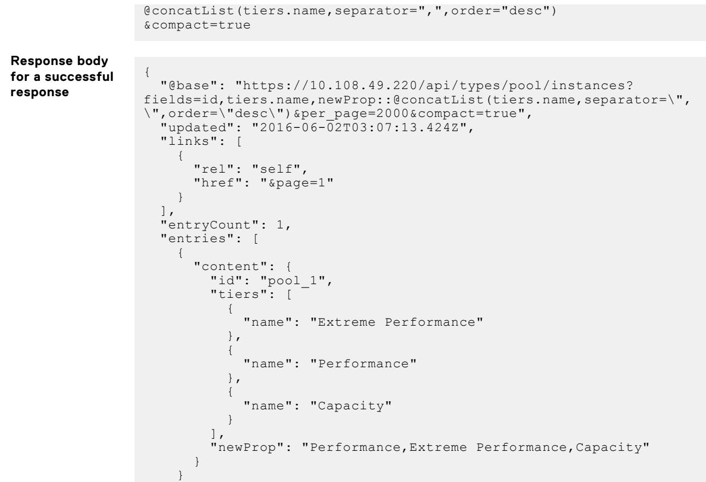
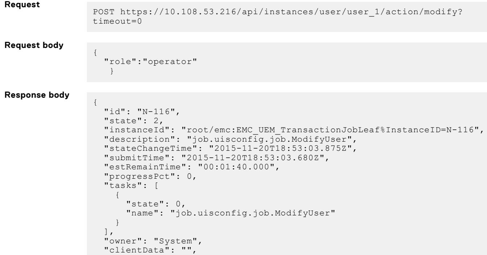

# **Dell Unity™ Family**

Unisphere® Management REST API Programmer's Guide

- [**Dell Unity™ Family**](#dell-unity-family)
    - [Notes, cautions, and warnings](#notes-cautions-and-warnings)
  - [Where to get help](#where-to-get-help)
  - [Product information](#product-information)
  - [Troubleshooting](#troubleshooting)
    - [**Topics:**](#topics)
  - [**The Unisphere Management REST API**](#the-unisphere-management-rest-api)
  - [**Examples in this guide**](#examples-in-this-guide)
- [**REST API overview**](#rest-api-overview)
    - [**Topics:**](#topics-1)
  - [**Resource-oriented architecture and REST**](#resource-oriented-architecture-and-rest)
    - [**Related concepts**](#related-concepts)
  - [**JSON data exchange format**](#json-data-exchange-format)
    - [**Related concepts**](#related-concepts-1)
- [**JSON request components**](#json-request-components)
    - [**Topics:**](#topics-2)
  - [**HTTP request headers**](#http-request-headers)
    - [**Related references**](#related-references)
    - [**Related tasks**](#related-tasks)
  - [**Request parameters**](#request-parameters)
    - [Example 1](#example-1)
    - [**Request**](#request)
    - [**Response**](#response)
  - [Example 2](#example-2)
      - [**Request**](#request-1)
      - [**Response**](#response-1)
    - [**Related references**](#related-references-1)
  - [**URI patterns**](#uri-patterns)
  - [Basic URI patterns](#basic-uri-patterns)
    - [**Table 1. Basic URI patterns in the REST API**](#table-1-basic-uri-patterns-in-the-rest-api)
  - [URI patterns for downloading and uploading files](#uri-patterns-for-downloading-and-uploading-files)
    - [Examples](#examples)
  - [**Request body**](#request-body)
      - [**Related references**](#related-references-2)
- [**JSON response components**](#json-response-components)
    - [**Topics:**](#topics-3)
  - [**HTTP response headers**](#http-response-headers)
    - [**Table 2. HTTP response headers in the REST API**](#table-2-http-response-headers-in-the-rest-api)
    - [**Related references**](#related-references-3)
  - [**JSON response body**](#json-response-body)
    - [**Related references**](#related-references-4)
  - [**HTTP status codes**](#http-status-codes)
    - [**Table 3. HTTP status codes in the REST API**](#table-3-http-status-codes-in-the-rest-api)
    - [**Table 3. HTTP status codes in the REST API (continued)**](#table-3-http-status-codes-in-the-rest-api-continued)
      - [**Related references**](#related-references-5)
  - [**Collection resource**](#collection-resource)
      - [**Request**](#request-2)
      - [**Response**](#response-2)
      - [**Related references**](#related-references-6)
      - [**Related tasks**](#related-tasks-1)
  - [**Instance resource**](#instance-resource)
      - [**Request**](#request-3)
      - [**Related references**](#related-references-7)
  - [**Minimal instance resource**](#minimal-instance-resource)
    - [**Example**](#example)
    - [**Request**](#request-4)
    - [**Request body**](#request-body-1)
    - [**Response**](#response-3)
  - [**Empty response body**](#empty-response-body)
    - [**Related references**](#related-references-8)
  - [**Job resource instance**](#job-resource-instance)
      - [**Request:**](#request-5)
      - [**Response:**](#response-4)
      - [**Related references**](#related-references-9)
  - [**Message entity**](#message-entity)
      - [**Request:**](#request-6)
      - [**Response**](#response-5)
    - [**Related references**](#related-references-10)
- [**JSON encodings**](#json-encodings)
    - [**Topics:**](#topics-4)
  - [**JSON base value encodings**](#json-base-value-encodings)
    - [**Related references**](#related-references-11)
  - [**JSON list encoding**](#json-list-encoding)
  - [Examples](#examples-1)
    - [**Related references**](#related-references-12)
- [**Preparing to make a request**](#preparing-to-make-a-request)
    - [**Topics:**](#topics-5)
  - [**Connecting and authenticating**](#connecting-and-authenticating)
  - [Logging into the Unisphere Management REST API server](#logging-into-the-unisphere-management-rest-api-server)
      - [X-EMC-REST-CLIENT: true](#x-emc-rest-client-true)
    - [Obtaining login session information](#obtaining-login-session-information)
    - [Logging out of the Unisphere Management REST API server](#logging-out-of-the-unisphere-management-rest-api-server)
    - [**Related references**](#related-references-13)
    - [**Related tasks**](#related-tasks-2)
- [**Retrieving basic system information**](#retrieving-basic-system-information)
      - [**Related references**](#related-references-14)
      - [**Related tasks**](#related-tasks-3)
- [**Querying a resource**](#querying-a-resource)
    - [**Topics:**](#topics-6)
  - [**Retrieving data for multiple occurrences in a collection**](#retrieving-data-for-multiple-occurrences-in-a-collection)
  - [Example](#example-1)
    - [**Related references**](#related-references-15)
      - [**Related tasks**](#related-tasks-4)
  - [**Retrieving data for a specified resource instance**](#retrieving-data-for-a-specified-resource-instance)
      - [**Body** Empty.](#body-empty)
    - [Example 1 - Using the ID to identify the instance](#example-1---using-the-id-to-identify-the-instance)
    - [Example 2 - Using the user-assigned name to identify the instance](#example-2---using-the-user-assigned-name-to-identify-the-instance)
      - [**Related references**](#related-references-16)
      - [**Related tasks**](#related-tasks-5)
  - [**Omitting metadata from responses**](#omitting-metadata-from-responses)
    - [Syntax](#syntax)
    - [Examples](#examples-2)
    - [**Related references**](#related-references-17)
      - [**Related tasks**](#related-tasks-6)
  - [**Specifying the attributes to return in a query response**](#specifying-the-attributes-to-return-in-a-query-response)
    - [Syntax](#syntax-1)
    - [Considerations](#considerations)
    - [Example](#example-2)
      - [**Related references**](#related-references-18)
      - [**Related tasks**](#related-tasks-7)
- [**Paginating response data**](#paginating-response-data)
  - [Considerations](#considerations-1)
  - [Example 1 - Using pagination with the with\_entrycount parameter omitted](#example-1---using-pagination-with-the-with_entrycount-parameter-omitted)
    - [Example 2 - Using pagination with the with\_entrycount parameter set to true](#example-2---using-pagination-with-the-with_entrycount-parameter-set-to-true)
    - [**Related references**](#related-references-19)
      - [**Related tasks**](#related-tasks-8)
  - [**Filtering response data**](#filtering-response-data)
    - [Syntax](#syntax-2)
    - [Filter expressions that apply to all base types](#filter-expressions-that-apply-to-all-base-types)
  - [Filter expressions that apply only to strings](#filter-expressions-that-apply-only-to-strings)
    - [**NOTE:**](#note)
    - [Example 1 - Filtering response data using the eq comparator](#example-1---filtering-response-data-using-the-eq-comparator)
    - [Example 2 - Filtering response data using the lk comparator](#example-2---filtering-response-data-using-the-lk-comparator)
    - [Example 2 - Filtering response data using a conditional expression](#example-2---filtering-response-data-using-a-conditional-expression)
      - [**Related references**](#related-references-20)
      - [**Related tasks**](#related-tasks-9)
  - [**Sorting response data**](#sorting-response-data)
    - [Syntax](#syntax-3)
    - [Example 1: Sorting drive information by drive name](#example-1-sorting-drive-information-by-drive-name)
    - [Example 2: Sorting by attributes from a referenced resource type](#example-2-sorting-by-attributes-from-a-referenced-resource-type)
    - [**Related references**](#related-references-21)
    - [**Related tasks**](#related-tasks-10)
  - [**Aggregating response data**](#aggregating-response-data)
  - [Syntax](#syntax-4)
  - [Example - Summarizing the size and rawSize of drives grouped by drive type](#example---summarizing-the-size-and-rawsize-of-drives-grouped-by-drive-type)
      - [**Related references**](#related-references-22)
      - [**Related tasks**](#related-tasks-11)
  - [**Defining new attributes from existing attributes**](#defining-new-attributes-from-existing-attributes)
    - [Syntax](#syntax-5)
      - [**NOTE:**](#note-1)
    - [Example 1 - Defining a new attribute using an arithmetic expression](#example-1---defining-a-new-attribute-using-an-arithmetic-expression)
    - [Example 2 - Defining a new attribute using a conditional expression](#example-2---defining-a-new-attribute-using-a-conditional-expression)
    - [Example 3 - Defining a new attribute using a concatenation expression](#example-3---defining-a-new-attribute-using-a-concatenation-expression)
    - [Example 4 - Defining a new attribute by concatenating elements from a list into a single string value](#example-4---defining-a-new-attribute-by-concatenating-elements-from-a-list-into-a-single-string-value)
  - [Example 5 - Defining a new attribute by using the text value of an attribute defined as an enum](#example-5---defining-a-new-attribute-by-using-the-text-value-of-an-attribute-defined-as-an-enum)
  - [Example 6 - Defining a new attribute by using the localized text value of an attribute defined as an enum](#example-6---defining-a-new-attribute-by-using-the-localized-text-value-of-an-attribute-defined-as-an-enum)
    - [**Related references**](#related-references-23)
    - [**Related tasks**](#related-tasks-12)
  - [**Extending queries to include related data**](#extending-queries-to-include-related-data)
    - [Example 1: Extending queries using the fields request parameter](#example-1-extending-queries-using-the-fields-request-parameter)
    - [Example 2: Extending queries using the filter request parameter](#example-2-extending-queries-using-the-filter-request-parameter)
    - [Example 3: Extending queries using the orderby request parameter](#example-3-extending-queries-using-the-orderby-request-parameter)
    - [**Related references**](#related-references-24)
      - [**Related tasks**](#related-tasks-13)
  - [**Localizing response text**](#localizing-response-text)
    - [Considerations for localizing response text](#considerations-for-localizing-response-text)
    - [Example 1: Using the Accept-language request header to localize](#example-1-using-the-accept-language-request-header-to-localize)
    - [**Request Header** Accept: application/json Accept-language:ja-JP **Request** GET https://10.6.7.41/api/types/alert/instances? fields=message,component,messageId,severity,resolution,timestamp,description\&compact=true **Response** { "@base": "https://10.6.7.41/api/types/ alert/instances?fields=message,component,messageId,severity,resolution,timestamp, description\&compact=true", "updated": "2014-01-16T03:08:53.889Z", "links": \[ { "rel": "self", "href": "\&page=1" }, { "rel": "next", "href": "\&page=2" }, \], "entries": \[ { "content": { "message": "ストレージ システムのライト キャッシュが無効になっています。", "id": 5962, "component": "AlertRaidppSources", "messageId": "29199", "severity": 4, "resolution": "ライト キャッシュにシステム メモリが配置されていることと、ライト キャッ シュが有効になっていることを確認します。 また、SPS が AC 電源に接続され、ストレージ システムと SPS の間のシリ アル通信ケーブルが正しく接続されていることも確認してください。 障害が発生しているハードウェア コンポーネント があれば取り替えて、障害が解決された後でライト キャッシュが自動的に有効になるまで数分間待ちます。 問題が解決 しない場合は、サービス プロバイダにお問い合わせください。", "timestamp": "2013-12-11T21:54:44.000Z", "description": "ストレージ システムのライト キャッシュが構成されていないか、ハードウェ ア コンポーネントまたはソフトウェアに問題があるため無効になっています。" }](#request-header-accept-applicationjson-accept-languageja-jp-request-get-https106741apitypesalertinstances-fieldsmessagecomponentmessageidseverityresolutiontimestampdescriptioncompacttrue-response--base-https106741apitypes-alertinstancesfieldsmessagecomponentmessageidseverityresolutiontimestamp-descriptioncompacttrue-updated-2014-01-16t030853889z-links---rel-self-href-page1---rel-next-href-page2---entries---content--message-ストレージ-システムのライト-キャッシュが無効になっています-id-5962-component-alertraidppsources-messageid-29199-severity-4-resolution-ライト-キャッシュにシステム-メモリが配置されていることとライト-キャッ-シュが有効になっていることを確認します-またsps-が-ac-電源に接続されストレージ-システムと-sps-の間のシリ-アル通信ケーブルが正しく接続されていることも確認してください-障害が発生しているハードウェア-コンポーネント-があれば取り替えて障害が解決された後でライト-キャッシュが自動的に有効になるまで数分間待ちます-問題が解決-しない場合はサービス-プロバイダにお問い合わせください-timestamp-2013-12-11t215444000z-description-ストレージ-システムのライト-キャッシュが構成されていないかハードウェ-ア-コンポーネントまたはソフトウェアに問題があるため無効になっています-)
    - [Example 2: Using the language request parameter to localize](#example-2-using-the-language-request-parameter-to-localize)
      - [**Related references**](#related-references-25)
      - [**Related tasks**](#related-tasks-14)
- [**Creating other types of requests**](#creating-other-types-of-requests)
    - [**Topics:**](#topics-7)
  - [**Creating a resource instance**](#creating-a-resource-instance)
    - [Example](#example-3)
    - [**Related references**](#related-references-26)
      - [**Related tasks**](#related-tasks-15)
  - [**Modifying a resource instance**](#modifying-a-resource-instance)
    - [**Headers**](#headers)
  - [Example 1 - Modifying a user identified by ID](#example-1---modifying-a-user-identified-by-id)
    - [Example 2 - Modifying a user identified by user-assigned name](#example-2---modifying-a-user-identified-by-user-assigned-name)
    - [**Related references**](#related-references-27)
      - [**Related tasks**](#related-tasks-16)
  - [**Deleting a resource instance**](#deleting-a-resource-instance)
      - [**Headers**](#headers-1)
    - [**Operation**](#operation)
  - [Example 1 Deleting a user identified by ID](#example-1-deleting-a-user-identified-by-id)
  - [Example 2 Deleting a user identified by user-assigned name](#example-2-deleting-a-user-identified-by-user-assigned-name)
      - [**Related references**](#related-references-28)
      - [**Related tasks**](#related-tasks-17)
  - [**Performing a class-level resource-specific action**](#performing-a-class-level-resource-specific-action)
  - [Example](#example-4)
    - [**Related references**](#related-references-29)
      - [**Related tasks**](#related-tasks-18)
  - [**Performing an instance-level resource-specific action**](#performing-an-instance-level-resource-specific-action)
  - [Example 1: Starting the relocation operation for a pool identified by ID](#example-1-starting-the-relocation-operation-for-a-pool-identified-by-id)
  - [Example 2: Starting the relocation operation for a pool identified by userassigned name](#example-2-starting-the-relocation-operation-for-a-pool-identified-by-userassigned-name)
      - [**Related references**](#related-references-30)
      - [**Related tasks**](#related-tasks-19)
  - [**Creating an aggregated management request**](#creating-an-aggregated-management-request)
  - [Usage](#usage)
  - [Example](#example-5)
      - [**Related references**](#related-references-31)
    - [**Related tasks**](#related-tasks-20)
  - [**Working with asynchronous requests**](#working-with-asynchronous-requests)
    - [Syntax](#syntax-6)
    - [Usage](#usage-1)
    - [Example 1: Creating an asynchronous request](#example-1-creating-an-asynchronous-request)
      - [**Headers**](#headers-2)
    - [Example 2: Viewing an asynchronous request](#example-2-viewing-an-asynchronous-request)
    - [**Related references**](#related-references-32)
    - [**Related tasks**](#related-tasks-21)
- [**Downloading and uploading files**](#downloading-and-uploading-files)
    - [**Topics:**](#topics-8)
  - [**Downloading and uploading NAS server configuration files**](#downloading-and-uploading-nas-server-configuration-files)
    - [Syntax for downloading a configuration file from a NAS server](#syntax-for-downloading-a-configuration-file-from-a-nas-server)
    - [Syntax for uploading a configuration file from a NAS server](#syntax-for-uploading-a-configuration-file-from-a-nas-server)
    - [Example 1: Downloading an LDAP schema file from a NAS server](#example-1-downloading-an-ldap-schema-file-from-a-nas-server)
    - [Example 2: Uploading an LDAP schema file to a NAS server](#example-2-uploading-an-ldap-schema-file-to-a-nas-server)
      - [**Related tasks**](#related-tasks-22)
  - [**Downloading and uploading x.509 certificates**](#downloading-and-uploading-x509-certificates)
    - [Syntax for downloading an x.509 certificate](#syntax-for-downloading-an-x509-certificate)
    - [Syntax for uploading a configuration file from a NAS server](#syntax-for-uploading-a-configuration-file-from-a-nas-server-1)
    - [Example 1: Downloading an x.509 certificate](#example-1-downloading-an-x509-certificate)
    - [Example 2: Uploading an x.509 certificate file to a NAS server](#example-2-uploading-an-x509-certificate-file-to-a-nas-server)
  - [Example 3: Uploading an x.509 certificate file to an LDAP server](#example-3-uploading-an-x509-certificate-file-to-an-ldap-server)
      - [**Related tasks**](#related-tasks-23)
  - [**Downloading configuration capture files**](#downloading-configuration-capture-files)
    - [Syntax for downloading a configuration capture file](#syntax-for-downloading-a-configuration-capture-file)
    - [Example 1: Downloading a configuration capture file to the local host](#example-1-downloading-a-configuration-capture-file-to-the-local-host)
  - [**Downloading service information files**](#downloading-service-information-files)
  - [Syntax for downloading service information files](#syntax-for-downloading-service-information-files)
  - [Example 1: Downloading service information files to the local host](#example-1-downloading-service-information-files-to-the-local-host)
  - [**Downloading import session report files**](#downloading-import-session-report-files)
    - [Syntax for downloading an import session report file](#syntax-for-downloading-an-import-session-report-file)
    - [Example 1: Downloading an import session report file to the local host](#example-1-downloading-an-import-session-report-file-to-the-local-host)
  - [**Downloading Data at Rest Encryption files**](#downloading-data-at-rest-encryption-files)
  - [Syntax for downloading the keystore file](#syntax-for-downloading-the-keystore-file)
  - [Syntax for downloading key manager audit logs and checksum files together](#syntax-for-downloading-key-manager-audit-logs-and-checksum-files-together)
    - [Syntax for downloading the checksum file for a specified audit log](#syntax-for-downloading-the-checksum-file-for-a-specified-audit-log)
  - [Example 1: Downloading the keystore file](#example-1-downloading-the-keystore-file)
    - [Example 2: Downloading audit logs and checksum files](#example-2-downloading-audit-logs-and-checksum-files)
    - [Example 3: Downloading a checksum file for a specified audit log](#example-3-downloading-a-checksum-file-for-a-specified-audit-log)
    - [**Related references**](#related-references-33)
    - [**Related tasks**](#related-tasks-24)
  - [**Uploading upgrade candidates and language packs**](#uploading-upgrade-candidates-and-language-packs)
    - [Syntax](#syntax-7)
  - [Example](#example-6)
    - [**Related tasks**](#related-tasks-25)
  - [**Uploading license files**](#uploading-license-files)
  - [Syntax](#syntax-8)
      - [**Headers**](#headers-3)
      - [**Operations**](#operations)
  - [Example](#example-7)
    - [**Header**](#header)
      - [**Request**](#request-7)
      - [**Related references**](#related-references-34)
      - [**Related tasks**](#related-tasks-26)
- [**Perl example**](#perl-example)
    - [**Topics:**](#topics-9)
  - [**Example of creating multiple standalone LUNs**](#example-of-creating-multiple-standalone-luns)


**5.2**


### Notes, cautions, and warnings

**NOTE:** A NOTE indicates important information that helps you make better use of your product.

**CAUTION: A CAUTION indicates either potential damage to hardware or loss of data and tells you how to avoid the problem.**

**WARNING: A WARNING indicates a potential for property damage, personal injury, or death.**

© 2016- 2022 Dell Inc. or its subsidiaries. All rights reserved. Dell Technologies, Dell, and other trademarks are trademarks of Dell Inc. or its subsidiaries. Other trademarks may be trademarks of their respective owners.

| Additional resources 5                                     |  |
|------------------------------------------------------------|--|
| Chapter 1: Welcome 6                                       |  |
| The Unisphere Management REST API 6                        |  |
| Examples in this guide 6                                   |  |
| Chapter 2: REST API overview7                              |  |
| Resource-oriented architecture and REST 7                  |  |
| JSON data exchange format 7                                |  |
| Chapter 3: JSON request components9                        |  |
| HTTP request headers 9                                     |  |
| Request parameters 10                                      |  |
| URI patterns 14                                            |  |
| Request body 18                                            |  |
| Chapter 4: JSON response components 19                     |  |
| HTTP response headers 19                                   |  |
| JSON response body20                                       |  |
| HTTP status codes 21                                       |  |
| Collection resource 22                                     |  |
| Instance resource24                                        |  |
| Minimal instance resource24                                |  |
| Empty response body25                                      |  |
| Job resource instance25                                    |  |
| Message entity26                                           |  |
| Chapter 5: JSON encodings28                                |  |
| JSON base value encodings 28                               |  |
| JSON list encoding 29                                      |  |
| Chapter 6: Preparing to make a request31                   |  |
| Connecting and authenticating31                            |  |
| Retrieving basic system information33                      |  |
| Chapter 7: Querying a resource 34                          |  |
| Retrieving data for multiple occurrences in a collection34 |  |
| Retrieving data for a specified resource instance36        |  |
| Omitting metadata from responses 38                        |  |
| Specifying the attributes to return in a query response39  |  |
| Paginating response data41                                 |  |
| Filtering response data45                                  |  |
| Sorting response data50                                    |  |
| Aggregating response data52                                |  |

| Defining new attributes from existing attributes 54         |  |
|-------------------------------------------------------------|--|
| Extending queries to include related data60                 |  |
| Localizing response text63                                  |  |
|                                                             |  |
| Chapter 8: Creating other types of requests 66              |  |
| Creating a resource instance 66                             |  |
| Modifying a resource instance 67                            |  |
| Deleting a resource instance 69                             |  |
| Performing a class-level resource-specific action 71        |  |
| Performing an instance-level resource-specific action72     |  |
| Creating an aggregated management request75                 |  |
| Working with asynchronous requests77                        |  |
|                                                             |  |
| Chapter 9: Downloading and uploading files 80               |  |
| Downloading and uploading NAS server configuration files 80 |  |
| Downloading and uploading x.509 certificates 84             |  |
| Downloading configuration capture files 86                  |  |
| Downloading service information files87                     |  |
| Downloading import session report files88                   |  |
| Downloading Data at Rest Encryption files88                 |  |
| Uploading upgrade candidates and language packs 91          |  |
| Uploading license files 92                                  |  |
|                                                             |  |
| Chapter 10: Perl example94                                  |  |
|                                                             |  |


<span id="page-4-0"/>As part of an improvement effort, revisions of the software and hardware are periodically released. Therefore, some functions described in this document might not be supported by all versions of the software or hardware currently in use. The product release notes provide the most up-to-date information on product features. Contact your technical support professional if a product does not function properly or does not function as described in this document.

## Where to get help

Support, product, and licensing information can be obtained as described below.

## Product information

For product and feature documentation or release notes, go to Unity Technical Documentation at: [dell.com/unitydocs](https://www.dell.com/unitydocs).

## Troubleshooting

For information about products, software updates, licensing, and service, go to Support (registration required) at: [dell.com/](https://www.dell.com/support) [support](https://www.dell.com/support). After logging in, locate the appropriate product page.

**1**

### <span id="page-5-0"/>**Topics:**

- The Unisphere Management REST API
- Examples in this guide

## **The Unisphere Management REST API**

The Unisphere Management REST API is a set of objects (resources), operations, and attributes that let you interact with Unisphere Management functionality through web browsers and application programs. You can use the REST API to do all of the following:

- Configure system settings for the storage system.
- Manage the connections to remote systems, including manage host configurations, iSCSI initiators, and iSCSI CHAP accounts.
- Configure network communication, including manage NAS Servers and set up iSNS for iSCSI storage.
- Manage storage, including configure storage pools and manage file systems, iSCSI, VMware, and Hyper-V storage resources.
- Protect data, including manage snapshots and replication sessions.
- Manage events and alerts.
- Service the system, including change the service password, manage EMC Secure Remote Support (ESRS) settings, and browse service contract and technical advisory information.

For more information about Unisphere Management REST API functionality, see the *Unisphere Management REST API Reference Guide*, which is available from the storage system at https://<ip>/apidocs/index.html and is also available on the support website.

The Unisphere Management API uses a Representational State Transfer (REST) architecture style to expose data. REST is a common approach in today's IT management products and a frequent choice for many web-based APIs. Using a REST API provides the following advantages:

- Presents a single, consistent interface to the Unisphere Management functionality.
- Requires no additional tools, other than standard web browsers or command-line HTTP tools, such as wGET and cURL. For complex interactions, clients can use any procedural programming language, such as C++ or Java, or scripting language, such as Perl or Python, to make calls to the REST API.
- Uses well known HTTP conventions in a standard manner to interact with the storage system.
- Is easy to transport in the network. REST API traffic looks and acts like standard HTTP network traffic, and requires no special ports open in the firewall or special settings in the switches.

## **Examples in this guide**

Most of the examples in this guide are examples in which the REST API is accessed through a browser plugin. To see an example of using the REST API with a Perl script, see [Example of creating multiple standalone LUNs](#page-93-0).

**NOTE:** The attributes in the example response text may differ from the response text you receive when running the same request.

# **REST API overview**

### <span id="page-6-0"/>**Topics:**

- Resource-oriented architecture and REST
- JSON data exchange format

## **Resource-oriented architecture and REST**

REST is a client-server architectural style that uses the HTTP protocol in a simple, effective, way. REST is based on the following principles:

- Application state and functionality are organized into resources. Resources represent physical things, such as a specific Storage Processor (SP); logical things, such as a specific alert; or collections of entities, such as the physical disks in the storage system.
- Each resource has a unique Universal Resource Identifier (URI), and each resource instance has a unique ID. For example, you can identify the alert collection with this URI: /api/types/alert/instances. And you can identify the alert instance that has an ID of 201 with this URI: /api/instances/alert/201.
- Resources share a uniform interface between the client and server through standard HTTP protocol operations. The Unisphere Management API uses the HTTP GET operation to retrieve data about a resource collection or resource instance, POST to create or modify a resource instance, and DELETE to delete a resource instance. (The API also uses POST for a limited set of other operations to implement resource-specific actions ) Thus, an application can interact with a resource by knowing the URI pattern, resource identifier, and action required.
- Communication between the client and server occurs through HTTP requests and responses. In the Unisphere Management API, requests and responses represent resource data using JavaScript Object Notation (JSON).
- Each request is stateless, which means that the server does not store application state information. Instead, client requests contain all the information needed to service the request.
- Resources in a REST API are self-documenting. A response from the server contains information about the requested resource in the form of attribute names and values. Some responses also contain HTML links that the user can use to retrieve additional information about the resource.

### **Related concepts**

JSON data exchange format

## **JSON data exchange format**

JavaScript Object Notation (JSON) is a text-based, platform-independent data-exchange format that is easy for humans and machines to read and write. It consists of two structures:

- A set of name:value pairs enclosed by curly brackets. The pairs may be metadata about the request, such as the time of the request, or they may be data about a resource.
- A list of values enclosed by square brackets. This structure is used when the value in a name:value pair is an array.

The value in a name can be a simple value, such as a string or a number, or it can be either of the structures above (a list of name:value pairs in curly brackets, or a list of values in square brackets).

The following example shows part of a response body for a GET dnsServer collection request in JSON format. In this content, the value for the addresses attribute is a list structure:

```
"content": {
 "origin": 1,
 "addresses": [
 "10.254.177.14",
 "10.255.134.14"
 ],
```

```
 "id": "0"
 }
 }
 ]
 }
```
For more information about JSON, see [json.org](HTTP://WWW.JSON.ORG/).

### **Related concepts**

[Resource-oriented architecture and REST](#page-6-0)

# **JSON request components**

### <span id="page-8-0"/>**Topics:**

- HTTP request headers
- [Request parameters](#page-9-0)
- [URI patterns](#page-13-0)
- [Request body](#page-17-0)

## **HTTP request headers**

The following table describes the HTTP request headers that are used by the Unisphere Management REST API. The API uses these headers in standard ways.

| HTTP header      | Value                                                                 | Description                                                                                                                                                                                                                                                                                                                                                                                              |
|------------------|-----------------------------------------------------------------------|----------------------------------------------------------------------------------------------------------------------------------------------------------------------------------------------------------------------------------------------------------------------------------------------------------------------------------------------------------------------------------------------------------|
| Accept:          | application/json;<br>version= <n.n></n.n>                             | Format and version of the body content<br>desired in the response.                                                                                                                                                                                                                                                                                                                                       |
|                  | where <n.n> is the version number for<br/>the desired response.</n.n> | All requests use Accept:<br>application/json, which is the<br>default and only value accepted. If the<br>Accept header is not specified, the<br>system defaults to the current version.                                                                                                                                                                                                                  |
|                  |                                                                       | If the client requests a version that<br>the server does not support, the server<br>returns an error. If the client requests<br>multiple versions, the server returns<br>the latest supported version that was<br>requested.                                                                                                                                                                             |
| Accept-language: | Locale name                                                           | Localization language for error response<br>messages, events, alerts, and other<br>localizable query results.                                                                                                                                                                                                                                                                                            |
|                  |                                                                       | Valid values are:                                                                                                                                                                                                                                                                                                                                                                                        |
|                  |                                                                       | ●<br>de-DE: German<br>●<br>en-US: English (default)<br>●<br>es-MX: Latin American Spanish<br>●<br>fr-FR: French<br>●<br>ja-JP: Japanese<br>●<br>ko-KR: Korean<br>●<br>pt-BR: Brazilian Portuguese<br>●<br>ru-RU: Russian<br>●<br>zh-CN: Chinese<br>NOTE: Support for all supported<br>locales except en-US requires the<br>installation of language packs.<br>If the requested dialect is not available, |
|                  |                                                                       | the API tries to match on the language,<br>alone. For example, de-AA will match<br>with de-DE.                                                                                                                                                                                                                                                                                                           |

<span id="page-9-0"/>

| HTTP header        | Value                                                        | Description                                                                                                                                                                                                                                                                     |
|--------------------|--------------------------------------------------------------|---------------------------------------------------------------------------------------------------------------------------------------------------------------------------------------------------------------------------------------------------------------------------------|
|                    |                                                              | If the API cannot find a match, it uses<br>en-US instead of returning an error<br>message.                                                                                                                                                                                      |
|                    |                                                              | For more information, see Localizing<br>response text.                                                                                                                                                                                                                          |
| Content-type:      | application/json                                             | Body content type of the request.                                                                                                                                                                                                                                               |
| Set-Cookie:        | Login session ticket                                         | Because the API uses cookie-based<br>authentication, the HTTP client must<br>support cookies in order to use the API.<br>More than one cookie may be required to<br>use the REST API.                                                                                           |
|                    |                                                              | For more information, see Connecting<br>and authenticating.                                                                                                                                                                                                                     |
| EMC-CSRF-TOKEN:    | <token></token>                                              | CSRF token used to mitigate Cross<br>Site Request Forgery vulnerabilities. The<br>token is gathered from a GET response<br>and required to send with POST and<br>DELETE requests. The token is good for<br>the entirety of the session.<br>For more information, see Connecting |
|                    |                                                              | and authenticating.                                                                                                                                                                                                                                                             |
| X-EMC-REST-CLIENT: | true                                                         | Required to send in all requests if using<br>Basic authentication.                                                                                                                                                                                                              |
|                    |                                                              | For more information, see Connecting<br>and authenticating.                                                                                                                                                                                                                     |
| Application-Type:  | <plugin name="">/<plugin<br>version&gt;</plugin<br></plugin> | Optional. REST client name and version.                                                                                                                                                                                                                                         |

### **Related references**

[URI patterns](#page-13-0) Request parameters [Request body](#page-17-0)

### **Related tasks**

[Connecting and authenticating](#page-30-0)

## **Request parameters**

The REST API supports the following request parameters:

| Request parameter | Applicable request types                        | Description                                                                                                                                                                                                                       |
|-------------------|-------------------------------------------------|-----------------------------------------------------------------------------------------------------------------------------------------------------------------------------------------------------------------------------------|
| compact           | Collection query and instance query<br>requests | Omits metadata from each instance in<br>the query response. Values are:<br>●<br>true (implied when you use<br>&compact without a value)<br>●<br>false (default)<br>For more information, see Omitting<br>metadata from responses. |

| Request parameter | Applicable request types                        | Description                                                                                                                                                                                          |
|-------------------|-------------------------------------------------|------------------------------------------------------------------------------------------------------------------------------------------------------------------------------------------------------|
| fields            | Collection query and instance query<br>requests | Specifies a comma-separated list of<br>attributes to return in a response. If you<br>do not use this parameter, a query will<br>return the id attribute only.                                        |
|                   |                                                 | When using fields, you can:                                                                                                                                                                          |
|                   |                                                 | ●<br>Use dot notation syntax to return the<br>values of related attributes.<br>●<br>Optionally, define a new attribute<br>from field expressions associated<br>with one or more existing attributes. |
|                   |                                                 | For more information, see Specifying the<br>attributes to return in a query response,<br>Extending queries to include related<br>data, and Defining new attributes from<br>existing attributes.      |
| filter            | Collection query request                        | Filters the response data against a<br>set of criteria. Only matching resource<br>instances are returned. Filtering is case<br>insensitive.                                                          |
|                   |                                                 | When using filter, you can use dot<br>notation syntax to filter by the attributes<br>of related resource types.                                                                                      |
|                   |                                                 | For more information, see Filtering<br>response data and Extending queries to<br>include related data.                                                                                               |
| groupby           | Collection query request                        | Groups the specified values and applies<br>the @sum function to each group.                                                                                                                          |
|                   |                                                 | For example, you could use groupby<br>with @sum to return a summary of disk<br>sizes for each disk type.                                                                                             |
|                   |                                                 | For more information, see Aggregating<br>response data.                                                                                                                                              |
| language          | All request types                               | Overrides the value of the Accept<br>language: header. This is useful for<br>testing from a plain browser or from an<br>environment where URL parameters are<br>easier to use than HTTP headers.     |
|                   |                                                 | The language parameter specifies the<br>localization language for error messages,<br>events, alerts, and other localizable<br>responses.                                                             |
|                   |                                                 | Valid values are:                                                                                                                                                                                    |
|                   |                                                 | ●<br>de-DE: German<br>●<br>en-US: English (default)                                                                                                                                                  |
|                   |                                                 | ●<br>es-MX: Latin American Spanish<br>●<br>fr-FR: French                                                                                                                                             |
|                   |                                                 | ●<br>ja-JP: Japanese                                                                                                                                                                                 |
|                   |                                                 | ●<br>ko-KR: Korean<br>●                                                                                                                                                                              |
|                   |                                                 | pt-BR: Brazilian Portuguese<br>●<br>ru-RU: Russian<br>●<br>zh-CN: Chinese                                                                                                                            |

| Request parameter | Applicable request types | Description                                                                                                                                                                                                                                                                                                                                                                                                                                                 |
|-------------------|--------------------------|-------------------------------------------------------------------------------------------------------------------------------------------------------------------------------------------------------------------------------------------------------------------------------------------------------------------------------------------------------------------------------------------------------------------------------------------------------------|
|                   |                          | For more information, see Localizing<br>response text.                                                                                                                                                                                                                                                                                                                                                                                                      |
| orderby           | Collection query request | Specifies how to sort response data.<br>You can sort response data in ascending<br>or descending order by the attributes<br>of the queried resource type. And you<br>can use dot notation syntax to sort<br>response data by the attributes of<br>related resource types.                                                                                                                                                                                   |
|                   |                          | For more information, see Sorting<br>response data and Extending queries to<br>include related data.                                                                                                                                                                                                                                                                                                                                                        |
| page              | Collection query request | Identifies the page to return in a<br>response by specifying the page number.<br>If this parameter is not specified, the<br>server returns all resource instances that<br>meet the request criteria in page 1.                                                                                                                                                                                                                                              |
|                   |                          | For more information, see Paginating<br>response data.                                                                                                                                                                                                                                                                                                                                                                                                      |
| per_page          | Collection query request | Specifies the number of resource type<br>instances that form a page. If this<br>parameter is not specified, the server<br>returns all resource instances that meet<br>the request criteria in the page specified<br>by page (or in page 1, if page is also not<br>specified).<br>NOTE: The server imposes an upper<br>limit of 2000 on the number of<br>resource instances returned in a<br>page.<br>For more information, see Paginating<br>response data. |
| with_entrycount   | Collection query request | Indicates whether to return the<br>entryCount response component in<br>the response data. The entryCount<br>response component indicates the<br>number of resource instances in the<br>complete list. You can use it to get<br>the total number of entries when paging<br>returned a partial response.<br>By default, the entryCount response                                                                                                               |
|                   |                          | component is not returned. Set<br>with_entrycount=true to return<br>the entryCount response component.<br>For more information, see Paginating<br>response data.                                                                                                                                                                                                                                                                                            |
| timeout           | Most non-GET requests    | Executes the request in the background.<br>Most active management requests<br>(ones that attempt to change the<br>configuration) support this option. The<br>documentation for each API method in<br>the Unisphere Management REST API<br>Reference Guide specifies whether the<br>method supports this option.                                                                                                                                             |

| Request parameter | Applicable request types | Description                                                      |
|-------------------|--------------------------|------------------------------------------------------------------|
|                   |                          | For more information, see Working with<br>asynchronous requests. |

To use request parameters, append the parameters to the request URI. The first request parameter appended to the URI begins with a ? character. Additional request parameters begin with & instead of ?. You can combine request parameters and can use them in any order. If a request parameter is repeated, all but the last one is ignored.

### Example 1

The following request uses a fields query parameter to return the name, and rpm attributes, a filter query parameter to return disk instances that have an RPM of 15000, and a compact query parameter to omit metadata from each instance in the query response. It also sets the with_entrycount query parameter to true, so that the entry count is included in the response data. For readability purposes, this example omits URI encoding for the space character (%20) and % character (%25).

### **Request**

```
GET api/types/disk/instances?fields=rpm,name&filter=rpm eq
15000&compact=true&with_entrycount=true
```
### **Response**

```
 {
 "@base": "https://10.108.53.216/api/types/disk/instances?filter=rpm eq
15000&fields=rpm,name,id&per_page=2000&compact=true",
 "updated": "2015-12-02T21:03:14.446Z",
 "links": [
 {
 "rel": "self",
 "href": "&page=1"
 }
 ],
 "entryCount": 20,
 "entries": [
 {
 "content": {
 "id": "dpe_disk_0",
 "name": "DPE Disk 0",
 "rpm": 15000
 }
 },
 {
 "content": {
 "id": "dpe_disk_1",
 "name": "DPE Disk 1",
 "rpm": 15000
 }
 },
 {
 "content": {
 "id": "dpe_disk_2",
 "name": "DPE Disk 2",
 "rpm": 15000
 }
 },
.
.
```
## Example 2

.

The following request uses the per_page and page query parameters to group returned disk instances into chunks of two instances per page and to return only the instances on page three. It also uses fields query parameter to return the <span id="page-13-0"/>name, pool and tierType attributes, and the compact query parameter to omit metadata from each instance in the query response:

#### **Request**

```
GET api/types/disk/instances?per_page=3&page=2&fields=name,pool,tierType&compact=true
```
#### **Response**

```
{
 "@base": "https://10.245.23.125/api/types/disk/instances?
fields=name,tierType,id,pool.id&per_page=3&compact=true",
 "updated": "2015-11-19T22:47:53.424Z",
 "links": [
 {
 "rel": "self",
 "href": "&page=2"
 }
 ],
 "entries": [
 {
 "content": {
 "id": "dae_0_1_disk_3",
 "tierType": 20,
 "name": "DAE 0 1 Disk 3",
 "pool": {
 "id": "pool_1"
 }
 }
 },
 {
 "content": {
 "id": "dae_0_1_disk_4",
 "tierType": 20,
 "name": "DAE 0 1 Disk 4",
 "pool": {
 "id": "pool_1"
 }
 }
 },
 {
 "content": {
 "id": "dae_0_1_disk_5",
 "tierType": 20,
 "name": "DAE 0 1 Disk 5",
 "pool": {
 "id": "pool_1"
 }
 }
 }
 ]
}
```
### **Related references**

[HTTP request headers](#page-8-0) URI patterns [Request body](#page-17-0)

## **URI patterns**

In a REST API, the client sends Uniform Resource Identifiers (URIs) to the server. Each URI acts as a template for which you specify a resource type, ID, and desired action.

## Basic URI patterns

The following table describes the basic URI patterns that the Unisphere Management REST API supports:

### **Table 1. Basic URI patterns in the REST API**

| URI pattern                                                                                                                    | HTTP Operations | Description                                                                                                                                                                                                                                                       |
|--------------------------------------------------------------------------------------------------------------------------------|-----------------|-------------------------------------------------------------------------------------------------------------------------------------------------------------------------------------------------------------------------------------------------------------------|
| Collection type resource URI                                                                                                   | GET             | Retrieves a list of instances for the specified resource type.                                                                                                                                                                                                    |
| /api/types/ <resourcetype>/<br/>instances</resourcetype>                                                                       |                 | For more information, see Retrieving data for multiple<br>occurrences in a collection.                                                                                                                                                                            |
|                                                                                                                                | POST            | Creates a new instance of the specified resource type, using<br>data specified in the request body, if allowed.                                                                                                                                                   |
|                                                                                                                                |                 | For more information, see Creating a resource instance.                                                                                                                                                                                                           |
| Instance resource URI                                                                                                          | GET             | Retrieves the specified resource instance.                                                                                                                                                                                                                        |
| For all resource types:                                                                                                        |                 | For more information, see Retrieving data for a specified<br>resource instance.                                                                                                                                                                                   |
| /api/instances/<br><resourcetype>/<id></id></resourcetype>                                                                     |                 | NOTE: To see if a resource type can be identified                                                                                                                                                                                                                 |
| For applicable resource types:                                                                                                 |                 | by the user-assigned name, see the individual resource                                                                                                                                                                                                            |
| /api/instances/<br><resourcetype>/</resourcetype>                                                                              |                 | type topics in the Unisphere Management API Reference<br>Guide.                                                                                                                                                                                                   |
| name: <assignedname></assignedname>                                                                                            | DELETE          | Deletes the specified resource instance, if allowed.                                                                                                                                                                                                              |
|                                                                                                                                |                 | For more information, see Deleting a resource instance.                                                                                                                                                                                                           |
|                                                                                                                                |                 | NOTE: To see if a resource type can be identified<br>by the user-assigned name, see the individual resource<br>type topics in the Unisphere Management API Reference<br>Guide.                                                                                    |
| Instance action URI                                                                                                            | POST            | Performs the action specified in /action/ <actionname></actionname>                                                                                                                                                                                               |
| For all resource types:<br>/api/instances/                                                                                     |                 | for the specified resource instance. For example, a URI<br>pattern containing /action/modify directs the system to<br>modify the specified resource instance.                                                                                                     |
| <resourcetype>/<id>/action/<br/><actionname></actionname></id></resourcetype>                                                  |                 | For more information, see Performing an instance-level                                                                                                                                                                                                            |
| For applicable resource types:                                                                                                 |                 | resource-specific action.                                                                                                                                                                                                                                         |
| /api/instances/<br><resourcetype>/<br/>name:<assignedname>/action/<br/><actionname></actionname></assignedname></resourcetype> |                 | NOTE: To see the supported actions for a resource<br>type and whether the resource type can be identified<br>by the user-assigned name, see the individual resource<br>type topics in the Unisphere Management API Reference<br>Guide.                            |
| Class-level action URI                                                                                                         | POST            | Performs the action specified in action/ <actionname></actionname>                                                                                                                                                                                                |
| /api/types/ <resourcetype>/<br/>action/<actionname></actionname></resourcetype>                                                |                 | for the specified non-singleton resource type. For example, a<br>URI pattern containing action/RecommendForInterface<br>for the ipPort resource type recommends ports on the SP<br>specified in the body of the request to use for creating iSCSI<br>NAS servers. |
|                                                                                                                                |                 | For more information, see Performing a class-level resource<br>specific action.                                                                                                                                                                                   |
|                                                                                                                                |                 | For a list of supported class-level actions for a resource<br>type, see the individual resource type topics in the Unisphere<br>Management API Reference Guide.                                                                                                   |

## URI patterns for downloading and uploading files

The following table describes the URI patterns for downloading and uploading files that the Unisphere Management REST API supports:

| URI pattern                                                                                              | HTTP Operations | Description                                                                                                                                                              |
|----------------------------------------------------------------------------------------------------------|-----------------|--------------------------------------------------------------------------------------------------------------------------------------------------------------------------|
| URI for downloading a NAS server<br>configuration file                                                   | GET             | Downloads a NAS server configuration file from the<br>specified NAS server to the local host.                                                                            |
| /download/ <protocoltype>/<br/>nasServer/<nasserverid></nasserverid></protocoltype>                      |                 | For more information, see Downloading and uploading NAS<br>server configuration files.                                                                                   |
| URI for uploading a NAS server<br>configuration file                                                     | POST            | Uploads a NAS server configuration file to the specified<br>NAS server. You must POST the NAS server configuration                                                       |
| /upload/ <protocoltype>/<br/>nasServer/<nasserverid></nasserverid></protocoltype>                        |                 | file using a multipart/form-data format, as if from a simple<br>web page.                                                                                                |
|                                                                                                          |                 | For more information, see Downloading and uploading NAS<br>server configuration files.                                                                                   |
| URI for downloading an x.509 certificate<br>file                                                         | GET             | Downloads the specified x.509 certificate file from the<br>storage system to the local host.                                                                             |
| /download/x509Certificate/<br><cert_id></cert_id>                                                        |                 | For more information, see Downloading and uploading x.509<br>certificates.                                                                                               |
| URI for uploading an x.509 certificate file                                                              | POST            | Uploads an x.509 certificate from the local host to the                                                                                                                  |
| /upload/x509Certificate/                                                                                 |                 | storage system. You must POST the x.509 certificate file<br>using a multipart/form-data format, as if from a simple web<br>page.                                         |
|                                                                                                          |                 | For more information, see Downloading and uploading x.509<br>certificates.                                                                                               |
| URI for downloading the keystore file for<br>Data at Rest Encryption                                     | GET             | Downloads the keystore file for Data at Rest Encryption<br>from the storage system to the local host.                                                                    |
| /download/encryption/keystore                                                                            |                 | For more information, see Downloading Data at Rest<br>Encryption files.                                                                                                  |
| URI for downloading the key manager<br>audit logs and checksum files for Data<br>at Rest Encryption      | GET             | Downloads the key manager audit logs and checksum files<br>together as a single .zip file from the storage system to the<br>local host.                                  |
| /download/encryption/<br>auditLogAndChecksum?<br>date= <yyyy-mm></yyyy-mm>                               |                 | For more information, see Downloading Data at Rest<br>Encryption files.                                                                                                  |
| URI for downloading the checksum file<br>for a specified key manager audit log                           | GET             | Downloads the checksum file for a specified audit log from<br>the storage system to the local host.                                                                      |
| /download/encryption/<br>checksum?<br>audit_log= <audit_log_file_nam<br>e&gt;GET</audit_log_file_nam<br> |                 | For more information, see Downloading Data at Rest<br>Encryption files.                                                                                                  |
| URI for uploading upgrade candidates<br>and language pack files                                          | POST            | Uploads an upgrade candidate or language pack file from<br>the local host to the storage system. You must POST the                                                       |
| /upload/files/types/<br>candidateSoftwareVersion                                                         |                 | upgrade candidate or language pack file using a multipart/<br>form-data format, as if from a simple web page.                                                            |
|                                                                                                          |                 | For more information, see Uploading upgrade candidates<br>and language packs.                                                                                            |
| URI for uploading license files                                                                          | POST            | Uploads an upgrade candidate or language pack file from                                                                                                                  |
| /upload/license                                                                                          |                 | the local host to the storage system. You must POST the<br>upgrade candidate or language pack file using a multipart/<br>form-data format, as if from a simple web page. |

| URI pattern | HTTP Operations | Description                                                                                                                                             |
|-------------|-----------------|---------------------------------------------------------------------------------------------------------------------------------------------------------|
|             |                 | For more information, see Uploading license files.<br>NOTE: To install an uploaded license file, create a new<br>instance of the license resource type. |

### Examples

| Retrieving all<br>instances of the<br>user resource                                            | GET /api/types/user/instances                               |
|------------------------------------------------------------------------------------------------|-------------------------------------------------------------|
| type                                                                                           |                                                             |
| Retrieving user<br>instance 001                                                                | GET /api/instances/user/001                                 |
| Creating a new<br>user instance                                                                | POST /api/types/user/instances                              |
| Deleting user<br>instance 001                                                                  | DELETE /api/instances/user/001                              |
| Modifying user<br>instance 001                                                                 | POST /api/instances/user/001/action/modify                  |
| Verifying<br>connectivity<br>from the storage                                                  | POST /api/instances/ldapServer/server1/action/verify        |
| server to the<br>specified LDAP<br>server (an<br>instance-level<br>action)                     |                                                             |
| Recommending<br>Ethernet ports to                                                              | POST /api/types/ethernetPort/action/RecommendForAggregation |
| use for creating<br>link aggregations<br>(a class-level<br>action)                             |                                                             |
| Downloading<br>the vasa_http<br>vc1-cacert-1<br>x.509 certificate<br>file to the local<br>host | GET /download/x509Certificate/vasa_http-vc1-cacert-1        |
| Uploading a<br>license file to the                                                             | POST /api/upload/license                                    |
| storage system                                                                                 |                                                             |
| Related references                                                                             |                                                             |
| HTTP request headers                                                                           |                                                             |

## <span id="page-17-0"/>**Request body**

A JSON request body for the Unisphere Management REST API consists of a collection of name:value pairs for a single resource type. The request body has the following syntax:

- For number or boolean values:
{

}

{

}

```
 <attributeName1>:<value1>,
 <attributeName2>:<value2>,
 .
 .
 .
```
- For IP, string, or datetime values:

```
 <attributeName1>:"<value1>",
 <attributeName2>:"<value2>",
 .
 .
 .
```
For example, the request body for a create request for the user resource type could contain the following values:

```
{
 "name": "June",
 "role": "operator",
 "password": "Operator_EMC1!"
}
```
#### **Related references**

[HTTP request headers](#page-8-0) [URI patterns](#page-13-0) [Request parameters](#page-9-0)

# **JSON response components**

### <span id="page-18-0"/>**Topics:**

- HTTP response headers
- [JSON response body](#page-19-0)
- [HTTP status codes](#page-20-0)
- [Collection resource](#page-21-0)
- [Instance resource](#page-23-0)
- [Minimal instance resource](#page-23-0)
- [Empty response body](#page-24-0)
- [Job resource instance](#page-24-0)
- [Message entity](#page-25-0)

## **HTTP response headers**

A response from the REST API always includes HTTP response headers that contain metadata about the response being sent. The following HTTP headers appear in every REST API response:

### **Table 2. HTTP response headers in the REST API**

| HTTP header      | Description                                                                                                                                                                                                                                                                                                                              |
|------------------|------------------------------------------------------------------------------------------------------------------------------------------------------------------------------------------------------------------------------------------------------------------------------------------------------------------------------------------|
| Status Code      | HTTP status code that indicates whether the request was<br>successful.                                                                                                                                                                                                                                                                   |
| Cache-Control    | Specifies whether the response can be cached and/or stored in<br>non-volatile storage. In this version of the REST API, the value<br>is always no-cache, nostore, max-age=0, which indicates<br>information should not be cached or stored.                                                                                              |
| Connection       | Specifies the preferred type of connection. In this version of the<br>REST API, the value is always Keep-Alive, which means the<br>client/server connection is left open for the length of time specified<br>in the Keep-Alive header.                                                                                                   |
| Content-Language | Indicates the language of the response content. If the language<br>specified in the request cannot be found, the language defaults to<br>en-US (US English).                                                                                                                                                                             |
| Content-Type     | MIME type of the response. In this version of<br>the REST API, the value is always application/<br>json;version=4.0;charset=UTF-8.                                                                                                                                                                                                       |
| Date             | Date and time when the response was sent.                                                                                                                                                                                                                                                                                                |
| EMC-CSRF-TOKEN   | Returned in the first GET request and required for subsequent<br>POST and DELETE requests.                                                                                                                                                                                                                                               |
| Expires          | Date and time when the response information is considered to be<br>expired.                                                                                                                                                                                                                                                              |
| Keep-Alive       | The timeout parameter associated with the Keep-Alive header<br>specifies the length of time for which the server will keep the<br>client/server connection open between requests, in seconds. The<br>max parameter specifies the number of requests allowed per<br>connection. If set to 0, an unlimited number of requests are allowed. |

<span id="page-19-0"/>

| Table 2. HTTP response headers in the REST API (continued) |  |  |
|------------------------------------------------------------|--|--|
|------------------------------------------------------------|--|--|

| HTTP header       | Description                                                                                                                                                                                                                                           |
|-------------------|-------------------------------------------------------------------------------------------------------------------------------------------------------------------------------------------------------------------------------------------------------|
| Pragma            | Implementation-specific directives. In this version of the REST API,<br>the value is always no-cache, which indicates that the application<br>should forward the request to the origin server, even if it has a<br>cached copy of what was requested. |
| Server            | REST API server name. In this version of the REST API, the value is<br>always Apache.                                                                                                                                                                 |
| Transfer-Encoding | Indicates how the response was transmitted. In this version of the<br>REST API, the value is always chunked.                                                                                                                                          |

When you log into the REST API, the response also includes a Set-Cookie header, which contains information about the login session. The response can include other cookies as well. You must include these cookies in each request that uses this login session.

### **Related references**

JSON response body [HTTP status codes](#page-20-0)

## **JSON response body**

If a request to the REST API is successful, the JSON response body contains data that represents the requested resources. If a request is unsuccessful, the response body contains a message entity. In both cases, the response body is a set of components enclosed by outer braces, with each component formatted as a name:value pair.

The following table describes the response body components:

| Component    | Description                                                                                                                                                                                                                                                                                                                                                                                                                                                                                                                                              |  |
|--------------|----------------------------------------------------------------------------------------------------------------------------------------------------------------------------------------------------------------------------------------------------------------------------------------------------------------------------------------------------------------------------------------------------------------------------------------------------------------------------------------------------------------------------------------------------------|--|
| "@base"      | Name of the base URI. The base URI is used at both the collection level and the instance<br>level.                                                                                                                                                                                                                                                                                                                                                                                                                                                       |  |
| "updated"    | Date and time the response was generated. The update time is used at both the collection<br>level and the instance level.                                                                                                                                                                                                                                                                                                                                                                                                                                |  |
| "links"      | List of one or more hyperlinks. Each hyperlink has two sub-components:<br>●<br>"rel" - Relationship name.<br>●<br>"href" - Link URI. This gets appended to the value of "@base" to create the full link.<br>The first hyperlink in a response body is the self-link to the requested resource, which<br>informs users how the data was retrieved. Subsequent hyperlinks in a response body are<br>related URIs that the user can use to retrieve additional information.<br>The hyperlinks are used at both the collection level and the instance level. |  |
| "entryCount" | Number of instances in the complete list. This component is used at the collection level only,<br>and is only returned if the with_entrycount query parameter is set to true.                                                                                                                                                                                                                                                                                                                                                                            |  |
| "entries"    | List of all instances in the current page of the specified collection that meet the request<br>criteria. This component is used at the collection level only.                                                                                                                                                                                                                                                                                                                                                                                            |  |
| "content"    | Set of name:value pairs for one resource. Not all requests return name:value pair content.                                                                                                                                                                                                                                                                                                                                                                                                                                                               |  |

The format of a response body depends on how the request was processed and whether the request was successful. The REST API supports the following types of response bodies:

- [Collection resource](#page-21-0)
- [Instance resource](#page-23-0)
- [Minimal instance resource](#page-23-0)
- [Empty response body](#page-24-0)
- [Job resource instance](#page-24-0)

- <span id="page-20-0"/>● [Message entity](#page-25-0)
### **Related references**

[HTTP response headers](#page-18-0) HTTP status codes

## **HTTP status codes**

Every response to a REST API request includes an HTTP status code in the response header, which indicates whether the request was successful. If requests are unsuccessful (that is, if they return 4nn and 5nn HTTP status codes) the system returns a message entity that describes the problem.

The following table describes the HTTP status codes that apply to the REST API:

### **Table 3. HTTP status codes in the REST API**

| Status<br>code | Name                  | Applies to                                                      | Description                                                                                                                                              |
|----------------|-----------------------|-----------------------------------------------------------------|----------------------------------------------------------------------------------------------------------------------------------------------------------|
| 200            | OK                    | GET requests and action POST<br>requests with output data       | Successful request.                                                                                                                                      |
|                |                       |                                                                 | For a GET request, the response body contains the<br>requested resource. For an action POST request,<br>the response body contains the output arguments. |
| 201            | Created               | POST requests for creating resources                            | Successful request.                                                                                                                                      |
|                |                       |                                                                 | The response body contains the id attribute and<br>self-link for the new resource.                                                                       |
| 202            | Accepted              | Asynchronous POST and DELETE<br>requests                        | Request is in process.                                                                                                                                   |
|                |                       |                                                                 | The response body is the job resource instance<br>executing the request.                                                                                 |
| 204            | No Content            | Action POST requests with no output<br>data and DELETE requests | Successful request.                                                                                                                                      |
|                |                       |                                                                 | There is no body content in the response.                                                                                                                |
| 302            | Unauthorized          | All requests                                                    | Authorization error or timeout when the X-EMC<br>REST-CLIENT header field is missing or not set to<br>true.                                              |
| 400            | Bad Request           | GET, POST, and DELETE requests                                  | Request syntax error.                                                                                                                                    |
|                |                       |                                                                 | The request has a badly formed URI or badly<br>formed parameters, headers, or body content.                                                              |
| 401            | Unauthorized          | All requests                                                    | Authorization error or timeout when the X-EMC<br>REST-CLIENT header field is set to true.                                                                |
| 403            | Forbidden             | GET, POST, and DELETE requests                                  | Not allowed.                                                                                                                                             |
|                |                       |                                                                 | This is an authentication or authorization failure.                                                                                                      |
| 404            | Not Found             | GET, POST, and DELETE requests                                  | Resource does not exist.                                                                                                                                 |
|                |                       |                                                                 | This can be caused by:                                                                                                                                   |
|                |                       |                                                                 | ●<br>An invalid resource type name for a GET<br>instance request or action POST request.                                                                 |
|                |                       |                                                                 | ●<br>An invalid ID for a specific instance in a GET,                                                                                                     |
|                |                       |                                                                 | POST, or DELETE request.<br>●<br>An invalid URI pattern.                                                                                                 |
| 405            | Method Not<br>Allowed | POST and DELETE requests                                        | Specified resource does not support the request's<br>operation.                                                                                          |

| Status<br>code | Name                     | Applies to                     | Description                                                                                                                                |
|----------------|--------------------------|--------------------------------|--------------------------------------------------------------------------------------------------------------------------------------------|
|                |                          |                                | For example, requesting a DELETE on a hardware<br>resource can cause this error.                                                           |
| 406            | Not<br>Acceptable        | GET, POST, and DELETE requests | Accept headers cannot be satisfied.                                                                                                        |
| 409            | Conflict                 | GET, POST, and DELETE requests | Request cannot be completed due to a conflict with<br>the current state of the resource.                                                   |
|                |                          |                                | The response body contains an error message that<br>describes the problem with the request.                                                |
| 422            | Unprocessable<br>Entity  | POST requests                  | POST request has semantically invalid content. For<br>example, a range error or inconsistent properties on<br>a POST can cause this error. |
|                |                          |                                | The response body contains an error message that<br>describes the problem with the request.                                                |
| 500            | Internal<br>Server Error | GET, POST, and DELETE requests | Internal error.                                                                                                                            |
| 503            | Service<br>Unavailable   | GET, POST, and DELETE requests | The REST service is temporarily unavailable.                                                                                               |

### <span id="page-21-0"/>**Table 3. HTTP status codes in the REST API (continued)**

#### **Related references**

[HTTP response headers](#page-18-0) [JSON response body](#page-19-0)

## **Collection resource**

A collection resource occurs in response to a GET collection request that results in a 200 OK HTTP status code. By default, the response body for a list contains the id for all instances in the resource type collection. You can specify additional fields to return by using the ?fields query parameter. You also can limit the amount of data returned by using the ?page, ? per_page, ?filter, and ?compact query parameters.

The following example illustrates the components of a collection resource. It shows a collection resource returned in response to a GET collection request for the alert resource type. In this example, the query returns the id, severity, and description of each alert in the storage system. Paging is set to 10 instances per page. Spaces outside the quoted strings are used for readability, and are not significant.

#### **Request**

```
GET https://10.245.23.125/api/types/alert/instances
 ?fields=severity,description?per_page=10
```
#### **Response**

{ "@base": "https://10.245.23.125/api/types/alert/instances?fields=severity,description ?per_page=10,id&per_page=2000"

Collection base URI and paging specification for this response. All links within this scope use this base URI. The per_page parameter (?per_page=10) specifies 10 instances per page.

```
"updated": "2015-11-19T21:18:30.613Z",,
```
Date and time the response was generated.

```
"links": [
 {
 "rel": "self",
 "href": "&page=1"
 }
 ],
```
A self-link and a set of hyperlinks to the first, previous, and next pages in the list, relative to the page in this response. In JSON, this is called an array. Only the relevant hyperlinks appear, so if you are on page 1, the hyperlink to the previous page does not appear.

```
"entries": [
 {
 "@base": "https://10.245.23.125/api/instances/alert",
 "updated": "2015-11-19T21:18:30.613Z",
 "links": [
 {
 "rel": "self",
 "href": "/alert_1"
 }
 ],
 "content": {
 "id": "alert_1",
 "severity": 4,
 "description": "The DNS client configured for the NAS server has faulted.
Contact your service provider."
 }
 }, {
 "@base": "https://10.245.23.125/api/instances/alert",
 "updated": "2015-11-19T21:18:30.613Z",
 "links": [
 {
 "rel": "self",
 "href": "/alert_2"
 }
 ],
 "content": {
 "id": "alert_2",
 "severity": 6,
 "description": "The component is operating normally. No action is required."
 }
 },
```
List of all instances in the specified collection that meet the request criteria. The response includes the following information for each instance:

- Instance base URI. This URI uses a different pattern than the collection URI.
- Date and time the response was generated.
- Self-link to this resource.
- Attribute values as a set of name:value pairs.

Using the ?compact=true query parameter suppresses the instance base URI and links.

#### **Related references**

[Instance resource](#page-23-0) [Empty response body](#page-24-0) [Job resource instance](#page-24-0) [Message entity](#page-25-0)

#### **Related tasks**

[Retrieving data for multiple occurrences in a collection](#page-33-0)

## <span id="page-23-0"/>**Instance resource**

An instance resource occurs in response to a GET instance request that results in a 200 OK HTTP status code. By default, this response body contains all available information about the requested resource instance. (The same information appears in the "entries" array of the collection resource.) You can limit the amount of data returned by using the ?fields, and ?compact query parameters.

The following example illustrates the components of an instance resource. It shows an instance resource returned in response to a GET instance request for the alert resource type with an id of alert_1. Spaces outside the quoted strings are used for readability, and are not significant.

#### **Request**

```
GET https://10.245.23.125/api/instances/alert/alert_1?fields=severity,description
```
**Response**

```
{
 "@base": "https://10.245.23.125/api/instances/alert",
```
Instance base URI. All links within this scope use this base URI.

```
 "updated": "2015-11-19T21:36:40.360Z",
```
Date and time the response was generated.

```
"links": [
 {
 "rel": "self",
 "href": "/ alert_1"
 }
 ],
```
Self-link to this resource. Using the ?compact=true query parameter suppresses this link.

```
 "content": {
 "id": "alert_1",
 "severity": 4,
 "description": "The DNS client configured for the NAS server has faulted. Contact
your service provider."
 }
}
```
Returned content, in which the attribute values are a set of name:value pairs.

#### **Related references**

[Collection resource](#page-21-0) [Empty response body](#page-24-0) [Job resource instance](#page-24-0) [Message entity](#page-25-0)

## **Minimal instance resource**

A minimal instance resource occurs in response to a POST operation for create that results in a 201 Created HTTP return code. This response body contains the id attribute and a self-link for the new resource instance.

The following examples illustrate the components of a minimal instance resource. It shows a minimal instance resource returned in response to a successful POST request for creating a new user configuration. The request body contains the arguments used to populate the new configuration.

### <span id="page-24-0"/>**Example**

### **Request**

POST https://10.6.9.55/api/types/user/instances

### **Request body**

```
 {
 "name": "Operator4",
 "role": "operator",
 "password":"Password456!"
}
```
### **Response**

```
{
 "@base": "https://10.6.9.55/api/instances/user",
```
Base URI for this response. All links within this scope use this base URI.

"updated": "2013-03-13T17:13:27.616Z",

Date and time the response was generated.

```
 "links": [
 {
 "rel": "self",
 "href": "/user_Operator4"
 }
 ],
```
Self-link to this resource.

```
 "content": {
 "id": "user_Operator4"
 }
}
```
Unique identifier of the new user instance.

## **Empty response body**

An empty response body occurs in response to a DELETE request that results in a 204 No Content status code (which indicates success). In this circumstance, response headers are returned with the empty response body. An empty response body also occurs in response to an action POST request that does not have output data and that results in a 204 No Content status code (indicating success).

### **Related references**

[Collection resource](#page-21-0) [Instance resource](#page-23-0) Job resource instance [Message entity](#page-25-0)

## **Job resource instance**

A job resource instance occurs in response to an asynchronous request that results in a 202 Accepted HTTP return code. This response body contains the id attribute and self-link for the job resource instance. You can query the job resource

<span id="page-25-0"/>instance to find out whether the job completed and to get the response to the asynchronous request. For a description of the job resource type, see the job topic in the *Unisphere Management REST API Reference Guide*.

The following example returns a job resource instance in response to a successful asynchronous request.

#### **Request:**

POST https://10.108.127.27/api/instances/user/user_Fredsmith/action/ modify?timeout=1

#### **Response:**

```
{
 "tasks": [
 {
 "name": "Common UIS job",
 "state": 0
 }
 ],
 "stateChangeTime": "2014-02-11T08:29:10.916Z",
 "submitTime": "2014-02-11T08:29:10.351Z",
 "estRemainTime": "00:01:40.000",
 "progressPct": 0,
 "methodName": "user.modify",
 "id": "N-67",
 "name": "Common UIS job",
 "state": 2
}
```
#### **Related references**

[Collection resource](#page-21-0) [Instance resource](#page-23-0) [Empty response body](#page-24-0) Message entity

## **Message entity**

A message entity is an instance of the message global embedded type. It occurs in response to an unsuccessful request; that is, a request that returns a 4*nn* or 5*nn* HTTP status code. Unlike the response bodies returned by successful requests, a message entity cannot be queried independently.

The server localizes message entity text according to the locale specified in the Accept-languages request header or the language request parameter.

The following example shows a message entity returned from a request in which the alert resource type is misspelled. For a description of the message entity attributes, see the *Unisphere Management REST API Reference Guide*.

#### **Request:**

GET https://10.6.7.21/api/instances/alrt

#### **Response**

```
{
 "error": {
 "errorCode": 131149829,
 "httpStatusCode": 404,
 "messages": [
 {
 "en-US": "The requested resource does not exist. (Error
Code:0x7d13005)"
 }
 ],
 "created": "2014-01-14T08:12:34.803Z"
 }
}
```
### **Related references**

[Collection resource](#page-21-0) [Instance resource](#page-23-0) [Empty response body](#page-24-0) [Job resource instance](#page-24-0)

# **JSON encodings**

### <span id="page-27-0"/>**Topics:**

- JSON base value encodings
- [JSON list encoding](#page-28-0)

## **JSON base value encodings**

The following table shows the JSON encodings for each base type:

| Type               | Format after " <name>":</name>                              | Example                                                                 | Notes                                                                                                                                                                                                                                                                                        |
|--------------------|-------------------------------------------------------------|-------------------------------------------------------------------------|----------------------------------------------------------------------------------------------------------------------------------------------------------------------------------------------------------------------------------------------------------------------------------------------|
| boolean            | true t 1                                                    | "force":true                                                            | Case insensitive.                                                                                                                                                                                                                                                                            |
|                    | yes y<br>false f<br>no n 0                                  |                                                                         | All of the listed formats are<br>accepted as input, but the<br>returned output is always<br>true false.                                                                                                                                                                                      |
| dateTime           | yyyy-mm<br>ddThh:mm:ss[.sss]Z                               | "updated":<br>"2015-07-14T18:21:32<br>.621Z"                            | Times are expressed in ISO<br>8601 UTC time (GMT time).<br>The [.sss] optional part<br>contains optional, fractional<br>seconds (in milliseconds).                                                                                                                                           |
| datetime[interval] | h+:mm:ss[.sss]                                              | 300:02:15                                                               | Time interval expressed in<br>hours, minutes, seconds,<br>and optionally milliseconds.<br>When used as an input<br>value, the resolution of<br>datetime is documented in<br>the Unisphere Management<br>REST API Reference Guide,<br>and its value is rounded down<br>to the specified unit. |
| embedded           | { " <propname>":<value1<br>&gt;, … }</value1<br></propname> | " health":<br>{ "value":0,<br>"description": "OK",<br>"resolution":"" } | In this example, health<br>is an embedded type<br>with three attributes:<br>value, description, and<br>resolution.                                                                                                                                                                           |
| enum               | <int value=""></int>                                        | "severity":3                                                            | Enumerations, which are<br>integer values with name/<br>value mapping defined in the<br>data model. For the definitions<br>of each enumeration, see the<br>Unisphere Management REST<br>API Reference Guide.                                                                                 |
| id                 | double quoted string                                        | "id":"123"                                                              | <id> value of the referenced<br/>resource instance. This is the<br/>same as the FriendlyId<br/>value that the CLI exposes.</id>                                                                                                                                                              |
| int                | <int value=""></int>                                        | "answer": 42                                                            | N/A                                                                                                                                                                                                                                                                                          |

<span id="page-28-0"/>

| Type      | Format after " <name>":</name>                                       | Example                      | Notes                                                                                                                                                                                                                                                                                                                                                                                                                      |
|-----------|----------------------------------------------------------------------|------------------------------|----------------------------------------------------------------------------------------------------------------------------------------------------------------------------------------------------------------------------------------------------------------------------------------------------------------------------------------------------------------------------------------------------------------------------|
| IPAddress | String containing an IPv4<br>address, IPv6 address, or host<br>name. | "mgmtAddr":"128.222.<br>1.2" | In this API, some attributes<br>support IPv4 only, while<br>others support both IPv4<br>and IPv6. Some attributes<br>also support port numbers,<br>and/or DNS names. When<br>used in method parameters,<br>some IPAddress type values<br>support /bits to specify the<br>v4 netmask or v6 prefix<br>length.<br>The Help topics for individual                                                                              |
|           |                                                                      |                              | resource types in the<br>Unisphere Management REST<br>API Reference Guide indicate<br>which IP address options are<br>supported by that resource<br>type.                                                                                                                                                                                                                                                                  |
| pair      | {value1:value2}                                                      | {"en-US":"message<br>text"}  | A list of pairs forms a JSON<br>map.                                                                                                                                                                                                                                                                                                                                                                                       |
| ref       | {"id":"value"}                                                       | "pool":{"id":"123"}          | The ref type value is the<br>embedding of the target<br>instance.<br>●<br>For requests, the ref type<br>value is populated with<br>the <id> value of the<br/>referenced resource.<br/>●<br/>For join output in GET<br/>responses, the ref type<br/>value is populated with<br/>more of the embedded<br/>reference property values.<br/>In the example, ref refers to<br/>a pool resource with an id<br/>value of 123.</id> |
| string    | double quoted string                                                 | "description":"some<br>text" | Use \ to escape the quote (")<br>and control characters.                                                                                                                                                                                                                                                                                                                                                                   |

### **Related references**

JSON list encoding

## **JSON list encoding**

A JSON list is a list of values with the following format:

```
[ <value1>,
<value2>, <value3>,...]
```
where:

- Square brackets enclose the list.
- Commas separate each value.
- <value> can be another list or any of the base value encoding formats.

JSON lists can be empty.

## Examples

The following example shows an empty list:

"ScheduleDays" : [ ]

The following example shows a list with one value:

"scheduleDays" : [ 2 ]

The following example shows a list with three values:

"scheduleDays" : [ 2, 3, 4 ]

### **Related references**

[JSON base value encodings](#page-27-0)

# **Preparing to make a request**

### <span id="page-30-0"/>**Topics:**

- Connecting and authenticating
- [Retrieving basic system information](#page-32-0)

## **Connecting and authenticating**

Every request to the Unisphere Management REST API must be authenticated, except for queries to the basicSystemInfo resource type. The Unisphere Management REST API uses the standard HTTP Basic access authentication mechanism to authenticate REST requests. The same users, whether defined in LDAP or defined locally, are valid for REST, CLI, or GUI access.

## Logging into the Unisphere Management REST API server

To log into the REST API server, include this header in a GET request:

#### X-EMC-REST-CLIENT: true

This tells the server to use the HTTP Basic access authentication mechanism to authenticate the login request.

The server returns the following in response to a successful login:

- A 200 OK HTTP status code.
- Login session cookies, which are required for all subsequent requests.
- EMC-CSRF-TOKEN token header, which is required for POST and DELETE requests. This token header is good for the entirety of the session.
- Ticket Granting Cookie (TGC), which is required when you are interacting with the authentication service.

To use Basic access authentication, you must include X-EMC-REST-CLIENT: true in each request to authenticate the login session.

The following table summarizes the items to include in requests subsequent to the first GET request in a session:

| Request type   | Items to include                                                                                                                 |
|----------------|----------------------------------------------------------------------------------------------------------------------------------|
| GET            | ●<br>X-EMC-REST-CLIENT<br>●<br>All cookies returned in the first GET request of the session.                                     |
| POST or DELETE | ●<br>X-EMC-REST-CLIENT<br>●<br>EMC-CSRF-TOKEN token header<br>●<br>All cookies returned in the first GET request of the session. |

The following headers should also be included in requests:

- Accept: application/json (to indicate that the format of the response content is JSON)
- Content-type: application/json (to indicate that the format of the request contains body is JSON; required if there is a request body)

### Obtaining login session information

Query the loginSessionInfo resource type to find out basic information about the current session. The following table describes the information returned in response to a successful query of the loginSessionInfo resource type:

| Attribute                | Description                                                                                                                                                             |
|--------------------------|-------------------------------------------------------------------------------------------------------------------------------------------------------------------------|
| id                       | Unique identifier of the loginSessionInfo resource instance.                                                                                                            |
| user                     | Information about the user logged into this session, as defined by the<br>user resource type.                                                                           |
| roles                    | List of roles for the user logged into this session, as defined by the<br>role resource type.                                                                           |
| idleTimeout              | Number of seconds after last use until this session expires.                                                                                                            |
| isPasswordChangeRequired | Indicates whether the password must be changed in order to use this<br>session created for the built-in admin account. Values are:                                      |
|                          | ●<br>true - Password must be changed.                                                                                                                                   |
|                          | ●<br>false - Password does not need to be changed.                                                                                                                      |
|                          | For information about changing the password for a local user, see the<br>Help topic for the user resource type in the Unisphere Management<br>REST API Reference Guide. |

For example:

```
 "content": {
 "id": "admin",
 "roles": [
 {
 "id": "administrator"
 }
 ],
 "user": {
 "id": "user_admin"
 },
 "idleTimeout": 3600,
 "isPasswordChangeRequired": false
 }
```
### Logging out of the Unisphere Management REST API server

Use the following request components to log out of the storage system to which the login request was made:

| Header:      | Accept: application/json<br>Content-Type: application/json<br>X-EMC-REST-CLIENT: true<br><tgc><br/><all cookies="" first="" get="" in="" of="" other="" request="" returned="" session="" the=""></all></tgc> |
|--------------|---------------------------------------------------------------------------------------------------------------------------------------------------------------------------------------------------------------|
| Operation:   | POST                                                                                                                                                                                                          |
| URI pattern: | /api/types/loginSessionInfo/action/logout                                                                                                                                                                     |
| Body         | {<br>"localCleanupOnly" : "true"<br>}                                                                                                                                                                         |

The server returns a 204 No Content HTTP status code and an empty response body in response to a successful local logout.

If you set the localCleanupOnly argument to "false" or you do not specify it, the client will log out of all storage systems in the overall SSO session.

### <span id="page-32-0"/>**Related references**

[HTTP request headers](#page-8-0) [HTTP status codes](#page-20-0) [Message entity](#page-25-0)

### **Related tasks**

Retrieving basic system information

# **Retrieving basic system information**

Use the following request components to access basic system information before logging into the REST API:

| Header:      | Accept: application/json             |
|--------------|--------------------------------------|
| Operation:   | GET                                  |
| URI pattern: | /api/types/basicSystemInfo/instances |
| Body         | Empty                                |

If the request succeeds, it returns a 200 OK HTTP status code and basic system information in the response body. If it does not succeed, it returns a 4*nn* or 5*nn* HTTP status code and a message entity.

The following table describes the information returned in response to a successful request to the basicSystemInfo resource type:

| Argument           | Description                                                                                                                          |
|--------------------|--------------------------------------------------------------------------------------------------------------------------------------|
| id                 | Unique identifier of the basicSystemInfo resource<br>instance.                                                                       |
| model              | Model name of this storage system. This value comes from<br>the model attribute of the system resource.                              |
| name               | Name of this storage system. This value comes from the<br>name attribute of the system resource.                                     |
| softwareVersion    | Software version of this storage system. This<br>value comes from the version attribute of the<br>installedSoftwareVersion resource. |
| apiVersion         | Latest version of the REST API that this storage system<br>supports.                                                                 |
| earliestAPIVersion | Earliest version of the REST API that this storage system<br>supports.                                                               |

#### **Related references**

[HTTP status codes](#page-20-0) [Message entity](#page-25-0)

#### **Related tasks**

[Connecting and authenticating](#page-30-0)

# **Querying a resource**

**7**

### <span id="page-33-0"/>**Topics:**

- Retrieving data for multiple occurrences in a collection
- [Retrieving data for a specified resource instance](#page-35-0)
- [Omitting metadata from responses](#page-37-0)
- [Specifying the attributes to return in a query response](#page-38-0)
- [Paginating response data](#page-40-0)
- [Filtering response data](#page-44-0)
- [Sorting response data](#page-49-0)
- [Aggregating response data](#page-51-0)
- [Defining new attributes from existing attributes](#page-53-0)
- [Extending queries to include related data](#page-59-0)
- [Localizing response text](#page-62-0)

## **Retrieving data for multiple occurrences in a collection**

To retrieve data for multiple occurrences of a resource type, use the following request components:

| Header      | Accept: application/json                                                                                                                                                                                                                                   |
|-------------|------------------------------------------------------------------------------------------------------------------------------------------------------------------------------------------------------------------------------------------------------------|
| Operation   | GET                                                                                                                                                                                                                                                        |
| URI pattern | /api/types/ <resourcetype>/instances</resourcetype>                                                                                                                                                                                                        |
|             | where <resourcetype> is the resource type for the collection you want to return.<br/>For additional functionality, such as paging, filtering, and localizing return messages, you can append one<br/>or more request parameters to the URI.</resourcetype> |
| Body        | Empty.                                                                                                                                                                                                                                                     |

If the request succeeds, the server returns a 200 OK HTTP status code and a collection resource in the response body. If the request does not succeed, the server returns a 4nn or 5*nn* HTTP status code and a message entity in the response body.

By default, the response to a GET collection request includes only the unique identifier (id attribute) of the specified resource type. You can use the following request parameters to customize the returned data:

| Request parameters | Description                                                                                                  |  |
|--------------------|--------------------------------------------------------------------------------------------------------------|--|
| per_page and page  | Groups returned resource type instances into chunks that form pages, and returns only the<br>specified page. |  |
| filter             | Returns the resource type instances that match the specified criteria.                                       |  |
| fields             | Requests data for a specified set of attributes.                                                             |  |
| compact            | Omits metadata from the resource type instances in the response.                                             |  |

The collection resource returned by a collection query contains a base URI and self-link for each instance in the list. You can create an instance query for a particular instance by appending the base URI to the instance's self-link.

## Example

The following request returns the unique identifiers of all resources in the alert resource collection. The fields parameter specifies that the value for the severity and description attributes should also be returned. This example shows two returned instances:

| Header        | Accept: application/json                                                                                                                                                                                                                                                                                                                                                                                                                                                                                                                                                                                                                                                                                      |
|---------------|---------------------------------------------------------------------------------------------------------------------------------------------------------------------------------------------------------------------------------------------------------------------------------------------------------------------------------------------------------------------------------------------------------------------------------------------------------------------------------------------------------------------------------------------------------------------------------------------------------------------------------------------------------------------------------------------------------------|
| Request       | GET https://10.108.53.216/api/types/alert/instances?<br>fields=severity,description                                                                                                                                                                                                                                                                                                                                                                                                                                                                                                                                                                                                                           |
| Request body  | Empty.                                                                                                                                                                                                                                                                                                                                                                                                                                                                                                                                                                                                                                                                                                        |
| Response body | "entries": [<br>{<br>"@base": "https://10.245.23.125/api/instances/alert",<br>"updated": "2015-11-19T21:18:30.613Z",<br>"links": [<br>{<br>"rel": "self",<br>"href": "/alert_1"<br>}<br>],<br>"content": {<br>"id": "alert_1",<br>"severity": 4,<br>"description": "The DNS client configured for the NAS server has<br>faulted. Contact your service provider."<br>}<br>},<br>{<br>"@base": "https://10.245.23.125/api/instances/alert",<br>"updated": "2015-11-19T21:18:30.613Z",<br>"links": [<br>{<br>"rel": "self",<br>"href": "/alert_2"<br>}<br>],<br>"content": {<br>"id": "alert_2",<br>"severity": 6,<br>"description": "The component is operating normally. No action<br>is required."<br>}<br>}, |

### **Related references**

[Collection resource](#page-21-0) [Request parameters](#page-9-0) [HTTP status codes](#page-20-0) [Message entity](#page-25-0)

#### **Related tasks**

[Retrieving data for a specified resource instance](#page-35-0) [Omitting metadata from responses](#page-37-0) [Specifying the attributes to return in a query response](#page-38-0) [Paginating response data](#page-40-0) [Filtering response data](#page-44-0) [Sorting response data](#page-49-0) [Aggregating response data](#page-51-0)

<span id="page-35-0"/>[Defining new attributes from existing attributes](#page-53-0) [Extending queries to include related data](#page-59-0) [Localizing response text](#page-62-0)

## **Retrieving data for a specified resource instance**

To retrieve data for a specified resource instance, use the following request components:

| Header       | Accept: application/json                                                                                                                                                                                                                                    |
|--------------|-------------------------------------------------------------------------------------------------------------------------------------------------------------------------------------------------------------------------------------------------------------|
| Operation    | GET                                                                                                                                                                                                                                                         |
| URI patterns | For all resource types:                                                                                                                                                                                                                                     |
|              | /api/instances/ <resourcetype>/<id></id></resourcetype>                                                                                                                                                                                                     |
|              | For applicable resource types:                                                                                                                                                                                                                              |
|              | /api/instances/ <resourcetype>/name:<assignedname></assignedname></resourcetype>                                                                                                                                                                            |
|              | where:<br>●<br><resourcetype> is the resource type of the desired instance.<br/>●<br/><id> is the unique identifier of the desired instance.<br/>●<br/><assignedname> is the user-assigned name of the desired instance.</assignedname></id></resourcetype> |

For additional functionality, such as returning specific attributes, paging, filtering, and localizing return messages, you can append one or more request parameters to the URI. To see if a resource type can be identified by the user-assigned name, see the individual resource type topics in the *Unisphere Management REST API Reference Guide*.

#### **Body** Empty.

If the request succeeds, the server returns a 200 OK HTTP status code and an instance resource in the response body. If the request does not succeed, the server returns a 4*nn* or 5*nn* HTTP status code and a message entity in the response body.

By default, the response to a GET collection request includes only the unique identifier (id attribute) of the specified resource type. You can use the following request parameters to customize what data is returned:

| Request parameter | Description                                       |
|-------------------|---------------------------------------------------|
| fields            | Requests data for a specified set of attributes.  |
| compact           | Omits metadata from the instance in the response. |

### Example 1 - Using the ID to identify the instance

The following request returns the values for the id, name, and rpm attributes for the disk resource instance that has an id of dpe_drive_4. The id attribute is returned automatically, while the fields parameter specifies that the value for the name and rpm attributes should also be returned.

| Header:       | Accept: application/json                                                                                                                                           |
|---------------|--------------------------------------------------------------------------------------------------------------------------------------------------------------------|
|               |                                                                                                                                                                    |
| Request       | GET https://10.108.53.216/api/instances/disk/dpe_drive_4?fields=name,rpm                                                                                           |
|               |                                                                                                                                                                    |
| Response body | {<br>"@base": "https://10.108.53.216/api/instances/disk",<br>"updated": "2015-10-27T21:30:58.013Z",<br>"links": [<br>{<br>"rel": "self",<br>"href": "/dpe_drive_4" |

```
 }
 ],
 "content": {
 "id": "dpe_drive_4",
 "name": "Drive 4",
 "rpm": 15000
 }
}
```
### Example 2 - Using the user-assigned name to identify the instance

The following request returns the values for the id, name, and rpm attributes for the disk resource instance that has a user-assigned name of Drive 4. The id attribute is returned automatically, while the fields parameter specifies that the value for the name and rpm attributes should also be returned.

```
Header:
               Accept: application/json
Request
               GET https://10.108.53.216/api/instances/disk/name:Drive 4?fields=name,rpm
Response body
               {
                "@base": "https://10.108.53.216/api/instances/disk",
                "updated": "2015-10-27T21:30:58.013Z",
                "links": [
                {
                "rel": "self",
                "href": "/dpe_drive_4"
                }
                ],
                "content": {
                "id": "dpe_drive_4",
                "name": "Drive 4",
                "rpm": 15000
                }
```
#### **Related references**

[Request parameters](#page-9-0) [HTTP status codes](#page-20-0) [Instance resource](#page-23-0) [Message entity](#page-25-0)

#### **Related tasks**

[Retrieving data for multiple occurrences in a collection](#page-33-0) [Omitting metadata from responses](#page-37-0) [Specifying the attributes to return in a query response](#page-38-0) [Paginating response data](#page-40-0) [Filtering response data](#page-44-0) [Sorting response data](#page-49-0) [Aggregating response data](#page-51-0) [Defining new attributes from existing attributes](#page-53-0) [Extending queries to include related data](#page-59-0) [Localizing response text](#page-62-0)

}

## <span id="page-37-0"/>**Omitting metadata from responses**

Use the compact request parameter in a collection or instance query to omit metadata from each instance in the response. When you set compact=true, only the "content" component is returned at the instance level. The compact request parameter does not affect metadata at the collection level, so the collection-level "@base," "links," and "updated," components are still returned when compact=true.

Using the compact request parameter can save bandwidth and processing on both ends of the client/server connection. For this reason, it is recommended that you always use the compact request parameter on queries, unless you need the collection-level hyperlinks.

### Syntax

As the first parameter on the request URI: ?compact=*<bool_value>*

As a subsequent parameter on the request URI: &compact=*<bool_value>*

where valid values for <bool_value> are:

- true Eliminates the "@base," "links", and "updated" components from the instance level in the response.
- false (Default) Returns all metadata, including instance-level metadata.

### Examples

The following request omits metadata from the returned alert resource type instances:

| Accept: application/json<br>Request<br>GET https://10.108.53.216/api/types/alert/instances?<br>fields=severity,component,message,resolution&compact=true<br>Response<br>{<br>"@base": "https://10.108.53.216/api/<br>types/alert/instances?filter=severity eq<br>3&fields=severity,component,message,resolution,id&per_page=2000&compact=true",<br>"updated": "2015-10-28T13:01:50.054Z",<br>"links": [<br>{<br>"rel": "self",<br>"href": "&page=1"<br>}<br>],<br>"entries": [<br>{<br>"content": {<br>"id": "alert_4",<br>"severity": 3,<br>"component": {<br>"id": "nas_4",<br>"resource": "nasServer"<br>},<br>"message": "All DNS servers configured for DNS client of NAS server<br>DHWindows2 are not reachable.",<br>"resolution": "0"<br>}<br>},<br>{<br>"content": {<br>"id": "alert_7",<br>"severity": 3,<br>"component": {<br>"id": "nas_6", |        |  |
|---------------------------------------------------------------------------------------------------------------------------------------------------------------------------------------------------------------------------------------------------------------------------------------------------------------------------------------------------------------------------------------------------------------------------------------------------------------------------------------------------------------------------------------------------------------------------------------------------------------------------------------------------------------------------------------------------------------------------------------------------------------------------------------------------------------------------------------------------------|--------|--|
|                                                                                                                                                                                                                                                                                                                                                                                                                                                                                                                                                                                                                                                                                                                                                                                                                                                         | Header |  |
|                                                                                                                                                                                                                                                                                                                                                                                                                                                                                                                                                                                                                                                                                                                                                                                                                                                         |        |  |
|                                                                                                                                                                                                                                                                                                                                                                                                                                                                                                                                                                                                                                                                                                                                                                                                                                                         |        |  |
|                                                                                                                                                                                                                                                                                                                                                                                                                                                                                                                                                                                                                                                                                                                                                                                                                                                         |        |  |
|                                                                                                                                                                                                                                                                                                                                                                                                                                                                                                                                                                                                                                                                                                                                                                                                                                                         |        |  |
|                                                                                                                                                                                                                                                                                                                                                                                                                                                                                                                                                                                                                                                                                                                                                                                                                                                         |        |  |

```
 "resource": "nasServer"
 },
 "message": "All LDAP servers configured for LDAP client of NAS server
DHWindows3 are not reachable.",
 "resolution": "0"
 }
 }
 ]
}
```
### **Related references**

[Request parameters](#page-9-0)

#### **Related tasks**

[Retrieving data for multiple occurrences in a collection](#page-33-0) [Retrieving data for a specified resource instance](#page-35-0) Specifying the attributes to return in a query response [Paginating response data](#page-40-0) [Filtering response data](#page-44-0) [Sorting response data](#page-49-0) [Aggregating response data](#page-51-0) [Defining new attributes from existing attributes](#page-53-0) [Extending queries to include related data](#page-59-0) [Localizing response text](#page-62-0)

## **Specifying the attributes to return in a query response**

Use the fields request parameter in a collection query to specify the set of attributes to return in a response. If you do not use this parameter, a query will return the id attribute only.

When you use the fields request parameter, you can refer to attributes in a related resource type, as described in the Syntax section below. You can also define a custom attribute.

### Syntax

As the first parameter on the request URI: ?fields=<attr1>,<attr2>,<attr3>...

As a subsequent parameter on the request URI: &fields=<attr1>,<attr2>,<attr3>...

where the attributes whose values you want to retrieve are listed in a comma-separated list.

You can use dot notation syntax (resource_type.attribute) in a fields expression to return the values of attributes from related resource types. A related resource type is a resource type that is either referred to explicitly in the definition of the target resource type or embedded in the target resource type.

### Considerations

The following considerations apply to using the fields parameter:

- If a fields request is made for an attribute that is not defined on the resource type, the server returns a 422 Unprocessable Entity error.
- No attributes, except for id, are guaranteed to be available on any returned instance. If you specify an attribute in the fields list and the attribute value is defined, but not available, the server does not return the attribute name in the response.
- If an attribute has a valid, empty string value, the server returns the value as <attribute>:"".

- Although a response normally contains only the requested attributes, this is not guaranteed. You should therefore be prepared to ignore unrequested properties.
### Example

The following request retrieves values for the slotNumber attribute in the disk resource collection:

| Accept: application/json<br>Request<br>GET https://10.108.53.216/api/types/disk/instances?<br>fields=name,slotNumber&compact=true<br>{<br>"@base": "https://10.108.53.216/api/types/disk/instances?<br>fields=name,slotNumber,id&per_page=2000&compact=true",<br>"updated": "2015-10-28T13:09:19.005Z",<br>"links": [<br>{<br>"rel": "self",<br>"href": "&page=1"<br>}<br>],<br>"entries": [<br>{<br>"content": {<br>"id": "dpe_disk_0",<br>"slotNumber": 0,<br>"name": "DPE Disk 0"<br>}<br>},<br>{<br>"content": {<br>"id": "dpe_disk_1",<br>"slotNumber": 1,<br>"name": "DPE Disk 1"<br>}<br>}, |          |  |
|----------------------------------------------------------------------------------------------------------------------------------------------------------------------------------------------------------------------------------------------------------------------------------------------------------------------------------------------------------------------------------------------------------------------------------------------------------------------------------------------------------------------------------------------------------------------------------------------------|----------|--|
|                                                                                                                                                                                                                                                                                                                                                                                                                                                                                                                                                                                                    | Header   |  |
|                                                                                                                                                                                                                                                                                                                                                                                                                                                                                                                                                                                                    |          |  |
|                                                                                                                                                                                                                                                                                                                                                                                                                                                                                                                                                                                                    |          |  |
|                                                                                                                                                                                                                                                                                                                                                                                                                                                                                                                                                                                                    |          |  |
|                                                                                                                                                                                                                                                                                                                                                                                                                                                                                                                                                                                                    | Response |  |

#### **Related references**

[Request parameters](#page-9-0)

#### **Related tasks**

[Retrieving data for multiple occurrences in a collection](#page-33-0) [Retrieving data for a specified resource instance](#page-35-0) [Omitting metadata from responses](#page-37-0) [Paginating response data](#page-40-0) [Filtering response data](#page-44-0) [Sorting response data](#page-49-0) [Aggregating response data](#page-51-0) [Defining new attributes from existing attributes](#page-53-0) [Extending queries to include related data](#page-59-0) [Localizing response text](#page-62-0)

# <span id="page-40-0"/>**Paginating response data**

Pagination in a REST API provides a way to create a paging view of a large list of resource instances returned by a collection query. Paging enables you to:

- Group resource instances in a response.
- Limit the number of resource type instances that get returned, which can save bandwidth.

The Unisphere Management REST API uses the following parameters to support pagination:

| Request parameter | Description                                                                                                                                                                                       | Syntax                                                                                                                                                                                                                                                                                                                                                             |
|-------------------|---------------------------------------------------------------------------------------------------------------------------------------------------------------------------------------------------|--------------------------------------------------------------------------------------------------------------------------------------------------------------------------------------------------------------------------------------------------------------------------------------------------------------------------------------------------------------------|
| per_page          | Specifies how many resource instances<br>to return in one page.                                                                                                                                   | As the first parameter<br>on the request URI: ?<br>per_page= <instances_per_page></instances_per_page>                                                                                                                                                                                                                                                             |
|                   |                                                                                                                                                                                                   | As a subsequent parameter on the<br>request URI:<br>&per_page= <instances_per_page<br>&gt;</instances_per_page<br>                                                                                                                                                                                                                                                 |
|                   |                                                                                                                                                                                                   | where <instances__per_page> is<br/>the number of resource instances<br/>returned in one page. You can specify<br/>any integer for the per_page value.<br/>If the per_page parameter is not<br/>specified, the server returns 2000<br/>resource instances that meet the<br/>request criteria on the page specified by<br/>the page parameter.</instances__per_page> |
|                   |                                                                                                                                                                                                   | NOTE: For event resource<br>instances, the per_page default<br>is 100 rather than 2000. Also, the<br>maximum value for per_page is<br>250. If you specify a higher value,<br>the system returns 250 resource<br>instances per page.                                                                                                                                |
| page              | Identifies the page to return in a<br>response. If this parameter is not<br>specified, the server returns all resource<br>instances that meet the request criteria<br>in page 1.                  | As the first parameter on the request<br>URI: ?page= <page_number>.<br/>As a subsequent parameter on the<br/>request URI:<br/>&amp;page=<page_number></page_number></page_number>                                                                                                                                                                                  |
|                   |                                                                                                                                                                                                   | where <page_number> is the specific<br/>page you want the server to return. If<br/>the page parameter is not specified,<br/>the server returns all resource type<br/>instances that meet the request criteria<br/>on page 1.</page_number>                                                                                                                         |
| with_entrycount   | When true, returns a link to the last<br>page in the response and also returns                                                                                                                    | As the first parameter on the request<br>URI: ?with_entrycount=true.                                                                                                                                                                                                                                                                                               |
|                   | the entryCount: <count> response<br/>component, where <count> indicates the<br/>number of resource instances in the<br/>complete list, irrespective of any type of<br/>filtering.</count></count> | As a subsequent parameter<br>on the request URI:<br>&with_entrycount=true                                                                                                                                                                                                                                                                                          |
|                   | The default for with_entrycount is<br>false.                                                                                                                                                      |                                                                                                                                                                                                                                                                                                                                                                    |

## Considerations

The REST API server limits the number of returned resource type instances in a page to 2000 and uses page number 1 as the default page. The per_page and page parameters can override these defaults.

When a query request includes both the per_page and page parameters, the server does the following:

- 1. Constrains the data based on the filter query parameter, if it is specified in the request.
- 2. Returns a chunk of data on a single page, as specified by the per_page and page parameters.

The server removes extra data before returning data to the client. Because of this, using the per_page and page parameters can save bandwidth.

To help you access other pages of response data, the REST API returns links to the previous and next page. If you set the with_entrycount parameter to true, the REST API also returns a link to the last page in the response and the number of resource instances in the complete list, irrespective of any filtering. This information can help you create meaningful scroll bars for responses in a GUI application.

**NOTE:** Even when two requests are the same, the contents of the returned list can change between the requests. The requests are independent, and adjacent pages can have missing or overlapped data due to changes in the data between the queries. You can use the orderby request parameter to ensure that results are consistent between requests with different paging.

## Example 1 - Using pagination with the with_entrycount parameter omitted

The following request directs the server to group return disk instance response data in chunks of two instances per page and to return only the instances on page 3. The fields parameter in this example specifies that the values for the name and id attributes be returned. The response does not contain a link to the last page, because the with_entrycount parameter is false by default, and it is not specified in this example.

| Header   | Accept: application/json                                                                                                                                                                                                                                                                                                                                                                  |
|----------|-------------------------------------------------------------------------------------------------------------------------------------------------------------------------------------------------------------------------------------------------------------------------------------------------------------------------------------------------------------------------------------------|
|          |                                                                                                                                                                                                                                                                                                                                                                                           |
| Request  | https://10.103.73.108/api/types/disk/instances?per_page=2&page=3                                                                                                                                                                                                                                                                                                                          |
|          |                                                                                                                                                                                                                                                                                                                                                                                           |
| Response | {<br>"@base": "https://10.103.73.108/api/types/disk/instances?<br>fields=name,id&per_page=2",<br>"updated": "2016-01-19T06:51:53.510Z",<br>"links":<br>[<br>{<br>"rel": "self",<br>"href": "&page=3"<br>},<br>{<br>"rel": "first",<br>"href": "&page=1"<br>},<br>{<br>"rel": "prev",<br>"href": "&page=2"<br>},<br>{<br>"rel": "next",<br>"href": "&page=4"<br>}<br>],<br>"entries":<br>[ |
|          | {                                                                                                                                                                                                                                                                                                                                                                                         |
|          | "@base": "https://10.103.73.108/api/instances/disk",                                                                                                                                                                                                                                                                                                                                      |

```
 "updated": "2016-01-19T06:51:53.510Z",
 "links":
 [
 {
 "rel": "self",
 "href": "/dpe_disk_4"
 }
 ],
 "content":
 {
 "id": "dpe_disk_4",
 "name": "DPE Disk 4"
 }
 },
 {
 "@base": "https://10.103.73.108/api/instances/disk",
 "updated": "2016-01-19T06:51:53.510Z",
 "links":
 [
 {
 "rel": "self",
 "href": "/dpe_disk_5"
 }
 ],
 "content":
 {
 "id": "dpe_disk_5",
 "name": "DPE Disk 5"
 }
 }
 ]
```
### Example 2 - Using pagination with the with_entrycount parameter set to true

}

The following request directs the server to group return disk instance response data in chunks of two instances per page and to return only the instances on page 3. The fields parameter in this example specifies that the values for the name and id attributes be returned. The response contains a link to the last page and also contains a count of all instances in the list, because the with_entrycount parameter is set to true.

| Accept: application/json<br>Request<br>https://10.103.73.108/api/types/disk/instances?<br>fields=name&per_page=2&page=3&with_entrycount=true<br>Response<br>{<br>"@base": "https://10.103.73.108/api/types/disk/instances?<br>fields=name,id&per_page=2",<br>"updated": "2016-01-19T06:51:53.510Z",<br>"links":<br>[<br>{<br>"rel": "self",<br>"href": "&page=3"<br>},<br>{<br>"rel": "first",<br>"href": "&page=1"<br>},<br>{<br>"rel": "prev",<br>"href": "&page=2" |        |  |
|-----------------------------------------------------------------------------------------------------------------------------------------------------------------------------------------------------------------------------------------------------------------------------------------------------------------------------------------------------------------------------------------------------------------------------------------------------------------------|--------|--|
|                                                                                                                                                                                                                                                                                                                                                                                                                                                                       | Header |  |
|                                                                                                                                                                                                                                                                                                                                                                                                                                                                       |        |  |
|                                                                                                                                                                                                                                                                                                                                                                                                                                                                       |        |  |
|                                                                                                                                                                                                                                                                                                                                                                                                                                                                       |        |  |
|                                                                                                                                                                                                                                                                                                                                                                                                                                                                       |        |  |

```
 },
 {
 "rel": "next",
 "href": "&page=4"
 }
 {
 "rel": "last",
 "href": "&page=13"
 }
 ],
 "entryCount": 25,
 "entries":
 [
 {
 "@base": "https://10.103.73.108/api/instances/disk",
 "updated": "2016-01-19T06:51:53.510Z",
 "links":
 [
 {
 "rel": "self",
 "href": "/dpe_disk_4"
 }
 ],
 "content":
 {
 "id": "dpe_disk_4",
 "name": "DPE Disk 4"
 }
 },
 {
 "@base": "https://10.103.73.108/api/instances/disk",
 "updated": "2016-01-19T06:51:53.510Z",
 "links":
 [
 {
 "rel": "self",
 "href": "/dpe_disk_5"
 }
 ],
 "content":
 {
 "id": "dpe_disk_5",
 "name": "DPE Disk 5"
 }
 }
 ]
```
### **Related references**

[Request parameters](#page-9-0)

#### **Related tasks**

[Retrieving data for multiple occurrences in a collection](#page-33-0) [Retrieving data for a specified resource instance](#page-35-0) [Omitting metadata from responses](#page-37-0) [Specifying the attributes to return in a query response](#page-38-0) [Filtering response data](#page-44-0) [Sorting response data](#page-49-0) [Aggregating response data](#page-51-0) [Defining new attributes from existing attributes](#page-53-0) [Extending queries to include related data](#page-59-0) [Localizing response text](#page-62-0)

}

## <span id="page-44-0"/>**Filtering response data**

Use the filter request parameter to specify matching criteria for a list of resources returned by a collection query. The filter parameter works like an SQL WHERE clause. You specify a filter expression composed of boolean predicates, and the expression is applied against the attribute values of the requested resource type. Only those instances that cause the filter expression to evaluate to true are returned in the query response.

Using the filter parameter can save bandwidth, because the server removes extra data before returning data to the client. However the filter parameter does not reduce the amount of work the server performs to answer the request.

**NOTE:** Very complex requests can be slow or can fail.

### Syntax

As the first parameter on the request URI: ?filter=<filter_expr>

As a subsequent parameter on the request URI: &filter=<filter_expr>

where <filter_expr> is defined by the following syntax using Backus-Naur Form (BNF):

```
filter_expr ::= and_bool_expr
 | bool_expr 'or' and_bool_expr
and_bool_expr ::= simple_bool_expr
 | and_bool_expr 'and' simple_bool_expr
simple_bool_expr ::= cmp_expr
 | unary_expr
 | 'not' unary_expr
cmp_expr ::= unary_expr comparator unary_expr
 | lk_expr
 | in_expr
comparator ::= 'eq' | 'ne' | 'gt' | 'ge' | 'lt' | 'le'
lk_expr ::= attribute_name 'lk' constant_string
in_expr ::= attribute_name in_items_expr ')'
in_items_expr ::= 'in' '(' constant_string
 | in_items_expr ',' constant_string
unary_expr ::= constant_value
 | attribute_name
 | '(' new_attr_expr ')'
 | concat_expr
 | count_expr
 | str_expr
 | enum_expr
 | sum_expr
 | concatList_expr
new_attr_expr ::= unary_expr
 | bool_expr
 | cond_expr
 | arith_expr
arith_expr ::= high_priority_arith_expr
 | arith_expr ['+'|'-'] high_priority_arith_expr
high_priority_arith_expr ::= unary_expr
 | high_priority_arith_expr ['*'|'/'] unary_expr
concat_expr ::= concat_prefix_expr ')'
concat_prefix_expr ::= '@concat' '(' concat_items_expr ',' concat_items_expr
 | concat_prefix_expr ',' concat_items_expr
```

```
concat_items_expr ::= unary_expr
 | new_attr_expr
count_expr ::= '@count' '(' attribute_name ')'
str_expr::= '@str '(' attribute_name ')'
enum_expr::= '@enum '(' attribute_name ')'
sum_expr::= '@sum '(' attribute_name ')'
concatList_expr::= '@concatList '('unary_expr ',' 'separator=' const_value ')'
 |'@concatList '('unary_expr unary_expr const_string ')'
 |'@concatList '('unary_expr ',' 'separator=' const_value ',' 'order='
const_string ')'
 |'@concatList '('unary_expr ',' 'order=' const_string ',' 'separator='
const_value ')'
```

```
In the syntax for <filter_expr>:
```
- attribute_name is the name of an attribute of the resource type. If the value of the attribute is a list, then the comparison is done against each value in the list, and the match is successful if at least one value in the list matches the filter expression. one of the following:
	- Null
	- The integer 0
	- An empty collection
	- An empty array

It evaluates to true in all other cases.

- constant_value can be a:
	- double quoted constant string
	- constant number: integer/float in decimal or hexadecimal format
	- boolean constant: true/false/True/False/TRUE/FALSE
	- null/Null/NULL

All string comparisons, including lk and in, are case insensitive.

**NOTE:** You can use dot notation syntax (resource_type.attribute) in a filter expression to filter by attributes from a related resource type. A related resource type is a resource type that is either referred to explicitly in the definition of the target resource type or embedded in the target resource type.

### Filter expressions that apply to all base types

The following comparators in a filter expression apply to all base types:

| Comparator | Symbol | Description           |
|------------|--------|-----------------------|
| eq         | =      | Equal                 |
| ne         | !=     | Not equal             |
| gt         | >      | Greater than          |
| ge         | >=     | Greater than or equal |
| lt         | <      | Less than             |
| le         | <=     | Less than or equal    |

The interpretation of gt, ge, lt, and le is type dependent. For example, gt used with dateTime attributes means the date value to the right of gt must be more recent than the date value to the left of gt.

## Filter expressions that apply only to strings

The following comparators in a filter expression apply only to strings:

| Comparator | Symbol | Description                                                                                                                                                                 |
|------------|--------|-----------------------------------------------------------------------------------------------------------------------------------------------------------------------------|
| lk         | LIKE   | (Like the SQL LIKE condition) Tests for<br>a match against a value that contains<br>one or more wildcards.                                                                  |
|            |        | % matches zero or more characters.<br>_ matches one character                                                                                                               |
|            |        | Use the escape character \ if a constant<br>string includes the % or _ characters<br>(such as abc%d or abc_d), and you<br>do not want to treat the % or _ as a<br>wildcard. |
|            |        | When using a wildcard or escape<br>character in HTML, you must use the<br>following HTML-encoded characters:                                                                |
|            |        | %25 to represent %<br>%5F to represent _<br>%5C to represent /                                                                                                              |
|            |        | For example:                                                                                                                                                                |
|            |        | ServerName lk "server%25"                                                                                                                                                   |
|            |        | matches instances where ServerName<br>equals server1, server2, server3,<br>server10, and so forth. In this<br>example, %25 is the encoded character<br>for %.               |
|            |        | ServerName lk "serv%5Fer"                                                                                                                                                   |
|            |        | matches instances where ServerName<br>equals serv1er, ser2er, serv3er<br>and so forth. In this example, %5F is the<br>encoded character for _.                              |
|            |        | ServerName lk "serv%5C%25"                                                                                                                                                  |
|            |        | matches instances where ServerName<br>equals serv%. In this example, %25<br>makes the wildcard a literal string.                                                            |
| in         | IN     | (Like the SQL IN function) Tests for a<br>match against one of a list of values.                                                                                            |
|            |        | For example:                                                                                                                                                                |
|            |        | ServerName in ("server1",<br>"server2", "server3")                                                                                                                          |
|            |        | matches instances where ServerName<br>equals server1, server2, or<br>server3.                                                                                               |

### **NOTE:**

- All string comparisons, including lk and in, are case insensitive.
- Spaces are supported in string compares when enclosed in single or double quotes. For example, ? filter=description lk "%mount point%".

### Example 1 - Filtering response data using the eq comparator

The following request returns the alert resource instances with severity equal to 3.

```
Header
              Accept: application/json
Request
              GET https://10.108.53.216/api/types/alert/instances?
              fields=severity,component,message,resolution,resource&filter=severity eq
              3&compact=true
Response
              {
               "@base": "https://10.108.53.216/api/
              types/alert/instances?filter=severity eq
              3&fields=severity,component,message,resolution,id&per_page=2000&compact=true",
               "updated": "2015-10-28T13:01:50.054Z",
               "links": [
               {
               "rel": "self",
               "href": "&page=1"
               }
               ],
               "entries": [
               {
               "content": {
               "id": "alert_4",
               "severity": 3,
               "component": {
               "id": "nas_4",
               "resource": "nasServer"
               },
               "message": "All DNS servers configured for DNS client of NAS server
              DHWindows2 are not reachable.",
               "resolution": "0"
               }
               },
               {
               "content": {
               "id": "alert_7",
               "severity": 3,
               "component": {
               "id": "nas_6",
               "resource": "nasServer"
               },
               "message": "All LDAP servers configured for LDAP client of NAS server
              DHWindows3 are not reachable.",
               "resolution": "0"
               }
               }
               ]
              }
```
### Example 2 - Filtering response data using the lk comparator

The following request returns user instances with names that start with the string "userA".

```
Header
                Accept: application/json
Request
                GET https://10.108.53.216/api/types/user/instances?fields=name,role
                &filter=name lk \"userA%\"&compact=true
```
**Response**

```
{
 "@base": "https://10.108.53.216/api/types/user/instances?
fields=name,id,role.id&per_page=2000&compact=true",
 "updated": "2015-10-28T13:15:20.183Z",
 "links": [
 {
 "rel": "self",
 "href": "&page=1"
 }
 ],
 "entries": [
 {
 "content": {
 "id": "user_admin",
 "name": "admin",
 "role": {
 "id": "administrator"
 }
 }
 }
 ]
}
```
### Example 2 - Filtering response data using a conditional expression

The following example returns user information for users whose role is "admin":

```
Header Accept: application/json
Request
              GET https://10.108.53.216/api/types/user/instances?
              fields=name,role&filter=role.id lk "admin%25"&compact=true
Response
              {
               "@base": "https://10.108.53.216/api/
              types/user/instances?filter=role.id lk \"admin%
              \"&fields=name,id,role.id&per_page=2000&compact=true",
               "updated": "2015-10-28T13:17:50.371Z",
               "links": [
               {
               "rel": "self",
               "href": "&page=1"
               }
               ],
               "entries": [
               {
               "content": {
               "id": "user_admin",
               "name": "admin",
               "role": {
               "id": "administrator"
               }
               }
               }
               ]
              }
```
#### **Related references**

[Request parameters](#page-9-0)

#### **Related tasks**

[Retrieving data for multiple occurrences in a collection](#page-33-0) [Retrieving data for a specified resource instance](#page-35-0)

<span id="page-49-0"/>[Omitting metadata from responses](#page-37-0) [Specifying the attributes to return in a query response](#page-38-0) [Paginating response data](#page-40-0) Sorting response data [Aggregating response data](#page-51-0) [Defining new attributes from existing attributes](#page-53-0) [Extending queries to include related data](#page-59-0) [Localizing response text](#page-62-0)

## **Sorting response data**

Use the orderby request parameter to specify sort criteria for one attribute in a list of resources returned by a collection query. The orderby parameter works like an SQL Order By clause. You can specify one of these sort orders for the attribute:

- asc: (Default) Sorts the response data in ascending order.
- desc: Sorts the response data in descending order.

Append the sort order to an attribute using an HTML space. For example:%20asc or %20desc.

If the request succeeds, it returns a 200 OK HTTP status code with requested resource information in the response body. If it does not succeed, it returns a 4*nn* or 5*nn* HTTP status code and a message entity.

### Syntax

As the first parameter on the request URI: ?orderby=<orderby_expr>

As a subsequent parameter on the request URI: &orderby=<orderby_expr>

where <orderby_expr> is defined by the following syntax using Backus-Naur Form (BNF):

orderby_expr ::= sub_orderby_expr | orderby_expr ',' sub_orderby_expr sub_orderby_expr ::= prop_expr | prop_expr 'ASC'| prop_expr 'DESC'

where:

- prop_expr is an attribute name defined for the resource being queried. Its type can be int, float, string, InetSocketAddress, Date, Boolean, Enum, or a list whose element is among the above types.
- 'ASC'/'DESC' is case insensitive.
- If a sort order is not specified, the default value is 'ASC'.

**NOTE:** You can use dot notation syntax (resource_type.attribute) in an orderby expression to sort responses by the value of an attributes from related a resource type. A related resource type is a resource type that is either referred to explicitly in the definition of the target resource type or embedded in the target resource type.

### Example 1: Sorting drive information by drive name

The following request retrieves drive names and sizes, and sorts this information by name in ascending order.

| Header   | Accept: application/json<br>Content-Type: application/json                                                                                                                           |
|----------|--------------------------------------------------------------------------------------------------------------------------------------------------------------------------------------|
| Request  | GET https://10.108.53.216/api/types/disk/instances?fields=name,size<br>&orderby=name&compact=true                                                                                    |
| Response | {<br>"@base": "https://10.108.53.216/api/types/disk/instances?<br>fields=name,size&orderby=name&per_page=2000&compact=true",<br>"updated": "2015-10-28T13:29:39.374Z",<br>"links": [ |

```
 {
 "rel": "self",
 "href": "&page=1"
 }
 ],
 "entries": [
 {
 "content": {
 "id": "dpe_disk_0",
 "name": "DPE Disk 0",
 "size": 30565990400
 }
 },
 {
 "content": {
 "id": "dpe_disk_1",
 "name": "DPE Disk 1",
 "size": 30565990400
 }
 },
 {
 "content": {
 "id": "dpe_disk_2",
 "name": "DPE Disk 2",
 "size": 30565990400
 }
 },
.
.
.
```
### Example 2: Sorting by attributes from a referenced resource type

The following request retrieves drive names and parent DPE names, and sorts this information by parent DPE name in ascending order.

```
Header
              Accept: application/json
              Content-Type: application/json
Request
              GET https://10.108.53.216/api/types/disk/instances?
              fields=name,parentDpe.name&orderby=parentDpe.name&compact=true
Response
              {
               "@base": "https://10.108.53.216/api/types/disk/instances?
              fields=id,name,parentDpe.name,parentDpe.id&orderby=parentDpe.name&per_page=2000&compact=true",
               "updated": "2015-10-28T18:53:40.256Z",
               "links": [
               {
               "rel": "self",
               "href": "&page=1"
               }
               ],
               "entries": [
               {
               "content": {
               "id": "disk_0",
               "name": "Disk 0",
               "parentDpe": {
               "id": "dpe_a",
               "name": "DPE_A"
               }
               }
               },
               {
```

```
 "content": {
 "id": "disk_1",
 "name": "Disk 1",
 "parentDpe": {
 "id": "dpe_b",
 "name": "DPE_B"
 }
 }
 },
 {
 "content": {
 "id": "disk_2",
 "name": "Disk 2",
 "parentDpe": {
 "id": "dpe_c",
 "name": "DPE_C"
 }
 }
 },
 {
.
.
.
```
### **Related references**

[Request parameters](#page-9-0)

### **Related tasks**

[Retrieving data for multiple occurrences in a collection](#page-33-0) [Retrieving data for a specified resource instance](#page-35-0) [Omitting metadata from responses](#page-37-0) [Specifying the attributes to return in a query response](#page-38-0) [Paginating response data](#page-40-0) [Filtering response data](#page-44-0) Aggregating response data [Defining new attributes from existing attributes](#page-53-0) [Extending queries to include related data](#page-59-0) [Localizing response text](#page-62-0)

## **Aggregating response data**

Use the groupby request parameter to group specified values and apply the aggregate function @sum to each group. The groupby parameter works like an SQL Group By clause.

**NOTE:** You can use @sum without the groupby parameter, if you are grouping by the id attribute of a resource.

## Syntax

As the first parameter on the request URI: ?groupby=<groupby_expr>

As a subsequent parameter on the request URI: &groupby=<groupby_expr>

where <groupby_expr> is defined by the following syntax using Backus-Naur Form (BNF):

```
groupby_expr ::= sub_groupby_expr
 | groupby_expr ',' sub_groupby_expr

sub_groupby_expr ::= prop_expr
```
In the syntax for <groupby_expr>, prop_expr is the name of an attribute. Its type can be int,float, string, InetSocketAddress, Date, Boolean, Enum, or a list whose element is among the above types.

**NOTE:** You can use dot notation syntax (resource_type.attribute) in a groupby expression to group the response data by attributes from a related resource type. A related resource type is a resource type that is either referred to explicitly in the definition of the target resource type or embedded in the target resource type.

## Example - Summarizing the size and rawSize of drives grouped by drive type

The following request returns a summary of size and rawSize of drives based on the type to which they belong.

| Accept: application/json<br>Content-Type: application/json<br>Request<br>GET https://10.108.53.216/api/types/disk/instances?<br>fields=diskTechnology,abc::@sum(size),def::@sum(rawSize)&groupby=diskTechnology"&compact=true<br>Response<br>{<br>"@base": "https://10.103.75.136/api/types/disk/instances?<br>fields=type,abc::@sum(size),def::@sum(rawSize)&groupby=type",<br>"updated": "2014-05-30T06:57:24.045Z",<br>"links": [<br>{"rel": "self",<br>"href": "&page=1"<br>}<br>]<br>"entries": [<br>{<br>"updated": "2015-11-12T10:07:05.467Z",<br>"content": {<br>"diskTechnology": 1,<br>"abc": 285741154304,<br>"def": 381681664000<br>} |        |   |
|---------------------------------------------------------------------------------------------------------------------------------------------------------------------------------------------------------------------------------------------------------------------------------------------------------------------------------------------------------------------------------------------------------------------------------------------------------------------------------------------------------------------------------------------------------------------------------------------------------------------------------------------------|--------|---|
|                                                                                                                                                                                                                                                                                                                                                                                                                                                                                                                                                                                                                                                   | Header |   |
|                                                                                                                                                                                                                                                                                                                                                                                                                                                                                                                                                                                                                                                   |        |   |
|                                                                                                                                                                                                                                                                                                                                                                                                                                                                                                                                                                                                                                                   |        |   |
|                                                                                                                                                                                                                                                                                                                                                                                                                                                                                                                                                                                                                                                   |        |   |
|                                                                                                                                                                                                                                                                                                                                                                                                                                                                                                                                                                                                                                                   |        |   |
| ]<br>}                                                                                                                                                                                                                                                                                                                                                                                                                                                                                                                                                                                                                                            |        | } |

#### **Related references**

[Request parameters](#page-9-0)

#### **Related tasks**

[Retrieving data for multiple occurrences in a collection](#page-33-0) [Retrieving data for a specified resource instance](#page-35-0) [Omitting metadata from responses](#page-37-0) [Specifying the attributes to return in a query response](#page-38-0) [Paginating response data](#page-40-0) [Filtering response data](#page-44-0) [Sorting response data](#page-49-0) [Defining new attributes from existing attributes](#page-53-0) [Extending queries to include related data](#page-59-0) [Localizing response text](#page-62-0)

## <span id="page-53-0"/>**Defining new attributes from existing attributes**

Use the fields request parameter in a collection query to define a new attribute from an expression associated with one or more existing attributes. You can use the new attributes in filter and order by clauses to filter and sort responses.

**NOTE:** The processing of complex requests can be slow or can fail.

The supported expressions are:

- Boolean expressions, which include comparison and boolean operators, as described in the Syntax section.
- Conditional expression with a format of " < expr_a > ? < expr_b > : < expr_c > ". The evaluation of <expr_a> leads to return of the value of <expr_b> if true, or <expr_c> if false.
- Arithmetic expressions with the supported operators +,-,*,/. These can include the following types of expressions:
	- Count expression, where you can apply the count function "@count(prop_name)" to a list type attribute "prop_name" and get the number of elements in the list returned.
	- Concatenation expression, where you can apply "@concat(...)" where "..." represents variable-length arguments that can be one or more attribute names, constant strings, or numbers. The concatenation expression results in a string that is a concatenation of the string values of all of the arguments. You cannot specify a reference attribute in a concatenation expression.

### Syntax

As the first parameter on the request URI:

?fields=<new_attr_name>::<new_attr_expr>,<attr1>,<attr2>,...

As a subsequent parameter on the request URI:

&fields=<new_attr_name>::<new_attr_expr>,<attr1>,<attr2>,...

where <new_attr_expr> is defined by the following syntax using Backus-Naur Form (BNF):

```
new_attr_expr ::= unary_expr
 | bool_expr
 | cond_expr
 | arith_expr
unary_expr ::= constant_value
 | attribute_name
 | '(' new_attr_expr ')'
 | concat_expr
 | FunctionName '('unary_expr')'
FunctionName : '@count'
 | '@enum'
 | '@enumString'
 | '@sum'
 | '@str'

bool_expr ::= and_bool_expr
 | bool_expr 'or' and_bool_expr
 | bool_expr '||' and_bool_expr
and_bool_expr ::= simple_bool_expr
 | and_bool_expr 'and' and_bool_expr
 | and_bool_expr '&&' and_bool_expr
simple_bool_expr ::= cmp_expr
 | unary_expr
 | 'not' unary_expr
 | '!' unary_expr
cmp_expr ::= unary_expr comparator unary_expr
 | lk_expr
 | in_expr
lk_expr ::= attribute_name 'lk' constant_value
```

```
in_expr ::= attribute_name in_items_expr ')'
in_items_expr ::= 'in' '(' constant_value
 | in_items_expr ',' constant_value
cond_expr ::= bool_expr '?'' new_attr_expr : new_attr_expr
arith_expr ::= high_priority_arith_expr
 | arith_expr ['+'|'-'] high_priority_arith_expr
high_priority_arith_expr ::= unary_expr
 | high_priority_arith_expr ['*'|'/'] unary_expr
concat_expr ::= concat_prefix_expr ')'
concat_prefix_expr ::= '(' concat_items_expr ',' concat_items_expr
 | concat_prefix_expr ',' concat_items_expr
concat_items_expr ::= unary_expr
 | new_attr_expr
```
In the syntax for <new_attr_expression>:

- attribute_name is the name of an attribute of the resource type you are querying. You can use dot notation to specify this.
- constant_value is one of the following:
	- Double quoted constant string
	- Constant number, both integer and float, in decimal or hexadecimal format
	- Boolean constant: true/false/True/False/TRUE/FALSE
	- null/Null/NULL
	- Comparators are the same as those used in the filter expression and share the same semantics and limitations.

#### **NOTE:**

- Define the new attribute explicitly in the fields request parameter.
- Calculate the new attribute definition from existing attributes or constants. A cascaded definition, in which a new attribute is calculated from other new attributes, is not supported.
- You cannot define a new attribute from an expression that contains a new attribute, or a new attribute whose name conflicts with an existing attribute.

### Example 1 - Defining a new attribute using an arithmetic expression

The following example defines a new attribute called percent by calculating the percent of used pool space compared to the total pool space.

| Header                                        | Accept: application/json<br>Content-Type: application/json                                                                                                                                                                                                               |
|-----------------------------------------------|--------------------------------------------------------------------------------------------------------------------------------------------------------------------------------------------------------------------------------------------------------------------------|
| Request                                       | GET https://10.108.53.165/api/types/pool/instances<br>?fields=sizeUsed,sizeTotal,percent::sizeUsed*100/sizeTotal<br>&compact=true&with_entrycount=true                                                                                                                   |
| Response body<br>for a successful<br>response | {<br>"@base": "https://10.108.53.165/api/types/pool/instances<br>?fields=sizeUsed,sizeTotal,percent::sizeUsed*100/sizeTotal,<br>id&per_page=2000&compact=true",<br>"updated": "2016-06-02T02:54:05.489Z",<br>"links": [<br>{<br>"rel": "self",<br>"href": "&page=1"<br>} |

```
 ],
 "entryCount": 1,
 "entries": [
 {
 "content": {
 "id": "pool_1",
 "sizeTotal": 118916907008,
 "sizeUsed": 15837691904,
 "percent": 13.318284
 }
 }
 ]
}
```
### Example 2 - Defining a new attribute using a conditional expression

The following example defines a new attribute called lunName. This attribute will display the LUN name for a storageResource instance if it has a type of 8 (lun). Otherwise, the lunName attribute will contain an empty string value.

| Header                                        | Accept: application/json<br>Content-Type: application/json                                                                                                                                                                                                                                                                                                                                                                                                                                                                                                                      |
|-----------------------------------------------|---------------------------------------------------------------------------------------------------------------------------------------------------------------------------------------------------------------------------------------------------------------------------------------------------------------------------------------------------------------------------------------------------------------------------------------------------------------------------------------------------------------------------------------------------------------------------------|
| Request                                       | GET https://10.108.53.165/api/types/storageResource/instances<br>?fields=type,lunName::type eq 8 ? name : ""<br>&compact=true&with_entrycount=true                                                                                                                                                                                                                                                                                                                                                                                                                              |
| Response body<br>for a successful<br>response | {<br>"@base": "https://10.108.53.165/api/types/storageResource/<br>instances?fields=type,lunName::type eq 8 ? name :<br>\"\",id&per_page=2000&compact=true",<br>"updated": "2016-06-02T02:58:32.695Z",<br>"links": [<br>{<br>"rel": "self",<br>"href": "&page=1"<br>}<br>],<br>"entryCount": 3,<br>"entries": [<br>{<br>"content": {<br>"id": "res_1",<br>"type": 1,<br>"lunName": ""<br>}<br>},<br>{<br>"content": {<br>"id": "res_2",<br>"type": 1,<br>"lunName": ""<br>}<br>},<br>{<br>"content": {<br>"id": "sv_1",<br>"type": 8,<br>"lunName": "LUN00"<br>}<br>}<br>]<br>} |

### Example 3 - Defining a new attribute using a concatenation expression

| Header                                        | Accept: application/json<br>Content-Type: application/json                                                                                                                                                                                                               |
|-----------------------------------------------|--------------------------------------------------------------------------------------------------------------------------------------------------------------------------------------------------------------------------------------------------------------------------|
| Request                                       |                                                                                                                                                                                                                                                                          |
|                                               | GET https://10.108.53.216/api/types/storageResource/instances?<br>fields=name,type,newName::@concat(name, type) &compact=true                                                                                                                                            |
|                                               |                                                                                                                                                                                                                                                                          |
| Response body<br>for a successful<br>response | {<br>"@base": "https://10.108.53.216/api/types/storageResource/instances?<br>fields=name,type,newName::@concat(name,type),id&per_page=2000&compact=true",<br>"updated": "2015-10-28T14:51:23.427Z",<br>"links": [<br>{<br>"rel": "self",<br>"href": "&page=1"<br>}<br>], |
|                                               | "entries": [                                                                                                                                                                                                                                                             |
|                                               | {<br>"content": {<br>"id": "res_1",<br>"type": 1,<br>"name": "FileSystem1",<br>"newName": "FileSystem11"<br>}<br>},<br>{<br>"content": {                                                                                                                                 |
|                                               | "id": "sv_1",<br>"type": 8,<br>"name": "LUNPersonal",<br>"newName": "LUNPersonal8"<br>}                                                                                                                                                                                  |
|                                               | },<br>{<br>"content": {<br>"id": "sv_2",<br>"type": 8,<br>"name": "LUNCorporate",<br>"newName": "LUNCorporate8"<br>}<br>}<br>]<br>}                                                                                                                                      |

### Example 4 - Defining a new attribute by concatenating elements from a list into a single string value

The following example defines a new attribute called newProp for pool resources by concatenating the values of the tiers.name attribute. It concatenates these values in descending order and separates them with commas.

| Header  | Accept: application/json<br>Content-Type: application/json                            |
|---------|---------------------------------------------------------------------------------------|
| Request | GET https://10.108.49.220/api/types/pool/instances<br>?fields=id,tiers.name,newProp:: |



## Example 5 - Defining a new attribute by using the text value of an attribute defined as an enum

The following example defines a new attribute called newProp for each disk resource by using the text value of the tierType attribute, which is an enum.

```
Header
                Accept: application/json
                Content-Type: application/json
Request
                GET https://10.108.53.165/api/types/disk/instances?fields=id,
                newProp::@enum(tierType)&filter=tierType != 0 &compact=true
                &with_entrycount=true
Response body
for a successful
response
                {
                 "@base": "https://10.108.53.165/api/
                types/disk/instances?filter=tierType != 0
                &fields=id,newProp::@enum(tierType)&per_page=2000&compact=true",
                 "updated": "2016-06-02T03:02:42.236Z",
                 "links": [
                 {
                 "rel": "self",
                 "href": "&page=1"
                 }
                 ],
                 "entryCount": 7,
                 "entries": [
                 {
                 "content": {
```

```
 "id": "dpe_disk_0",
 "newProp": "Performance"
 }
 },
 {
 "content": {
 "id": "dpe_disk_1",
 "newProp": "Performance"
 }
 },
 {
 "content": {
 "id": "dpe_disk_2",
 "newProp": "Performance"
 }
 },
 {
 "content": {
 "id": "dpe_disk_3",
 "newProp": "Performance"
 }
 },
 {
 "content": {
 "id": "dpe_disk_4",
 "newProp": "Performance"
 }
 },
 {
 "content": {
 "id": "dpe_disk_5",
 "newProp": "Performance"
 }
 },
 {
 "content": {
 "id": "dpe_disk_6",
 "newProp": "Performance"
 }
 }
 ]
```
}

## Example 6 - Defining a new attribute by using the localized text value of an attribute defined as an enum

The following example defines a new attribute for the capabilityProfile resource type called se by using the localized text of the spaceEfficiencies attribute, which is a collection enum. In this example, the text is localized to American English.

| Header           | Accept: application/json<br>Content-Type: application/json<br>accept-language: en_US                                                               |
|------------------|----------------------------------------------------------------------------------------------------------------------------------------------------|
| Request          | GET https://10.103.73.73/api/types/capabilityProfile<br>/instances?fields=se::@enumString(spaceEfficiencies)<br>&compact=true&with_entrycount=true |
| Response body    | {                                                                                                                                                  |
| for a successful | "@base": "https://10.103.73.73/api/types/capabilityProfile/instances?                                                                              |
| response         | fields=se::@enumString(spaceEfficiencies),id&per_page=2000&compact=true",                                                                          |
|                  | "updated": "2016-06-02T03:09:44.668Z",<br>"links": [                                                                                               |

```
 {
 "rel": "self",
 "href": "&page=1"
 }
 ],
 "entryCount": 1,
 "entries": [
 {
 "content": {
 "id": "cp_1",
 "se": [
 "Thin",
 "Thick"
 ]
 }
 }
 ]
}
```
### **Related references**

[Request parameters](#page-9-0)

### **Related tasks**

[Retrieving data for multiple occurrences in a collection](#page-33-0) [Retrieving data for a specified resource instance](#page-35-0) [Omitting metadata from responses](#page-37-0) [Specifying the attributes to return in a query response](#page-38-0) [Paginating response data](#page-40-0) [Filtering response data](#page-44-0) [Sorting response data](#page-49-0) [Aggregating response data](#page-51-0) Extending queries to include related data [Localizing response text](#page-62-0)

## **Extending queries to include related data**

You can extend the scope of a collection query to retrieve data from a related resource type. Access to data from a related resource type is supported for the following scenarios:

- A resource type referenced explicitly by the target resource. For example, the pool attribute of the fileystem resource type has the data type pool, which is defined by the pool resource type. Therefore, you can create a collection query for filesystem that returns data from filesystem instances and related pool instances.
- An embedded resource type. For example, the poolTier resource type is embedded into the pool resource type. Therefore, you can create a collection query for a pool that returns data from pool instances and related poolTier instances.

To create an extended query, use dot notation syntax within the fields, filter, or orderby request parameters to specify the desired attributes from related resource types.

For example, to obtain information about file systems, including the health of their associated pools, create a collection query for the filesystem resource type that has a fields, filter, or orderby request parameter. In the parameter expression, reference the health attribute in the pool resource type as follows:

pool.health

### Example 1: Extending queries using the fields request parameter

The following query uses the fields request parameter to return information about drives and their parent DPEs. It retrieves values for the id and name attributes for all disk instances and values from the id and name attributes from the related

dpe instances. disk instances are related to dpe instances through the disk resource type's parentDpe attribute, which references the dpe resource type.

| Accept: application/json<br>https://10.108.53.216/api/types/disk/instances ?<br>fields=name,pool,parentDpe,parentDpe.name&compact=true<br>{<br>"@base": "https://10.108.53.216/api/types/disk/instances?<br>"updated": "2015-10-28T15:12:40.655Z",<br>"links": [<br>{                                                            | Header   |                                                                                                                |
|----------------------------------------------------------------------------------------------------------------------------------------------------------------------------------------------------------------------------------------------------------------------------------------------------------------------------------|----------|----------------------------------------------------------------------------------------------------------------|
|                                                                                                                                                                                                                                                                                                                                  |          |                                                                                                                |
|                                                                                                                                                                                                                                                                                                                                  | Request  |                                                                                                                |
|                                                                                                                                                                                                                                                                                                                                  | Response |                                                                                                                |
| "href": "&page=1"<br>}<br>],<br>"entries": [<br>{<br>"content": {<br>"id": "dpe_disk_0",<br>"name": "DPE Disk 0",<br>"parentDpe": {<br>"id": "dpe",<br>"name": "DPE_1"<br>}<br>}<br>},<br>{<br>"content": {<br>"id": "dpe_disk_1",<br>"name": "DPE Disk 1",<br>"parentDpe": {<br>"id": "dpe",<br>"name": "DPE_2"<br>}<br>}<br>}, |          | fields=name,parentDpe.name,id,pool.id,parentDpe.id,parentDpe.id&per_page=2000&compact=true",<br>"rel": "self", |

### Example 2: Extending queries using the filter request parameter

The following query uses the filter request parameter to return information about all alerts whose component name is nasServer. It retrieves values for the id, severity, component, and message attributes for the alert instances that meet this criteria and values from the id and resource attributes from the related resourceRef instances.

| Header   | Accept: application/json                                                                                                                                                                                                           |
|----------|------------------------------------------------------------------------------------------------------------------------------------------------------------------------------------------------------------------------------------|
| Request  | GET https://10.108.53.216/api/types/alert/instances?<br>fields=severity,component,message,component.resource&filter=component.resource eq<br>"nasServer"                                                                           |
| Response | {<br>"@base": "https://10.108.53.216/api/<br>types/alert/instances?filter=component.resource eq<br>\"nasServer\"&fields=severity,component,message,component.resource,id&per_page=2000",<br>"updated": "2015-10-28T19:04:21.310Z", |

```
 "links": [
 {
 "rel": "self",
 "href": "&page=1"
 }
 ],
 "entries": [
 {
 "@base": "https://10.108.53.216/api/instances/alert",
 "updated": "2015-10-28T19:04:21.310Z",
 "links": [
 {
 "rel": "self",
 "href": "/alert_3"
 }
 ],
 "content": {
 "id": "alert_3",
 "severity": 6,
 "component": {
 "id": "nas_1",
 "resource": "nasServer"
 },
 "message": "Network interface N/A is operating normally"
 }
 },
 {
 "@base": "https://10.108.53.216/api/instances/alert",
 "updated": "2015-10-28T19:04:21.310Z",
 "links": [
 {
 "rel": "self",
 "href": "/alert_4"
 }
 ],
 "content": {
 "id": "alert_4",
 "severity": 3,
 "component": {
 "id": "nas_4",
 "resource": "nasServer"
 },
 "message": "All DNS servers configured for DNS client of NAS server
DHWindows2 are not reachable."
 }
 },
.
.
.
```
### Example 3: Extending queries using the orderby request parameter

The following query uses the orderby request parameter to sort returned data by the name of the parent DPE. It retrieves values for the id and name attributes for all disk instances and values for the id attribute of the dpe instance.

| Header   | Accept: application/json                                                                                                                                                                                   |
|----------|------------------------------------------------------------------------------------------------------------------------------------------------------------------------------------------------------------|
|          |                                                                                                                                                                                                            |
| Request  | GET https://10.108.53.216/api/types/disk/instances?fields=id,name,parentDpe.name<br>&orderby=parentDpe.name&compact=true                                                                                   |
|          |                                                                                                                                                                                                            |
| Response | {<br>"@base": "https://10.108.53.216/api/types/disk/instances?<br>fields=id,name,parentDpe.name,parentDpe.id&orderby=parentDpe.name&per_page=2000&compact=true",<br>"updated": "2015-10-28T18:09:32.692Z", |

```
 "links": [
 {
 "rel": "self",
 "href": "&page=1"
 }
 ],
 "entries": [
 {
 "content": {
 "id": "disk_1",
 "name": "Disk 1",
 "parentDpe": {
 "id": "dpe",
 "name": "DPE_1"
 }
 }
 },
 {
 "content": {
 "id": "disk_0",
 "name": "Disk 0",
 "parentDpe": {
 "id": "dpe",
 "name": "DPE_2"
 }
 }
 },
 {
 "content": {
 "id": "disk_2",
 "name": "Disk 2",
 "parentDpe": {
 "id": "dpe",
 "name": "DPE_3"
 }
 }
 },
```
### **Related references**

[Request parameters](#page-9-0)

#### **Related tasks**

[Retrieving data for multiple occurrences in a collection](#page-33-0) [Retrieving data for a specified resource instance](#page-35-0) [Omitting metadata from responses](#page-37-0) [Specifying the attributes to return in a query response](#page-38-0) [Paginating response data](#page-40-0) [Filtering response data](#page-44-0) [Sorting response data](#page-49-0) [Aggregating response data](#page-51-0) [Defining new attributes from existing attributes](#page-53-0) Localizing response text

. . .

## **Localizing response text**

For requests that result in localizable resources, such as response body text, events, alerts, and error messages, the locale specified in the request determines the localization language for the response. If the requested dialect is not available, the API tries to match matches on the language, alone. For example, de-AA will match with de-DE, if de-AA is not available. If the API cannot find a match, it uses en-US (American English) instead of returning an error message.

By default, REST API responses are in locale en-US. To request the localization of response text to other locales, use one of the following request components:

- Accept-language request header. (Some browsers and other clients set this header automatically.)
- language request parameter, as described in the Request parameters topic. This parameter overrides the Accept-Language request header.

### Considerations for localizing response text

The following considerations apply to localizing response text in the REST API:

- Support for locales other than en-US requires the installation of language packs.
- If the requested locale is not available, the API defaults to en-US instead of returning an error message.
- All time values are supplied in Coordinated Universal Time (UTC) format.
- The language request parameter is useful for testing from a plain browser or from an environment where headers are inconvenient.

### Example 1: Using the Accept-language request header to localize

The following request returns the alert resource instances and specifies that the response be localized to Japanese.

### **Request Header** Accept: application/json Accept-language:ja-JP **Request** GET https://10.6.7.41/api/types/alert/instances? fields=message,component,messageId,severity,resolution,timestamp,description&compact=true **Response** { "@base": "https://10.6.7.41/api/types/ alert/instances?fields=message,component,messageId,severity,resolution,timestamp, description&compact=true", "updated": "2014-01-16T03:08:53.889Z", "links": [ { "rel": "self", "href": "&page=1" }, { "rel": "next", "href": "&page=2" }, ], "entries": [ { "content": { "message": "ストレージ システムのライト キャッシュが無効になっています。", "id": 5962, "component": "AlertRaidppSources", "messageId": "29199", "severity": 4, "resolution": "ライト キャッシュにシステム メモリが配置されていることと、ライト キャッ シュが有効になっていることを確認します。 また、SPS が AC 電源に接続され、ストレージ システムと SPS の間のシリ アル通信ケーブルが正しく接続されていることも確認してください。 障害が発生しているハードウェア コンポーネント があれば取り替えて、障害が解決された後でライト キャッシュが自動的に有効になるまで数分間待ちます。 問題が解決 しない場合は、サービス プロバイダにお問い合わせください。", "timestamp": "2013-12-11T21:54:44.000Z", "description": "ストレージ システムのライト キャッシュが構成されていないか、ハードウェ ア コンポーネントまたはソフトウェアに問題があるため無効になっています。" }

|   |   | } |  |  |  |  |  |  |
|---|---|---|--|--|--|--|--|--|
|   | ] |   |  |  |  |  |  |  |
| } |   |   |  |  |  |  |  |  |
|   |   |   |  |  |  |  |  |  |
|   |   |   |  |  |  |  |  |  |
|   |   |   |  |  |  |  |  |  |
|   |   |   |  |  |  |  |  |  |

### Example 2: Using the language request parameter to localize

The following request yields the same response as the previous example.

| Request Header | Accept: application/json                                                                                                                              |
|----------------|-------------------------------------------------------------------------------------------------------------------------------------------------------|
| Request        | GET https://10.6.7.41/api/types/alert/instances?<br>fields=message,component,messageId,severity,resoultion,<br>timestamp&compact=true &language=ja-JP |

#### **Related references**

[Request parameters](#page-9-0)

#### **Related tasks**

[Retrieving data for multiple occurrences in a collection](#page-33-0) [Retrieving data for a specified resource instance](#page-35-0) [Omitting metadata from responses](#page-37-0) [Specifying the attributes to return in a query response](#page-38-0) [Paginating response data](#page-40-0) [Filtering response data](#page-44-0) [Sorting response data](#page-49-0) [Aggregating response data](#page-51-0) [Defining new attributes from existing attributes](#page-53-0) [Extending queries to include related data](#page-59-0)

# **Creating other types of requests**

### <span id="page-65-0"/>**Topics:**

- Creating a resource instance
- [Modifying a resource instance](#page-66-0)
- [Deleting a resource instance](#page-68-0)
- [Performing a class-level resource-specific action](#page-70-0)
- [Performing an instance-level resource-specific action](#page-71-0)
- [Creating an aggregated management request](#page-74-0)
- [Working with asynchronous requests](#page-76-0)

## **Creating a resource instance**

To create a resource instance, use the following request components:

| Headers     | Accept: application/json<br>Content-Type: application/json<br>X-EMC-REST-CLIENT: true<br>EMC-CSRF-TOKEN: <token></token> |
|-------------|--------------------------------------------------------------------------------------------------------------------------|
|             |                                                                                                                          |
| Operation   | POST                                                                                                                     |
|             |                                                                                                                          |
| URI pattern | /api/types/ <resourcetype>/instances/</resourcetype>                                                                     |
|             | where <resourcetype> is the resource type of the instance you want to create.</resourcetype>                             |
| Body        | {<br>"argument1": <value>,<br/>"argument2":<value>,<br/>"argument3":<value><br/>}</value></value></value>                |

where the comma-separated list contains all required arguments and any optional arguments. Use double quotes around a string, dateTime, or IPAddress value.

**NOTE:** The unique identifier of the new instance is generated automatically by the server.

If the request succeeds, it returns a 201 Created HTTP status code and a minimal instance resource in the response body. This resource contains the id argument, a self-link for the new resource instance, and the arguments used to populate the new instance. If the request does not succeed, the server returns a 4*nn* or 5*nn* HTTP status code and a message entity in the response body.

### Example

The following request creates a new instance of the user resource type.

<span id="page-66-0"/>

| Headers       | Accept: application/json<br>Content-Type: application/json<br>X-EMC-REST-CLIENT: true<br>EMC-CSRF-TOKEN: <token></token>                                                                                                              |
|---------------|---------------------------------------------------------------------------------------------------------------------------------------------------------------------------------------------------------------------------------------|
|               |                                                                                                                                                                                                                                       |
| Request       | POST https://10.245.23.125/api/types/user/instances                                                                                                                                                                                   |
|               |                                                                                                                                                                                                                                       |
| Request body  | {<br>"name":"user_Operator5",<br>"role":"operator",<br>"password":"MyPassword1!"<br>}                                                                                                                                                 |
|               |                                                                                                                                                                                                                                       |
| Response body | .{<br>"@base": "https://10.245.23.125/api/instances/user",<br>"updated": "2015-11-24T21:57:35.233Z",<br>"links": [<br>{<br>"rel": "self",<br>"href": "/user_Operator5"<br>}<br>],<br>"content": {<br>"id": "user_Operator5"<br>}<br>} |

### **Related references**

[Request parameters](#page-9-0) [HTTP status codes](#page-20-0) [Minimal instance resource](#page-23-0) [Message entity](#page-25-0)

#### **Related tasks**

Modifying a resource instance [Deleting a resource instance](#page-68-0) [Performing a class-level resource-specific action](#page-70-0) [Performing an instance-level resource-specific action](#page-71-0) [Creating an aggregated management request](#page-74-0) [Working with asynchronous requests](#page-76-0)

## **Modifying a resource instance**

To modify a resource instance, use the following request components:

### **Headers**

```
Accept: application/json
Content-Type: application/json
X-EMC-REST-CLIENT: true
EMC-CSRF-TOKEN: <token>
```
**Operation**

POST

```
URI patterns For all resource types that support the modify operation:
                    /api/instances/<resourceType>/<id>/action/modify
                  For applicable resource types that support the modify operation:
                    /api/instances/<resourceType>/name:<assignedName>/action/modify
                  where:
                  ● <resourceType> is the resource type of the instance you want to modify.
                  ● <id> is the unique identifier of the instance you want to modify.
                  ● <assignedName> is the user-assigned name of the instance you want to modify.
                  For additional functionality, such as making the request an asynchronous request and localizing return
                  messages, you can append one or more request parameters to the URI. To see if a resource type can
                  be identified by the assigned name, see the individual resource type topics in the Unisphere Management
                  REST API Reference Guide.
Body
                    {
                     "argument1":<value>,
                     "argument2":<value>,
                     .
                     .
                     .
                    }
```
where the comma-separated list contains all required arguments and any optional arguments. Use double quotes around a string, dateTime, or IPAddress value.

If the request succeeds, it returns a 204 No Content HTTP status code and an empty response body. If the request does not succeed, the server returns a 4*nn* or 5*nn* HTTP status code in the response header and a message entity in the response body.

## Example 1 - Modifying a user identified by ID

The following request changes the role value to storageadmin for the user resource instance that has an id of user_June:

| Headers      | Accept: application/json<br>Content-Type: application/json<br>X-EMC-REST-CLIENT: true<br>EMC-CSRF-TOKEN: <token></token> |
|--------------|--------------------------------------------------------------------------------------------------------------------------|
| Request      | POST https://10.108.127.27/api/instances/user/user_June/action/modify                                                    |
| Request body | {<br>"role":"storageadmin"                                                                                               |
|              | }                                                                                                                        |

### Example 2 - Modifying a user identified by user-assigned name

The following request changes the role value to storageadmin for the user resource instance that has a user-assigned name of June:

**Headers**

**Response body** Empty.

Accept: application/json Content-Type: application/json

<span id="page-68-0"/>

|               | X-EMC-REST-CLIENT: true                                               |
|---------------|-----------------------------------------------------------------------|
|               | EMC-CSRF-TOKEN: <token></token>                                       |
|               |                                                                       |
| Request       | POST https://10.108.127.27/api/instances/user/name:June/action/modify |
|               |                                                                       |
| Request body  | {<br>"role":"storageadmin"<br>}                                       |
| Response body | Empty.                                                                |

### **Related references**

[Request parameters](#page-9-0) [HTTP status codes](#page-20-0) [Message entity](#page-25-0)

#### **Related tasks**

[Creating a resource instance](#page-65-0) Deleting a resource instance [Performing a class-level resource-specific action](#page-70-0) [Performing an instance-level resource-specific action](#page-71-0) [Creating an aggregated management request](#page-74-0) [Working with asynchronous requests](#page-76-0)

## **Deleting a resource instance**

To delete a resource instance, use the following request components:

#### **Headers**

Accept: application/json X-EMC-REST-CLIENT: true EMC-CSRF-TOKEN: <token>

If a resource type has request arguments for the DELETE operation, you must also use the following header:

Content-Type: application/json

### **Operation**

**URI pattern** For all resource types that support the delete operation:

```
/api/instances/<resourceType>/<id>
```
For applicable resource types that support the delete operation:

/api/instances/<resourceType>/name:<assignedName>

where:

DELETE

- <resourceType> is the resource type of the instance you want to delete.
- <id> is the unique identifier of the instance you want to delete.
- <assignedName>is the user-assigned name of the instance you want to delete.

For additional functionality, such as making the request an asynchronous request and localizing return messages, you can append one or more request parameters to the URI. To see if a resource type

can be identified by the user-assigned name, see the individual resource type topics in the *Unisphere Management REST API Reference Guide*.

-
**Body** For most resource types, the body of a DELETE request is empty. However, if a resource type has request arguments for the DELETE operation, they are passed as a comma-separated list of name:value pairs.

If the request succeeds, it returns a 204 No Content HTTP status code and an empty response body. If the request does not succeed, the server returns a 4*nn* or 5*nn* HTTP status code in the response header and a message entity in the response body.

## Example 1 Deleting a user identified by ID

The following request deletes the user resource instance that has an id of user_June:

| Headers       | Accept: application/json<br>X-EMC-REST-CLIENT: true<br>EMC-CSRF-TOKEN: <token></token> |
|---------------|----------------------------------------------------------------------------------------|
| Request       | DELETE https://10.108.127.27/api/instances/user/user_June                              |
| Request body  | Empty.                                                                                 |
| Response body | Empty.                                                                                 |

## Example 2 Deleting a user identified by user-assigned name

The following request deletes the user resource instance that has a user-assigned name of June:

| Headers       | Accept: application/json<br>X-EMC-REST-CLIENT: true<br>EMC-CSRF-TOKEN: <token></token> |
|---------------|----------------------------------------------------------------------------------------|
| Request       | DELETE https://10.108.127.27/api/instances/user/name:June                              |
| Request body  | Empty.                                                                                 |
| Response body | Empty.                                                                                 |

#### **Related references**

[Request parameters](#page-9-0) [HTTP status codes](#page-20-0) [Message entity](#page-25-0)

#### **Related tasks**

[Creating a resource instance](#page-65-0) [Modifying a resource instance](#page-66-0) [Performing a class-level resource-specific action](#page-70-0) [Performing an instance-level resource-specific action](#page-71-0) [Creating an aggregated management request](#page-74-0) [Working with asynchronous requests](#page-76-0)

## <span id="page-70-0"/>**Performing a class-level resource-specific action**

Some resource types have class-level operations, which let you perform actions related to the resource type that are not targeted at a specific instance. For example, you can use the ipPort resource type's Recommend operation to recommend ports on the specified SP to use for creating NAS servers.

To perform a resource-specific action on a resource type, use the following request components:

| Headers     | For operations without request arguments:                                                                                                                                                                                                                                                                           |
|-------------|---------------------------------------------------------------------------------------------------------------------------------------------------------------------------------------------------------------------------------------------------------------------------------------------------------------------|
|             | Accept: application/json<br>X-EMC-REST-CLIENT: true<br>EMC-CSRF-TOKEN: <token></token>                                                                                                                                                                                                                              |
|             | For operations with request arguments:                                                                                                                                                                                                                                                                              |
|             | Accept: application/json<br>Content-Type: application/json<br>X-EMC-REST-CLIENT: true<br>EMC-CSRF-TOKEN: <token></token>                                                                                                                                                                                            |
| Operation   | POST                                                                                                                                                                                                                                                                                                                |
| URI pattern | /api/types/ <resourcetype>/action/<operationname></operationname></resourcetype>                                                                                                                                                                                                                                    |
|             | where <resourcetype> is the resource type of the instance for which you want to perform the desired<br/>action.<br/>For additional functionality, such as making the request an asynchronous request and localizing response<br/>messages, you can append one or more request parameters to the URI.</resourcetype> |
| Body        | For operations without request arguments:<br>Empty.<br>For operations with input data:                                                                                                                                                                                                                              |
|             | {<br>"argument1":value,<br>"argument2":value,<br>}                                                                                                                                                                                                                                                                  |

where the comma-separated list contains all required arguments and any optional arguments. Use double quotes around a string, dateTime, or IPAddress value.

The success response for a class-level resource-specific action differs depending on whether the action performed has output data:

- For actions that do not have output data, a successful request returns 204 No Content HTTP status code and an empty response body.
- For actions that have output data, a successful request returns 200 OK HTTP status code, and the body will have the specified out attributes in an instance resource response body.

If the request does not succeed, the server returns a 4*nn* or 5*nn* HTTP status code in the response header and a message entity in the response body

## Example

The following example uses the Recommend operation for the ipPort resource type to recommend ports on the specified SP to use for creating NAS servers:

```
Headers
              Accept: application/json
              Content-Type: application/json
              X-EMC-REST-CLIENT: true
              EMC-CSRF-TOKEN: <token>
Request
              POST https://10.108.125.206/api/types/ipPort/action/
              recommendForInterface

Request body
              {
               "storageProcessor":{"id":"spa"}
              }
Response body
              {
               "@base": "_https://10.108.125.206/api/types/ipPort/action/
              RecommendForInterface",
               "updated": "2013-04-24T20:46:53.730Z",
               "links":
               [
               {
               "rel": "self",
               "href": "/"
               }
               ],
               "content":
               {
               "recommendedPorts":
               [
               {
               "spa_iom_0_eth1"
               },
               {
               "spa_iom_0_eth2"
               }
               ]
               }
              }
```
### **Related references**

[Request parameters](#page-9-0) [HTTP status codes](#page-20-0) [Instance resource](#page-23-0) [Message entity](#page-25-0)

#### **Related tasks**

[Creating a resource instance](#page-65-0) [Modifying a resource instance](#page-66-0) [Deleting a resource instance](#page-68-0) Performing an instance-level resource-specific action [Creating an aggregated management request](#page-74-0) [Working with asynchronous requests](#page-76-0)

## **Performing an instance-level resource-specific action**

Some resource types have operations that let you perform resource-specific actions on resource instances beyond the standard delete and modify actions. For example, you can use the ldapServer resource type's Verify operation to verify connectivity between the system and a specified LDAP server.

To perform a resource-specific action on a resource instance, use the following request components:

| Headers     | For operations without request arguments:                                                                                                                                                                                                                                                                                                                                                                                                                                                                                                                                                                                                                                                                                                                                                           |
|-------------|-----------------------------------------------------------------------------------------------------------------------------------------------------------------------------------------------------------------------------------------------------------------------------------------------------------------------------------------------------------------------------------------------------------------------------------------------------------------------------------------------------------------------------------------------------------------------------------------------------------------------------------------------------------------------------------------------------------------------------------------------------------------------------------------------------|
|             | Accept: application/json<br>X-EMC-REST-CLIENT: true<br>EMC-CSRF-TOKEN: <token></token>                                                                                                                                                                                                                                                                                                                                                                                                                                                                                                                                                                                                                                                                                                              |
|             | For operations with request arguments:                                                                                                                                                                                                                                                                                                                                                                                                                                                                                                                                                                                                                                                                                                                                                              |
|             | Accept: application/json<br>Content-Type: application/json<br>X-EMC-REST-CLIENT: true<br>EMC-CSRF-TOKEN: <token></token>                                                                                                                                                                                                                                                                                                                                                                                                                                                                                                                                                                                                                                                                            |
| Operation   | POST                                                                                                                                                                                                                                                                                                                                                                                                                                                                                                                                                                                                                                                                                                                                                                                                |
| URI pattern | For all resource types that support instance-level resource-specific actions:                                                                                                                                                                                                                                                                                                                                                                                                                                                                                                                                                                                                                                                                                                                       |
|             | /api/instances/ <resourcetype>/<id>/action/<actionname></actionname></id></resourcetype>                                                                                                                                                                                                                                                                                                                                                                                                                                                                                                                                                                                                                                                                                                            |
|             | For applicable resource types that support instance-level resource-specific actions:                                                                                                                                                                                                                                                                                                                                                                                                                                                                                                                                                                                                                                                                                                                |
|             | /api/instances/ <resourcetype>/name:<assignedname>/action/<actionname></actionname></assignedname></resourcetype>                                                                                                                                                                                                                                                                                                                                                                                                                                                                                                                                                                                                                                                                                   |
|             | where:<br>●<br><resourcetype> is the resource type of the instance for which you want to perform an action.<br/>●<br/><id> is the unique identifier of the instance for which you want to perform an action.<br/>●<br/><actionname> is the action you want to perform.<br/>●<br/><assignedname> is the user-assigned name of the instance for which you want to perform an<br/>action.<br/>For additional functionality, such as making the request an asynchronous request and localizing response<br/>messages, you can append one or more request parameters to the URI. To see if a resource type<br/>can be identified by the user-assigned name, see the individual resource type topics in the Unisphere<br/>Management API Reference Guide.</assignedname></actionname></id></resourcetype> |
| Body        | For operations without request arguments:<br>Empty.<br>For operations with input data:                                                                                                                                                                                                                                                                                                                                                                                                                                                                                                                                                                                                                                                                                                              |
|             | {<br>"argument1": <value>,<br/>"argument2":<value>,<br/>}</value></value>                                                                                                                                                                                                                                                                                                                                                                                                                                                                                                                                                                                                                                                                                                                           |

where the comma-separated list contains all required arguments and any optional arguments. Use double quotes around a string, dateTime, or IPAddress value.

The success response for a class-level resource-specific action differs depending on whether the action performed has output data:

- For actions that do not have output data, a successful request returns a 204 No Content HTTP status code and an empty response body.
- For actions that have output data, a successful request returns a 200 OK HTTP status code, and the body will have the specified out attributes in an instance resource response body.

If the request does not succeed, the server returns a 4*nn* or 5*nn* HTTP status code in the response header and a message entity in the response body.

## Example 1: Starting the relocation operation for a pool identified by ID

The following example uses the startRelocation operation to initiate data relocation on the pool that has an id of pool_4:

| Headers       | Accept: application/json<br>Content-Type: application/json<br>X-EMC-REST-CLIENT: true<br>EMC-CSRF-TOKEN: <token></token> |
|---------------|--------------------------------------------------------------------------------------------------------------------------|
| Request       | POST https://10.207.120.104/api/instances/pool/pool_4/action/<br>startRelocation                                         |
| Request body  | {<br>"endTime":"0:05:30"<br>}                                                                                            |
| Response body | Empty                                                                                                                    |

## Example 2: Starting the relocation operation for a pool identified by userassigned name

The following example uses the startRelocation operation to initiate data relocation on the pool that has a user-assigned name of Pool 4:

| Headers       | Accept: application/json<br>Content-Type: application/json<br>X-EMC-REST-CLIENT: true<br>EMC-CSRF-TOKEN: <token></token> |
|---------------|--------------------------------------------------------------------------------------------------------------------------|
| Request       | POST https://10.207.120.104/api/instances/pool/name:Pool 4/action/<br>startRelocation                                    |
| Request body  | {<br>"endTime":"0:05:30"<br>}                                                                                            |
| Response body | Empty                                                                                                                    |

#### **Related references**

[Request parameters](#page-9-0) [HTTP status codes](#page-20-0) [Instance resource](#page-23-0) [Message entity](#page-25-0)

#### **Related tasks**

[Creating a resource instance](#page-65-0) [Modifying a resource instance](#page-66-0) [Deleting a resource instance](#page-68-0) [Performing a class-level resource-specific action](#page-70-0) [Creating an aggregated management request](#page-74-0) [Working with asynchronous requests](#page-76-0)

## <span id="page-74-0"/>**Creating an aggregated management request**

You can group active management (non-GET) requests together into one aggregated request. This enables you to track the requests as a group and to pipe the output of requests as input to other requests.

To create an aggregated request, create a job instance for the request. Within the job instance, create one embedded jobTask instance for each POST request in the aggregate:

| Headers         | Accept: application/json<br>Content-Type: application/json<br>X-EMC-REST-CLIENT: true<br>EMC-CSRF-TOKEN: <token></token>                                                                                                                                                                                                                                                                                                                                                                                                                                                                                                                                                                                                                                            |
|-----------------|---------------------------------------------------------------------------------------------------------------------------------------------------------------------------------------------------------------------------------------------------------------------------------------------------------------------------------------------------------------------------------------------------------------------------------------------------------------------------------------------------------------------------------------------------------------------------------------------------------------------------------------------------------------------------------------------------------------------------------------------------------------------|
| Operation       | POST                                                                                                                                                                                                                                                                                                                                                                                                                                                                                                                                                                                                                                                                                                                                                                |
| URI pattern     | /api/types/job/instances/                                                                                                                                                                                                                                                                                                                                                                                                                                                                                                                                                                                                                                                                                                                                           |
| Body            | For each nested request:                                                                                                                                                                                                                                                                                                                                                                                                                                                                                                                                                                                                                                                                                                                                            |
|                 | {<br>"name" : <request_name>",<br/>"object" : <request_resource_type><br/>"action": <request_action>,<br/>"parametersIn":{<request_arguments>}<br/>}</request_arguments></request_action></request_resource_type></request_name>                                                                                                                                                                                                                                                                                                                                                                                                                                                                                                                                    |
|                 | where:<br>●<br><request_name> is the user-specified name of the nested request. The name must be unique within<br/>the aggregated request. It can consist of alphabetic characters, digits, and underscores.<br/>●<br/><request_resource_type> is the target resource type of the nested request, for example, pool<br/>or nasServer.<br/>●<br/><request_action> is the target action for the nested request, for example, Create or Modify.<br/>●<br/><request_arguments> are the regular arguments for the specified request action, expressed as<br/>name-value pairs or lists.<br/>NOTE: For an instance-level action, you must specify the target instance identifier in the body.</request_arguments></request_action></request_resource_type></request_name> |
| Passing values  | To pass the output of one nested request to the input of another nested request, use the following                                                                                                                                                                                                                                                                                                                                                                                                                                                                                                                                                                                                                                                                  |
| from one nested | notation:                                                                                                                                                                                                                                                                                                                                                                                                                                                                                                                                                                                                                                                                                                                                                           |
| request to      | @ <task_request name="">.<out_parameter_name></out_parameter_name></task_request>                                                                                                                                                                                                                                                                                                                                                                                                                                                                                                                                                                                                                                                                                   |
| another         | where:                                                                                                                                                                                                                                                                                                                                                                                                                                                                                                                                                                                                                                                                                                                                                              |
|                 | ●<br><task_request_name> is the name of the nested request that is passing the value.<br/>●<br/><out_parameter_name> is the name of the input argument in the nested request to receive the<br/>value.</out_parameter_name></task_request_name>                                                                                                                                                                                                                                                                                                                                                                                                                                                                                                                     |

If the request succeeds, it returns a 201 Created HTTP status code for synchronous requests or a 202 Accepted HTTP status code for asynchronous requests, along with a minimal instance resource in the response body. This resource contains the id argument, a self-link for the new resource instance, and the arguments used to populate the new instance.

If the request does not succeed, the server returns a 4*nn* or 5*nn* HTTP status code and a message entity in the response body.

## Usage

All nested requests must share the same HTTP headers and URL parameters.

## Example

The following example shows an aggregated request that creates the following resources:

- A pool named POOL40388.
- A LUN named testLun, which is associated with the new pool.

```
Headers
             Accept: application/json
             Content-Type: application/json
             X-EMC-REST-CLIENT: true
             EMC-CSRF-TOKEN: <token>
Request
             POST https://10.108.53.216/api/types/job/instances?timeout=0
Request body
             {
              "tasks": [{
              "object": "pool",
              "action": "create",
              "name": "poolStep",
              "parametersIn": {
              "addRaidGroupParameters": [{
              "raidType": 1,
              "numDisks": 5,
              "stripeWidth": 5,
              "dskGroup": {
              "id": "dg_18"
              }
              }],
              "name": "POOL40388"
              }
              },
              {
              "object": "storageResource",
              "action": "createLun",
              "name": "lunStep",
              "parametersIn": {
              "lunParameters": {
              "pool": "@poolStep.id",
              "isThinEnabled": 0,
              "size": 1073741824
              },
              "name": "testLun"
              }
              }],
              "description": "CreateLUN"
             }
Response body
for a successful
response
             {
              "@base": "https://10.103.73.112/api/instances/job",
              "updated": "2016-03-03T15:56:17.785Z",
              "links": [{
              "rel": "self",
              "href": "/B-42"
              }],
              "content": {
              "id": "B-42"
              }
             }
              NOTE: For this example, a successful return code is a 201 Created HTTP status code, because
```
the request is a synchronous request.

#### **Related references**

[Request parameters](#page-9-0)

<span id="page-76-0"/>[HTTP status codes](#page-20-0) [Minimal instance resource](#page-23-0) [Message entity](#page-25-0)

### **Related tasks**

[Creating a resource instance](#page-65-0) [Modifying a resource instance](#page-66-0) [Deleting a resource instance](#page-68-0) [Performing a class-level resource-specific action](#page-70-0) [Performing an instance-level resource-specific action](#page-71-0) Working with asynchronous requests

## **Working with asynchronous requests**

By default, all REST API requests are synchronous, which means that the client/server connection stays open until the request completes and the response is returned.

Alternatively, you can make any active management request (one that changes the system rather than just querying it) into an asynchronous request by appending a timeout parameter to the HTTP request header. Asynchronous requests are more reliable than synchronous requests. With an asynchronous request, you start a job, and the server returns an associated job resource instance almost immediately, if you use timeout=0. You can query the job resource instance when convenient to get the HTTP response code and response body for the request. If you create a synchronous request and the network connection is lost, or the REST client or server goes down while the request is processing, there is no way to obtain the request status.

### Syntax

As the first parameter on the request URI:

?timeout=<seconds>

- As a subsequent parameter on the request URI:
- &timeout=<seconds>

### Usage

The following considerations apply to asynchronous requests:

- A valid asynchronous request returns a 202 Accepted HTTP status code and a minimal job resource instance in the response body.
- Depending on the type of error, an invalid asynchronous request can either return immediately or return after the timeout with the appropriate error code in the response header and a message entity in the response body.

To view the status of an asynchronous request, retrieve data for the appropriate job resource instance. For example, if an asynchronous modify user request returns a job resource instance with an ID of N-67, you can use an instance query to retrieve the asynchronous request data from this job resource.

### Example 1: Creating an asynchronous request

The following example uses the timeout request parameter on a request to modify a user instance.

#### **Headers**

```
Accept: application/json
Content-Type: application/json
X-EMC-REST-CLIENT: true
EMC-CSRF-TOKEN: <token>
```


### Example 2: Viewing an asynchronous request

}

The following example shows the job instance associated with the request shown above:

 "methodName": "user.modify", "isJobCancelable": false, "isJobCancelled": false

```
Headers
              Accept: application/json
              X-EMC-REST-CLIENT: true
Request
              GET https://10.108.53.216/api/instances/job/N-116?
              fields=description,tasks
Request body Empty.
Response body
              {
               "@base": "https://10.108.53.216/api/instances/job",
               "updated": "2015-11-20T18:59:23.635Z",
               "links": [
               {
               "rel": "self",
               "href": "/N-116"
               }
               ],
               "content": {
               "id": "N-116",
               "description": "Modify User",
               "tasks": [
               {
               "state": 2,
               "name": "job.uisconfig.job.ModifyUser172",
               "description": "Modify User",
               "messages": [
               {
               "errorCode": 0,
               "messages": [
```

```
 {
 "locale": "en_US",
 "message": "Success"
 }
 ]
 }
 ]
 }
 ]
 }
}
```
### **Related references**

[Request parameters](#page-9-0) [HTTP status codes](#page-20-0) [Job resource instance](#page-24-0) [Message entity](#page-25-0)

### **Related tasks**

[Creating a resource instance](#page-65-0) [Modifying a resource instance](#page-66-0) [Deleting a resource instance](#page-68-0) [Performing a class-level resource-specific action](#page-70-0) [Performing an instance-level resource-specific action](#page-71-0) [Creating an aggregated management request](#page-74-0)

# **Downloading and uploading files**

### <span id="page-79-0"/>**Topics:**

- Downloading and uploading NAS server configuration files
- [Downloading and uploading x.509 certificates](#page-83-0)
- [Downloading configuration capture files](#page-85-0)
- [Downloading service information files](#page-86-0)
- [Downloading import session report files](#page-87-0)
- [Downloading Data at Rest Encryption files](#page-87-0)
- [Uploading upgrade candidates and language packs](#page-90-0)
- [Uploading license files](#page-91-0)

## **Downloading and uploading NAS server configuration files**

You can download or upload the following types of NAS server configuration files:

| LDAP schema                                                                           | When configuring NAS server LDAP settings, the NAS server attempts to connect to the LDAP server<br>and detect the default LDAP schema, based on the LDAP type. You can download the default schema file,<br>customize it, and then upload the customized file to the NAS server. If the schema is valid, it is applied to<br>the NAS server configuration.                                                                                                                                                                                                                                                                                                                                                                                                                                                                                          |
|---------------------------------------------------------------------------------------|------------------------------------------------------------------------------------------------------------------------------------------------------------------------------------------------------------------------------------------------------------------------------------------------------------------------------------------------------------------------------------------------------------------------------------------------------------------------------------------------------------------------------------------------------------------------------------------------------------------------------------------------------------------------------------------------------------------------------------------------------------------------------------------------------------------------------------------------------|
| LDAP<br>Configuration<br>Authority (CA)<br>certificate                                | If the storage system uses LDAPS (LDAP using SSL) to communicate with the LDAP server, you might be<br>required to upload the CA certificate to the NAS server. If the verification fails, or the LDAP server does<br>not present a certificate, the connection is refused.                                                                                                                                                                                                                                                                                                                                                                                                                                                                                                                                                                          |
| User mapping<br>file (applies<br>to multiprotocol<br>NAS servers<br>only)             | When configuring a multiprotocol NAS server, the following types of user mappings are required:<br>●<br>A Windows user must map to a corresponding Unix user in order to access a file system.<br>●<br>A Unix user must map to a corresponding Windows user when using NFS to access a file system<br>configured with a Windows access policy.<br>NOTE: A Unix user does not have to map to a corresponding Windows user when using NFS to<br>access a file system configured with a Unix or native access policy.<br>The system automatically maps a Windows user to a Unix user when the same user name is defined to<br>the Unix Directory Service (UDS) and Windows Active Directory (AD). If the user names are different,<br>you can download a user mapping file template, customize it, and upload the customized file to the NAS<br>server. |
| Antivirus<br>configuration<br>(applies to<br>multiprotocol and<br>SMB NAS<br>servers) | Common AntiVirus Agent (CAVA) provides an antivirus solution to the client using a NAS server, and<br>uses third-party antivirus software to identify and eliminate known viruses before they infect files on the<br>storage system. You can download the current antivirus configuration file, customize it, and then upload<br>the customized file to the NAS server. If the file is valid, it is supplied to the NAS server configuration.                                                                                                                                                                                                                                                                                                                                                                                                        |
| Local files - users                                                                   | The user password file is a type of local file that defines which users can access the NAS server. It is<br>used for resolving Unix users for NFS and FTP. Each line of the user password file contains the username,<br>encrypted password (optional), user ID (UID) and group ID (GID). You can download the current user<br>password file, customize it, and then upload the customized file to the NAS server. If the file is valid, it is<br>supplied to the NAS server configuration.<br>NOTE: If a directory service is enabled, the local files are checked before the directory service.                                                                                                                                                                                                                                                    |

| Local files -<br>groups                                                                    | The groups file is a type of local file that defines the groups to which users belong. Each line of the group<br>file contains the group name, GID and list of UIDs of group members. You can download the current group<br>file, customize it, and then upload the customized file to the NAS server. If the file is valid, it is supplied to<br>the NAS server configuration.<br>NOTE: If a directory service is enabled, the local files are checked before the directory service.                                                                                                                                                                                    |
|--------------------------------------------------------------------------------------------|--------------------------------------------------------------------------------------------------------------------------------------------------------------------------------------------------------------------------------------------------------------------------------------------------------------------------------------------------------------------------------------------------------------------------------------------------------------------------------------------------------------------------------------------------------------------------------------------------------------------------------------------------------------------------|
| Local files -<br>hosts                                                                     | The hosts file is a type of local file that defines which hosts can access the NAS server. Each line of the<br>hosts file contains the IP address, corresponding host name and an optional alias. You can download the<br>current hosts file, customize it, and then upload the customized file to the NAS server. If the file is valid,<br>it is supplied to the NAS server configuration.<br>NOTE: If a directory service is enabled, the local files are checked before the directory service.                                                                                                                                                                        |
| Local files -<br>network groups                                                            | The network groups file is a type of local file that contains a list of network group names with the list<br>of hostnames for hosts belonging to the group. In addition to mapping hosts to network groups, it also<br>maps users to network groups. Each line of the network group file contains the group name and members<br>such as hosts and other groups. You can download the current network groups file, customize it, and<br>then upload the customized file to the NAS server. If the file is valid, it is supplied to the NAS server<br>configuration.<br>NOTE: If a directory service is enabled, the local files are checked before the directory service. |
| User mapping<br>diagnostics<br>report (applies<br>to multiprotocol<br>NAS servers<br>only) | The user mapping diagnostics report is generated to confirm that the user mappings are properly<br>configured. It also lists both resolved and unresolved users. You can generate a user mapping diagnostic<br>report before enabling multiprotocol sharing or checking a multiprotocol NAS server for mapping issues.<br>You can only download the generated user mapping diagnostics report after it is created. You cannot<br>upload an existing user mapping diagnostics report.                                                                                                                                                                                     |
| Kerberos key<br>table                                                                      | The Kerberos key table (keytab) file is required for secure NFS services with Linux or Unix Kerberos<br>Key Distribution Center (KDC). It contains service principal names (SPNs), encryption methods, and keys<br>for secure NFS service. You can download the current keytab file, customize it, and then upload the<br>customized file to the NAS server. If the file is valid, it is supplied to the NAS server configuration.<br>NOTE: A DNS server is required to join or unjoin a Kerberos server to a realm.                                                                                                                                                     |
| Local files - home<br>directory                                                            | The homedir configuration file is defined with user names and home directories. Each line of the homedir<br>configuration file contains a Windows domain (optional), a user name, a home directory related to the<br>NAS server root and non-mandatory options. You can download the current homedir file, customize it,<br>and then upload the customized file to the NAS server. If the file is valid, it is supplied to the NAS server<br>configuration.<br>NOTE: If a directory service is enabled, the local files are checked before the directory service.                                                                                                        |

### Syntax for downloading a configuration file from a NAS server

To download a configuration file from a NAS server to the local host, use the following request components:

| Headers     | Accept: application/json<br>Content-Type: application/json<br>X-EMC-REST-CLIENT: true                                                                                                                                                            |
|-------------|--------------------------------------------------------------------------------------------------------------------------------------------------------------------------------------------------------------------------------------------------|
| Operation   | GET                                                                                                                                                                                                                                              |
| URI pattern | /download/ <protocoltype>/nasServer/<nasserverid><br/>where:<br/>●<br/><protocoltype> is the type of configuration file to download. Values are:<br/>○<br/>1 - Ldap_Configuration (LDAP schema file)</protocoltype></nasserverid></protocoltype> |
|             | ○<br>2 - Ldap_CA_Certificate                                                                                                                                                                                                                     |

- 3 Username_Mappings
- 4 Virus_Checker_Configuration
- 5 Users
- 6 Groups
- 7 Hosts
- 8 Netgroups
- 9 User_Mapping_Report
- 10 Kerberos_Key_Table
- 11 Homedir
- <nasServerId> is the unique identifier of the NAS server from which you want to download a configuration file.

**Body** Empty.

A successful download request returns a 200 OK HTTP status code. If the request does not succeed, the server returns a 4*nn* or 5*nn* HTTP status code in the response header and a message entity in the response body.

### Syntax for uploading a configuration file from a NAS server

To upload a configuration file from the local host to a NAS server, use the following request components:

| Header      | Accept: application/json<br>Content-Type: application/json<br>X-EMC-REST-CLIENT: true                                                                                                                                                                                                                                                                                                                                                                                                                                                                      |
|-------------|------------------------------------------------------------------------------------------------------------------------------------------------------------------------------------------------------------------------------------------------------------------------------------------------------------------------------------------------------------------------------------------------------------------------------------------------------------------------------------------------------------------------------------------------------------|
| Operations  | POST                                                                                                                                                                                                                                                                                                                                                                                                                                                                                                                                                       |
| URI pattern | /upload/ <protocoltype>/nasServer/<nasserverid></nasserverid></protocoltype>                                                                                                                                                                                                                                                                                                                                                                                                                                                                               |
|             | where:<br>●<br><protocoltype> is the type of configuration file to upload. Values are:<br/>○<br/>1 - Ldap_Configuration (LDAP schema file)<br/>○<br/>2 - Ldap_CA_Certificate<br/>○<br/>3 - Username_Mappings<br/>○<br/>4 - Virus_Checker_Configuration<br/>○<br/>5 - Users<br/>○<br/>6 - Groups<br/>○<br/>7 - Hosts<br/>○<br/>8 - Netgroups<br/>○<br/>10 - Kerberos_Key_Table<br/>○<br/>11 - Homedir<br/>●<br/><nasserverid> is the unique identifier of the NAS server to which you want to upload a<br/>configuration file.</nasserverid></protocoltype> |
| Body        | None.                                                                                                                                                                                                                                                                                                                                                                                                                                                                                                                                                      |
| Usage       | You must POST the configuration file using a multipart/form-data format as if from a simple web page<br>form, like that shown in the following example:                                                                                                                                                                                                                                                                                                                                                                                                    |
|             | <html><br/><body><br/><form <br="" enctype="multipart/form-data" method="post">action="https://<ip_address>/upload/<protocol_type>/nasServer/<br/><nas_server_id>"&gt;<br/><input "name="filename" type="file"/><br/><input type="submit"/><br/></nas_server_id></protocol_type></ip_address></form><br/></body></html>                                                                                                                                                                                                                                    |

</html >

A successful upload request returns 200 OK HTTP status code. If the request does not succeed, the server returns a 4*nn* or 5*nn* HTTP status code in the response header and a message entity in the response body.

### Example 1: Downloading an LDAP schema file from a NAS server

The following example downloads an LDAP schema file from the NAS server that has an id of nas_1 to the local host:

| Header                                                 | Accept: application/json<br>X-EMC-REST-CLIENT: true   |
|--------------------------------------------------------|-------------------------------------------------------|
| Request                                                | GET https://10.108.253.216/download/1/nasServer/nas_1 |
| Request body                                           | Empty.                                                |
| Response body<br>(raw) for<br>a successful<br>response | Contains the downloaded LDAP schema file.             |

### Example 2: Uploading an LDAP schema file to a NAS server

The following example uploads LDAP schema file ldap1.conf from the local host to NAS server nas_1:

| Header                                                 | Accept: application/json<br>X-EMC-REST-CLIENT: true<br>EMC-CSRF-TOKEN: <token></token>                                                                                                                                                                                                                                           |
|--------------------------------------------------------|----------------------------------------------------------------------------------------------------------------------------------------------------------------------------------------------------------------------------------------------------------------------------------------------------------------------------------|
|                                                        |                                                                                                                                                                                                                                                                                                                                  |
| Request                                                | HTML PUBLIC "-//W3C//DTD HTML 4.01 Transitional//EN"<br><html><br/><body><br/><form <br="" enctype="multipart/form-data" method="post">action="https://10.108.253.216/upload/1/nasServer/nas_1"&gt;<br/><input name="filename" type="file"/><br/><input type="submit"/><br/></form><br/></body><br/>filename="ldap1.conf"</html> |
| Request body                                           | Empty.                                                                                                                                                                                                                                                                                                                           |
| Response body<br>(raw) for<br>a successful<br>response | Empty.                                                                                                                                                                                                                                                                                                                           |
| Related references                                     |                                                                                                                                                                                                                                                                                                                                  |
| Request parameters                                     |                                                                                                                                                                                                                                                                                                                                  |
| HTTP status codes                                      |                                                                                                                                                                                                                                                                                                                                  |
| Message entity                                         |                                                                                                                                                                                                                                                                                                                                  |

#### **Related tasks**

[Downloading and uploading x.509 certificates](#page-83-0) [Downloading Data at Rest Encryption files](#page-87-0)

<span id="page-83-0"/>[Uploading upgrade candidates and language packs](#page-90-0) [Uploading license files](#page-91-0)

## **Downloading and uploading x.509 certificates**

You can download and upload x.509 certificates.

### Syntax for downloading an x.509 certificate

To download an x.509 certificate file from the storage system to the local host, use the following request components:

| Headers     | Accept: application/json<br>Content-Type: application/json<br>X-EMC-REST-CLIENT: true                                                       |
|-------------|---------------------------------------------------------------------------------------------------------------------------------------------|
| Operation   | GET                                                                                                                                         |
| URI pattern | /download/x509Certificate/ <cert_id><br/>where <cert_id> is the unique identifier of the x.509 certificate to download.</cert_id></cert_id> |
| Body        | Empty.                                                                                                                                      |

A successful download request returns a 200 OK HTTP status code. If the request does not succeed, the server returns a 4*nn* or 5*nn* HTTP status code in the response header and a message entity in the response body.

### Syntax for uploading a configuration file from a NAS server

To upload an x.509 certificate from the local host to the storage system, use the following request components:

```
Headers
                Accept: application/json
                Content-Type: application/json
                X-EMC-REST-CLIENT: true
Operations
                POST
URI pattern
                /upload/x509Certificate
Body See the Usage row.
Usage You must POST the certificate file using a multipart/form-data format as if from a simple web page form,
               like that shown in the following example:
                <!DOCTYPE HTML PUBLIC "-//W3C//DTD HTML 4.01 Transitional//EN">
                <html>
                 <body>
                 <form enctype="multipart/form-data" method="post"
                 action="https://<IP_address>/upload/x509Certificate">
                 <input type="file" name="filename"/>
                 <input type="text" name="paramMap"/>
                 <input type="submit"/>
                 </form>
                 </body>
                </html>
```
where paramMap is in JSON format and is defined by the following attributes:

- type Certificate type, as defined by the CertifcateTypeEnum enumeration.
- service Service with which the certificate is associated, as defined by the ServiceTypeEnum enumeration.
- scope (optional) Certificate scope, as defined by the certificateScope enumeration.
- passphrase Pass phrase used to decrypt the private key. This attribute is required if the file contains a private key.

For a list of enumeration values, see the *Unisphere Management REST API Reference Guide*.

A successful upload request returns a 200 OK HTTP status code. If the request does not succeed, the server returns a 4*nn* or 5*nn* HTTP status code in the response header and a message entity in the response body.

### Example 1: Downloading an x.509 certificate

The following example downloads the vasa_http-vc1-cacert-1 certificate file to the local host:

| Headers                                                | Accept: application/json<br>X-EMC-REST-CLIENT: true                               |
|--------------------------------------------------------|-----------------------------------------------------------------------------------|
| Request                                                | GET https://10.108.53.216/download/x509Certificate/vasa_http-vc1-<br>servercert-1 |
| Request body                                           | Empty.                                                                            |
| Response body<br>(raw) for<br>a successful<br>response | Contains the downloaded x.509 certificate file.                                   |

### Example 2: Uploading an x.509 certificate file to a NAS server

The following example uploads certificate1.pem to authorize communication between NAS server nas_0 and the VASA provider.

```
Headers
                Accept: application/json
                X-EMC-REST-CLIENT: true
                EMC-CSRF-TOKEN: <token>
Request
                <html>
                 <body>
                 <form enctype="multipart/form-data" method="post"
                 action="https://10.108.253.216/upload/x509Certificate">
                 <input type="file" name="filename"/>
                 <input type="text" name="paramMap"/>
                 <input type="submit"/>
                 </form>
                 </body>
                filename="certificate1.pem"
                paramMap={"type":1,"service":2, "passphrase":"ddd","scope":
                {"nasServer":"nas_0"}}
Request body Empty.
Response body
(raw) for
a successful
response
               Empty.
```
## <span id="page-85-0"/>Example 3: Uploading an x.509 certificate file to an LDAP server

The following example uploads certificate1.cer to authenticate a connection to an LDAP server.

| Headers                                                | Accept: application/json<br>X-EMC-REST-CLIENT: true<br>EMC-CSRF-TOKEN: <token></token>                                                                                                                                                                                                                                                                   |
|--------------------------------------------------------|----------------------------------------------------------------------------------------------------------------------------------------------------------------------------------------------------------------------------------------------------------------------------------------------------------------------------------------------------------|
|                                                        |                                                                                                                                                                                                                                                                                                                                                          |
| Request                                                | <html><br/><body><br/><form <br="" enctype="multipart/form-data" method="post">action="https://10.108.253.216/upload/x509Certificate"&gt;<br/><input name="filename" type="file"/><br/><input name="paramMap" type="text"/><br/><input type="submit"/><br/></form><br/></body><br/>filename="certificate.cer"<br/>paramMap={"type":2,"service":3}</html> |
| Request body                                           | Empty.                                                                                                                                                                                                                                                                                                                                                   |
| Response body<br>(raw) for<br>a successful<br>response | Empty.                                                                                                                                                                                                                                                                                                                                                   |
| Related references                                     |                                                                                                                                                                                                                                                                                                                                                          |
| Request parameters<br>HTTP status codes                |                                                                                                                                                                                                                                                                                                                                                          |

#### **Related tasks**

[Downloading and uploading NAS server configuration files](#page-79-0) [Downloading Data at Rest Encryption files](#page-87-0) [Uploading upgrade candidates and language packs](#page-90-0) [Uploading license files](#page-91-0)

## **Downloading configuration capture files**

You can download a specified configuration capture HTML or tar file.

### Syntax for downloading a configuration capture file

To download a configuration capture file, use the following request components:

| Headers     | Accept: application/json<br>X-EMC-REST-CLIENT: true                                           |
|-------------|-----------------------------------------------------------------------------------------------|
| Operation   |                                                                                               |
|             | GET                                                                                           |
|             |                                                                                               |
| URI pattern | /download/configCaptureResult/ <cc_id></cc_id>                                                |
|             | where <cc_id> is the unique identifier of the configuration capture file to download.</cc_id> |

<span id="page-86-0"/>**Body** Empty.

A successful download request returns a 200 OK HTTP status code. If the request does not succeed, the server returns a 4*nn* or 5*nn* HTTP status code in the response header and a message entity in the response body.

### Example 1: Downloading a configuration capture file to the local host

| Headers                                                | Accept: application/json<br>X-EMC-REST-CLIENT: true                       |
|--------------------------------------------------------|---------------------------------------------------------------------------|
| Request                                                | GET https://10.108.53.216/download/configCaptureResult/m20190412_025541:h |
| Request body                                           | Empty.                                                                    |
| Response body<br>(raw) for<br>a successful<br>response | Contains the downloaded configuration capture file.                       |

## **Downloading service information files**

You can download the existing service information files.

## Syntax for downloading service information files

To download service information files, use the following request components:

| Headers     | Accept: application/json<br>X-EMC-REST-CLIENT: true                                                    |
|-------------|--------------------------------------------------------------------------------------------------------|
| Operation   | GET                                                                                                    |
| URI pattern | /download/dataCollectionResult/ <dc_id></dc_id>                                                        |
| Body        | where <dc_id> is the unique identifier of the service information file to download.<br/>Empty.</dc_id> |

A successful download request returns a 200 OK HTTP status code. If the request does not succeed, the server returns a 4*nn* or 5*nn* HTTP status code in the response header and a message entity in the response body.

## Example 1: Downloading service information files to the local host

| Headers                    | Accept: application/json<br>X-EMC-REST-CLIENT: true                                        |
|----------------------------|--------------------------------------------------------------------------------------------|
| Request                    | GET https://10.108.53.216/download/dataCollectionResult/<br>m2019-04-12_02_47_19:Unity_300 |
| Request body               | Empty.                                                                                     |
| Response body<br>(raw) for | Contains the downloaded data collection file.                                              |

<span id="page-87-0"/>**a successful response**

## **Downloading import session report files**

You can download a ZIP file that contains all import session information.

### Syntax for downloading an import session report file

To download an import session report file, use the following request components:

| Headers     | Accept: application/json<br>Content-Type: application/json<br>X-EMC-REST-CLIENT: true                                                                                                  |
|-------------|----------------------------------------------------------------------------------------------------------------------------------------------------------------------------------------|
| Operation   | GET                                                                                                                                                                                    |
| URI pattern | /download/importSession/ <im_id>/<report_file_name></report_file_name></im_id>                                                                                                         |
|             | where <im_id> is the unique identifier of the configuration capture to download.<br/>where <report_file_name> is the report file named by user to download.</report_file_name></im_id> |
| Body        | Empty.                                                                                                                                                                                 |

A successful download request returns a 200 OK HTTP status code. If the request does not succeed, the server returns a 4*nn* or 5*nn* HTTP status code in the response header and a message entity in the response body.

### Example 1: Downloading an import session report file to the local host

| Headers                                                | Accept: application/json<br>X-EMC-REST-CLIENT: true                             |
|--------------------------------------------------------|---------------------------------------------------------------------------------|
|                                                        |                                                                                 |
| Request                                                | GET https://10.108.53.216/download/importSession/import_1/<br>report_name_1.zip |
|                                                        |                                                                                 |
| Request body                                           | Empty.                                                                          |
| Response body<br>(raw) for<br>a successful<br>response | Contains the downloaded import session report file.                             |

## **Downloading Data at Rest Encryption files**

You can download the following files to manage Data at Rest Encryption:

- Encrypted copy of the keystore file, for backing up to an external location. Key manager audit logs and checksum files together in a single .tar file, for monitoring encryption events
- Checksum file for a specified audit log, for verifying the integrity of the previously-downloaded audit log. The hash in the checksum file should match the hash in the checksum file for the specified audit log.

## Syntax for downloading the keystore file

To download the keystore file from the storage system to the local host, use the following request components:

| Headers     | Accept: application/json<br>X-EMC-REST-CLIENT: true |
|-------------|-----------------------------------------------------|
| Operation   | GET                                                 |
| URI pattern | /download/encryption/keystore                       |
| Body        | Empty.                                              |

A successful download request returns a 200 OK HTTP status code. If the request does not succeed, the server returns a 4*nn* or 5*nn* HTTP status code in the response header and a message entity in the response body.

## Syntax for downloading key manager audit logs and checksum files together

To download the key manager audit logs and checksum files together as a single .tar file from the storage system to the local host, use the following request components:

| Headers     | Accept: application/json<br>X-EMC-REST-CLIENT: true                                                                                            |
|-------------|------------------------------------------------------------------------------------------------------------------------------------------------|
| Operations  | GET                                                                                                                                            |
| URI pattern | /download/encryption/auditLogAndChecksum?date= <yyyy-mm></yyyy-mm>                                                                             |
|             | where <yyyy-mm> is the year and month of the audit log to download. If no date is specified, the entire<br/>audit log is downloaded.</yyyy-mm> |
| Body        | Empty.                                                                                                                                         |

A successful download request returns 200 OK HTTP status code. If the request does not succeed, the server returns a 4*nn* or 5*nn* HTTP status code in the response header and a message entity in the response body.

### Syntax for downloading the checksum file for a specified audit log

To download the checksum file for a specified audit log from the storage system to the local host, use the following request components:

| Headers     | Accept: application/json<br>X-EMC-REST-CLIENT: true                                                                                                  |
|-------------|------------------------------------------------------------------------------------------------------------------------------------------------------|
| Operations  | GET                                                                                                                                                  |
| URI pattern | /download/encryption/checksum?audit_log= <audit_log_file_name></audit_log_file_name>                                                                 |
|             | where <audit_log_file_name> is the file name of the previously downloaded audit log. The audit log<br/>file has a .log suffix.</audit_log_file_name> |
| Body        | Empty.                                                                                                                                               |

A successful download request returns a 200 OK HTTP status code. If the request does not succeed, the server returns a 4*nn* or 5*nn* HTTP status code in the response header and a message entity in the response body.

## Example 1: Downloading the keystore file

The following example downloads the keystore file to the local host.

| Headers                                                | Accept: application/json<br>X-EMC-REST-CLIENT: true    |
|--------------------------------------------------------|--------------------------------------------------------|
| Request                                                | GET https://10.108.53.216/download/encryption/keystore |
| Request body                                           | Empty.                                                 |
| Response body<br>(raw) for<br>a successful<br>response | Contains the downloaded keystore file.                 |

### Example 2: Downloading audit logs and checksum files

The following example downloads audit logs and checksum files for November, 2015 to the local host as a single .tar file.

| Headers                                                | Accept: application/json<br>X-EMC-REST-CLIENT: true                                 |
|--------------------------------------------------------|-------------------------------------------------------------------------------------|
| Request                                                | GET https://10.108.253.216/download/encryption/auditLogAndChecksum?<br>date=2015-11 |
| Request body                                           | Empty.                                                                              |
| Response body<br>(raw) for<br>a successful<br>response | A tar file that contains the downloaded key manager audit log and checksum files.   |

### Example 3: Downloading a checksum file for a specified audit log

The following example downloads the checksum file for audit log APM00143414369_2015_02_03_19_50_38_0000000000000001_000000000000002C.log to the local host.

| Headers                                                | Accept: application/json<br>X-EMC-REST-CLIENT: true                                                                                             |
|--------------------------------------------------------|-------------------------------------------------------------------------------------------------------------------------------------------------|
| Request                                                | GET https://10.108.253.216/download/encryption/checksum ?audit_log=<br>APM00143414369_2015_02_03_19_50_38_0000000000000001_000000000000002C.log |
| Request body                                           | Empty.                                                                                                                                          |
| Response body<br>(raw) for<br>a successful<br>response | A file that contains the downloaded checksum file.                                                                                              |

### <span id="page-90-0"/>**Related references**

[Request parameters](#page-9-0) [HTTP status codes](#page-20-0) [Message entity](#page-25-0)

### **Related tasks**

[Downloading and uploading NAS server configuration files](#page-79-0) [Downloading and uploading x.509 certificates](#page-83-0) Uploading upgrade candidates and language packs [Uploading license files](#page-91-0)

## **Uploading upgrade candidates and language packs**

You can upload upgrade candidates (software or firmware) and language packs to the storage system to make them available to install. To install an uploaded file, create a new candidateSoftwareVersion instance.

**NOTE:** When you upload an upgrade candidate file onto the storage system, it replaces the previous version. There can only be one upgrade candidate on the system at a time.

For information about the candidateSoftwareVersion resource type, see the *Unisphere Management REST API Reference Guide*.

### Syntax

To upload a system software upgrade candidate or language pack file, use the following components:

| Headers     | Accept: application/json<br>Content-Type: application/json<br>X-EMC-REST-CLIENT: true<br>EMC-CSRF-TOKEN: <token></token>                                                                                                                                                                                                                          |
|-------------|---------------------------------------------------------------------------------------------------------------------------------------------------------------------------------------------------------------------------------------------------------------------------------------------------------------------------------------------------|
| Operation   | POST                                                                                                                                                                                                                                                                                                                                              |
| URI pattern | /upload/files/types/candidateSoftwareVersion                                                                                                                                                                                                                                                                                                      |
| Body        | Empty.                                                                                                                                                                                                                                                                                                                                            |
| Usage       | You must post the upgrade file using a multipart/form-data format as if from a simple web page form, like<br>that shown in the following example:                                                                                                                                                                                                 |
|             | HTML PUBLIC "-//W3C//DTD HTML 4.01 Transitional//EN"<br><html><br/><body><br/><form <br="" enctype="multipart/form-data" method="post">action="https://<ip_address>/upload/file/types/<br/>candidateSoftwareVersion"&gt;<br/><input name="filename&gt;" type="file"/><br/><input type="submit"/><br/></ip_address></form><br/></body><br/></html> |

A successful upload request returns 200 OK HTTP status code. If the request does not succeed, the server returns a 4*nn* or 5*nn* HTTP status code in the response header and a message entity in the response body.

## <span id="page-91-0"/>Example

The following example uploads the upgrade candidate file update1.gpg from the local host to the storage server:

| Header                                                 | Accept: application/json<br>Content-Type: application/json<br>X-EMC-REST-CLIENT: true<br>EMC-CSRF-TOKEN: <token></token>                                                                                                                                                                              |
|--------------------------------------------------------|-------------------------------------------------------------------------------------------------------------------------------------------------------------------------------------------------------------------------------------------------------------------------------------------------------|
| Request                                                | <html><br/><body><br/><form action="https://&lt;br&gt;10.108.253.216/upload/files/types/candidateSoftwareVersion&lt;br&gt;&lt;input type=" enctype="multipart/form-data" file"="" method="post" name="filename"></form><br/><input type="submit"/><br/><br/></body><br/>filename="update1.gpg"</html> |
| Request body                                           | Empty.                                                                                                                                                                                                                                                                                                |
| Response body<br>(raw) for<br>a successful<br>response | Empty.                                                                                                                                                                                                                                                                                                |
| Related references                                     |                                                                                                                                                                                                                                                                                                       |
| Request parameters                                     |                                                                                                                                                                                                                                                                                                       |

### **Related tasks**

[Downloading and uploading NAS server configuration files](#page-79-0) [Downloading and uploading x.509 certificates](#page-83-0) [Downloading Data at Rest Encryption files](#page-87-0) Uploading license files

## **Uploading license files**

You can upload license files to the storage system to make them available to install. To install an uploaded license file, create a new instance of the license resource type.

For information about the license resource type, see the *Unisphere Management REST API Reference Guide*.

## Syntax

To upload a license file, use the following components:

#### **Headers**

```
Accept: application/json
Content-Type: application/json
X-EMC-REST-CLIENT: true
EMC-CSRF-TOKEN: <token>
```
#### **Operations**

POST

| URI pattern | /upload/license                                                                                                                                                                                                                                                                                                  |
|-------------|------------------------------------------------------------------------------------------------------------------------------------------------------------------------------------------------------------------------------------------------------------------------------------------------------------------|
| Body        | Empty.                                                                                                                                                                                                                                                                                                           |
| Usage       | You must POST the upgrade file using a multipart/form-data format as if from a simple web page form,<br>like that shown in the following example:                                                                                                                                                                |
|             | HTML PUBLIC "-//W3C//DTD HTML 4.01 Transitional//EN"<br><html><br/><body><br/><form <br="" enctype="multipart/form-data" method="post">action="https://<ip_address>/upload/license"&gt;<br/><input name="filename&gt;" type="file"/><br/><input type="submit"/><br/></ip_address></form><br/></body><br/></html> |

A successful upload request returns 200 OK HTTP status code. If the request does not succeed, the server returns a 4*nn* or 5*nn* HTTP status code in the response header and a message entity in the response body.

## Example

The following example uploads the license file license1.lic from the local host to the storage server:

### **Header**

```
Accept: application/json
Content-Type: application/json
X-EMC-REST-CLIENT: true
EMC-CSRF-TOKEN: <token>
```
#### **Request**

```
<html>
 <body>
 <form enctype="multipart/form-data" method="post" action="https://
10.108.253.216/upload/license"
 <input type="file" name="filename"/>
 <input type="submit"/>
 </form>
 </body>
filename="license1.lic"
```

| Request body  | Empty. |  |
|---------------|--------|--|
| Response body | Empty. |  |
| (raw) for     |        |  |
| a successful  |        |  |
| response      |        |  |

#### **Related references**

[Request parameters](#page-9-0) [HTTP status codes](#page-20-0) [Message entity](#page-25-0)

#### **Related tasks**

[Downloading and uploading NAS server configuration files](#page-79-0) [Downloading and uploading x.509 certificates](#page-83-0) [Downloading Data at Rest Encryption files](#page-87-0) [Uploading upgrade candidates and language packs](#page-90-0)

# **Perl example**

### <span id="page-93-0"/>**Topics:**

- Example of creating multiple standalone LUNs
## **Example of creating multiple standalone LUNs**

The following example is a Perl script that uses the REST API to consecutively create multiple standalone LUNs. To run the script, you must install the relevant Perl libraries listed at the top of the file.

```
#!/usr/bin/perl
#Required Debian Packages: apt-get install perl libwww-perl libjson-perl
use strict;
use LWP::UserAgent;
use HTTP::Cookies;
use JSON;
use Data::Dumper;
my $IP_ADDR = '';
my $USER = '';
my $PASS = '';
my $EMC_CSRF_TOKEN;
use constant {
 GET => 'GET',
 POST => 'POST',
 DELETE => 'DELETE',
};
my $ua = LWP::UserAgent->new(
 ssl_opts => { SSL_verify_mode => 'SSL_VERIFY_NONE'},
 cookie_jar => {}
);
my $json = JSON->new->allow_nonref();
sub request{
 #http://perl101.org/subroutines.html
my $type = $_[0];
 my $url = $_[1];
 my $post_data = $_[2];

 #Does an initial get request to make sure a login is done beforehand
 if(!defined($EMC_CSRF_TOKEN) && $type ne GET){
 #First connection
 request(GET, 'types/loginSessionInfo');
 }

 # set custom HTTP request header fields
 #my $req = HTTP::Request->new(GET => 'https://'.$IP_ADDR.'/api/types/'.$url.'/
instances');
 #http://xmodulo.com/how-to-send-http-get-or-post-request-in-perl.html
 my $req = HTTP::Request->new;
 $req->uri('https://'.$IP_ADDR.'/api/'.$url);
 $req->method($type);

 $req->header('content-type' => 'application/json');
 $req->header('accept' => 'application/json');
 $req->header('X-EMC-REST-CLIENT' => 'true');
 if(defined($EMC_CSRF_TOKEN)){
```

```
 $req->header('EMC-CSRF-TOKEN' => $EMC_CSRF_TOKEN);
 }

 #This is the first request, lets login!
 if($ua->cookie_jar->as_string eq ""){
 $req->authorization_basic($USER, $PASS);
 }

 if (defined $post_data){
 $req->content( $json->encode($post_data));
 }

 my $resp = $ua->request($req);

 #FOR DEBUG - PRINTS HEADERS
 #print $resp->headers_as_string;
 #PRINT COOKIES
 #print $ua->cookie_jar->as_string;

 if ($resp->is_success) {

 if(!defined($EMC_CSRF_TOKEN)){
 $EMC_CSRF_TOKEN = $resp->header('EMC-CSRF-TOKEN');
 }

 my $message = $resp->decoded_content;
 #print "Received reply: $message\n";
 return $json->decode($message);
 } else {
 print "HTTP error code: ", $resp->code, "\n";
 print "HTTP error message: ", $resp->message, "\n";
 return 0;
 }

 #print $ua->cookie_jar->as_string;
}
sub getInputLine{
 my $lowercase = $_[0];
 my $question = $_[1];
 my $cmp = $_[2];

 if(defined $question){
 print $question;
 }
 my $input = <STDIN>;
 chomp($input);
 $input = $lowercase ? lc($input) : $input;
 #print $input;
 if(defined $cmp){
 return $input eq $cmp;
 }else{
 return $input;
 }
}
print "Enter IP and credentials for your storage system.\n";
$IP_ADDR = getInputLine(1, 'IP Address: ');
$USER = getInputLine(0, 'Username: ');
$PASS = getInputLine(0, 'Password: ');
do{
 my $pool_id = getInputLine(1, 'CLI_ID of pool to add LUN to: ');
 my $lun_name = getInputLine(0, 'LUN Name: ');
 my $lun_size = getInputLine(1, 'LUN Size (Gigabytes): ');
 my $lun_isThinEnabled = getInputLine(1, 'LUN type (thick/thin): ', 'thin');

 my $resp = request(POST, 'types/storageResource/action/createLun',
 {
 "name" => $lun_name,
 "lunParameters" => {"pool" => {"id" => $pool_id},
```
 "size" => $lun_size*1024*1024*1024, 'isThinEnabled' => ($lun_isThinEnabled ? 'true' : 'false')}, #'hostAccess' => }); print $resp eq 0 ? "FAILED TO CREATE LUN $lun_name!\n" : "LUN $lun_name sucessfully created!\n"; }while(getInputLine(1, 'Would you like to create another LUN? (y/n) ', 'y')); #Creates a 20GB LUN #request(POST, 'types/storageResource/action/createLun', {"name" => "LUN-RestAPI", "lunParameters" => {"pool" => {"id" => "pool_1"}, "size" => 21474836480}});
